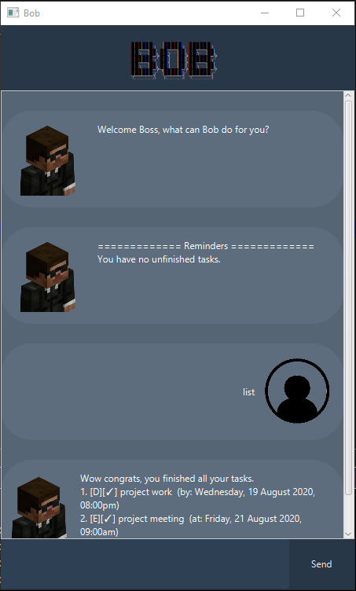

# User Guide
Duke is a desktop app for managing tasks. Duke keeps track of ongoing and finished tasks. Duke offers an interactive and easy way to manage your time. 

## Quick Start

1. Download `duke.jar` file from [github](https://github.com/ijavierja/ip/releases).

2. Ensure you have Java `11` or above installed.

3. Choose the home folder and make a copy of the file there.

4. Double-click the file to start the app.

5. A GUI should start.<br>
    

6. Refer to the [Usage](#usage) below for the details of each command.

## Features 

###  Task Management
* Add tasks
* Delete tasks
* Mark task as done
* Tag tasks

### Task Types
* Todo
* Event
* Deadline

### View Tasks
* view all tasks in the current task list

### Interactive Design
* Greets user when Duke is started up

```
 ____        _        
|  _ \ _   _| | _____ 
| | | | | | | |/ / _ \
| |_| | |_| |   <  __/
|____/ \__,_|_|\_\___|
 Hello I'm Duke
 What can I do for you?
```
* Gives user a response when commands are inputted
* Tells user when input is incorrect

## Usage

### `list` - List Command

Lists all tasks in the current task list numerically. 
The details, such as tags, date & time, other information, of the tasks are also shown

Example of usage: 

`list`

Expected outcome:

```
Here are the tasks in your list:
1. [D][✗] iP (by: 16 Sep 2020, 11:59 PM) #OMFG
2. [T][✓] eat dinner #hungry
3. [E][✗] Graduation! (at: 2021 ) 
```

### `todo` - Todo Task Command

Creates and adds an ongoing todo task to the list.

Format:

`todo <description>`

Example of usage: 

`todo eat dinner`

Expected outcome:

```
Got it. I've added this task:
 [T][✗] eat dinner
Now you have 4 tasks in the list.
```

### `event` - Event Task Command

Creates and adds an ongoing event task to the list.

Format:

`event <description> /at <description>`

Example of usage: 

`event my birthday /at my place`

Expected outcome:

```
Got it. I've added this task:
 [E][✗] my birthday (at: my place) 
Now you have 5 tasks in the list.
```

### `deadline` - Deadline Task Command

Creates and adds an ongoing deadline task to the list.

Format:

`event <description> /by <date&time>`

date&time format:

 `dd/mm/yyyy tttt`

* Note: no need to write 0 for day and month

* 02/09/2020 can be written as 2/9/2020

Example of usage: 

`deadline user guide /by 17/9/2020 2359`

Expected outcome:

```
Got it. I've added this task:
 [D][✗] user guide (by: 17 Sep 2020, 11:59 PM) 
Now you have 6 tasks in the list.
```

### `delete` - Delete Command

Deletes a task from the task list specified by task's index shown using list command.

Format:

`delete <task index>`

Example of usage: 

`delete 6`

Expected outcome:

```
Noted. I've removed this task:
 [D][✗] user guide (by: 17 Sep 2020, 11:59 PM) 
Now you have 5 tasks in the list.
```

### `done` - Done Command

Marks a task as done. Task is specified using task's index shown using list command.

Format:

`done <task index>`

Example of usage: 

`done 5`

Expected outcome:

```
Nice! I've marked this task as done:
 [E][✓] my birthday (at: my place) 
```

### `/tag` - tag notation

Note tasks with a tag when creating new tasks.

Format:
`<add tas command> /tag <tag>`

Example of usage: 

`deadline user guide /by 17/9/2020 2359 /tag GG`

Expected outcome:

```
Got it. I've added this task:
 [D][✗] user guide (by: 17 Sep 2020, 11:59 PM) #GG
Now you have 6 tasks in the list.
```

Note:
* /tag must be added at the end of input
* the tag must be alphanumeric

### `save` - Save Command

Saves the current task list to the hard drive.

Example of usage: 

`save`

Expected outcome:

```
Tasks have been saved!
```

### `find` - Find Command

Finds and lists the tasks that have a matching sequence.

Format:

`find <phrase>`

Example of usage: 

`find user guide`

Expected outcome:

```
Here are the matching tasks in your list:
6.[D][✗] user guide (by: 17 Sep 2020, 11:59 PM) #GG
```

### `bye` - Bye Command

Exits the program.

Example of usage: 

`bye`

Expected outcome:

```
Bye. Hope to see you again soon!
```