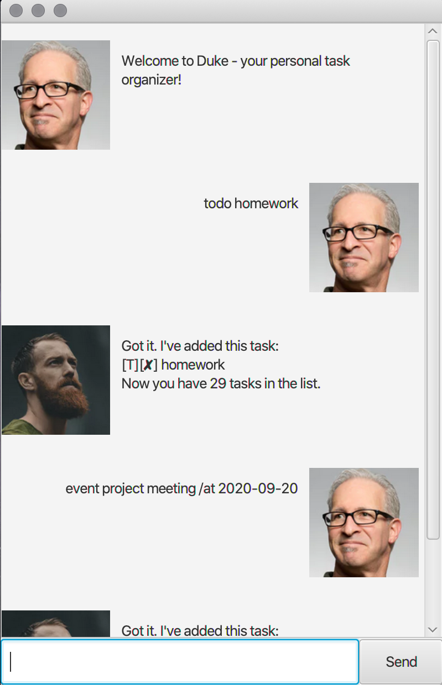

# Duke Melvin Task Tracker
Duke Melvin Task Tracker is a desktop app to manage your tasks,
optimized for use via a Command Line Interface (CLI) while 
still having the benefits of a Graphical User Interface (GUI). 
If you can type fast, this app can allow you to manage your tasks
faster than traditional GUI apps.

## Features 

### Feature 1 - Add Task
### Feature 2 - List tasks
### Feature 3 - Mark Task as Done
### Feature 4 - Delete Task
### Feature 5 - Find task 
### Feature 6 - Detect duplicate tasks
## Usage

### `todo` - Adds a todo task

Adds a todo task to the list of tasks.

Example of usage: 

`todo CS2103T quiz`

Expected outcome:

`Got it. I've added this task:`\
`[T][X] CS2103T quiz`\
`Now you have 1 tasks in the list`

### `event` - Adds an event task

Adds an event task to the list of tasks. Date must be specified in <b>YYYY-MM-DD</b> or <b>YYYY/MM/DD</b> format.

Example of usage:

`event examinations /at 2020-09-19`

Expected outcome:

`Got it. I've added this task:`\
`[E][X] examinations [at: SEP 19 2020]`\
`Now you have 2 tasks in the list`

### `deadline` - Adds a deadline task

Adds a deadline task to the list of tasks. Date must be specified in <b>YYYY-MM-DD</b> or <b>YYYY/MM/DD</b> format.

Example of usage:

`deadline assignment /by 2020-09-19`

Expected outcome:

`Got it. I've added this task:`\
`[D][✗] assignment [by: SEP 19 2020]`\
`Now you have 3 tasks in the list`

### `list` - Lists all tasks

Lists all tasks. Each task is given an index starting from 1.

Example of usage:

`list`

Expected outcome:

`Here are the tasks in your list:`\
`1. [T][✗] CS2103T quiz`\
`2. [E][✗] examinations [at: SEP 19 2020]`\
`3. [D][✗] assignment [by: SEP 19 2020]`

### `done` - Mark task as done

Mark a task specified by the index as done.

Example of usage:

`done 1`

Expected outcome:

`Nice I've marked this task as done:`\
`1. [T][✓] CS2103T quiz`

### `delete` - Delete a task

Deletes a task specified by the index. Index is obtained through `list`.

Example of usage:

`delete 1`

Expected outcome:

`Noted. I've removed this task:`\
`[T][✓] CS2103T quiz`\
`Now you have 2 tasks in the list`

### `find` - Find a task

Finds a task specified by the given keyword.
Example of usage:

`find assignment`

Expected outcome:

`Here are the search results:`\
`1. [D][✗] assignment [by: SEP 19 2020]`

### Detect duplicate tasks

Prompts the user when a task that already exists in the list is being added
This feature is case-insensitive.

Example of usage:

`deadline aSsiGnment /by 2020-09-19`

Expected outcome:

`There appears to be a duplicate task`

## Command summary
|Action|Format|Examples|
|--------------|----------------|----------------|
|`todo` | `todo [task description]` | `todo read book`|
|`event` | `event [task description] /at [date]` | `event examinations /at 2020-09-19`|
|`deadline` | `deadline [task description] /by [date]` | `deadline assignment /by 2020-09-19`|
|`list` | `list`|
|`done` | `done [INDEX]` | `done 2`|
|`delete` | `delete [INDEX]` | `delete 1`| 
|`find` | `find [search terms]...` | `find assignment`, `find math assignment`|
|`bye` | `bye`|