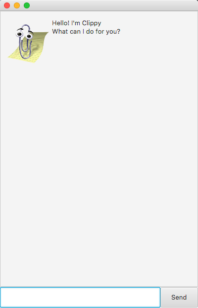

# Clippy Project
Clippy is a desktop app made by Wang Jun Hao under the module CS2103T AY20/21-S1. Clippy assists you in 
managing your tasks, and it is optimized for use via a Command Line Interface (CLI). You can keep track of 
your day-to-day tasks, search for specific tasks by keywords and update details of tasks. If you can type fast, Clippy 
can help you keep track of your tasks faster than traditional GUI apps.

## Quick start
1. Ensure you have Java 11 or above installed in your Computer.
2. Download the latest `duke.jar` release from https://github.com/wang-jun-hao/ip.
3. Copy the file to the folder you want to use as the home folder for your Clippy.
4. To launch the application, type `java -jar duke.jar` in Command Prompt (Windows) or 
Terminal (macOS). The GUI similar to the below should appear in a few seconds. 
  
5. Type the command in the command box and press Enter to execute it. 
 e.g. typing `help` and pressing Enter will open the help window.

## Acknowledgement
This is a green-field project with GUI template taken from [Prof Damith](https://github.com/damithc).