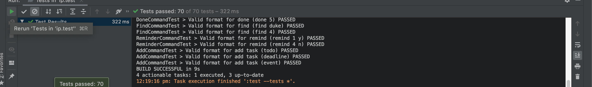

# Duke
_Lum Jian Yang Sean | A0199758Y_

Welcome to Duke, a task manager app to track your todos, deadlines and events.

## About Duke

This is a project from a greenfield Java project. It's named after the Java mascot _Duke_. This project was written for CS2103T AY2020/2021 S1, a Software Engineering module, as part of its Individual Project. It is primarily used to prepare students for their Team Project later on.

## Highlights

1. <b>Extensive Testing Using JUnit</b>

70 JUnit tests were written to test most of the commands and checks to ensure everything works well.

2. <b>Scalable in size</b>

Users can dictate the size of duke!

## Features 
* Add different types of task _e.g._ `todo`, `deadline`, `event`
* Display the list of tasks _e.g._ `list`
* Marks a task as done _e.g._ `done`
* Delete tasks _e.g._ `delete`
* Find tasks using a keyword _e.g._ `find`
* Set a reminder on a task _e.g._ `remind`
* Exit and save the data _e.g._ `bye`
* Case-insensitive commands allowed _e.g._ `TODO`, `EveNT`
* Platform compatibility with Windows, MacOS, Linux
* Responsive ui
* Informative responses when encountered wrong commands.
* Prevents duplicated tasks.

## Download Link

Download the JAR file [here!](https://github.com/seanjyjy/ip/releases/tag/A-Release) You can launch the app by either clicking on the jar file or `java -jar Duke-0.1.4.jar` in the path where you have the jar file.

## Setting up in Intellij

Prerequisites: JDK 11, update Intellij to the most recent version.
1. Fork this repo to your GitHub account and clone the fork to your computer.
1. Open Intellij (if you are not in the welcome screen, click `File` > `Close Project` to close the existing project dialog first)
1. Set up the correct JDK version, as follows:
   1. Click `Configure` > `Structure for New Projects` and then `Project Settings` > `Project` > `Project SDK`
   1. If JDK 11 is listed in the drop down, select it. If it is not, click `New...` and select the directory where you installed JDK 11
   1. Click `OK`
1. Import the project into Intellij as follows:
   1. Click `Open or Import`.
   1. Select the project directory, and click `OK`
   1. If there are any further prompts, accept the defaults.
   
## Credits

### External Packages Used
* [JUnit by JUnit Team](https://github.com/junit-team/junit5/) - For testing Duke.
* [JavaFX by OpenJDK](https://github.com/openjdk/jfx) - For creating the graphical user interface.

### Images Used

* [User image](https://www.freepik.com/premium-vector/cute-cartoon-character-doctor-style_4424223.htm)
* [Duke image](https://www.pngitem.com/middle/hmJbxbb_love-stitch-cute-hearts-disney-stitch-cute-whit/)
* [Welcome image](https://www.hotpng.com/free-png-clipart-gnkqq)
