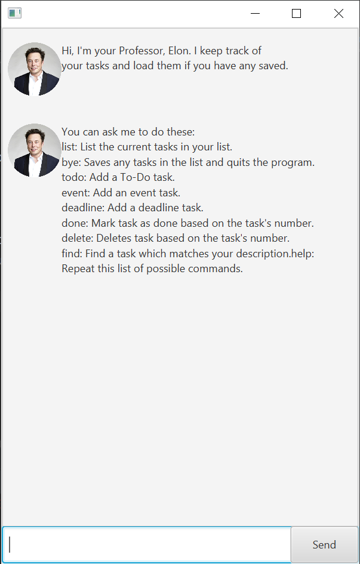

# Elon
Elon is a desktop application for managing tasks, such as to-dos, events,
and deadlines. This project is built as a greenfield Java project, based off the
original project named Duke. This was done as an assignment for CS2103T at 
the National University of Singapore, Fall 2020.

## Setting up in Intellij

Prerequisites: JDK 11, update Intellij to the most recent version.

1. Open Intellij (if you are not in the welcome screen, click `File` > `Close Project`
   to close the existing project dialog first)
1. Set up the correct JDK version, as follows:
   1. Click `Configure` > `Structure for New Projects` and then `Project Settings` > `Project` > `Project SDK`
   1. If JDK 11 is listed in the drop down, select it. If it is not, click `New...` and select the directory
      where you installed JDK 11
   1. Click `OK`
1. Import the project into Intellij as follows:
   1. Click `Open or Import`.
   1. Navigate to the project directory, select `build.gradle`, and click `OK`
   1. If there are any further prompts, accept the defaults.
1. After the importing is complete, locate the `src/main/java/duke/Launcher.java` file, right-click it, and choose
   `Run Launcher.main()`. If the setup is correct, you should see something like the below:
   
   
