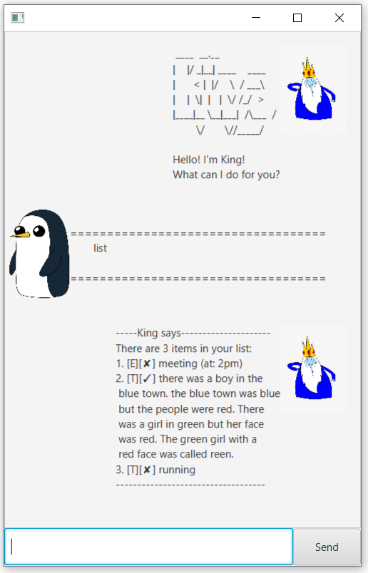

# cs2103t Individual Project

This is a project under the module CS2103t taken in the National University of Singapore.

## Running the Project
<strong>UPDATE: Deprecated method 01/09/2020: King now runs on javaFXML GUI.</strong>\
Simply download JAR file in the latest release and run on your local system.\
The program requires minimum `Java SDK 11`. To run the JAR file simply run `java -jar ip.jar`. \
Refer to the fork for the project template.

   ```
   ____  __.__
  |    |/ _|__| ____    ____
  |      < |  |/    \  / ___\
  |    |  \|  |   |  \/ /_/  >
  |____|__ \__|___|  /\___  /
          \/       \//_____/
  
  Hello! I'm King
  What can I do for you?
   ```
<strong>GUI on JavaFXML 01/09/2020: </strong>
<br> `javaFX` must also be downloaded on local system. Then, fork repo and run `king.launcher`.\
On running the application successfully, you should see the pop-up window.

