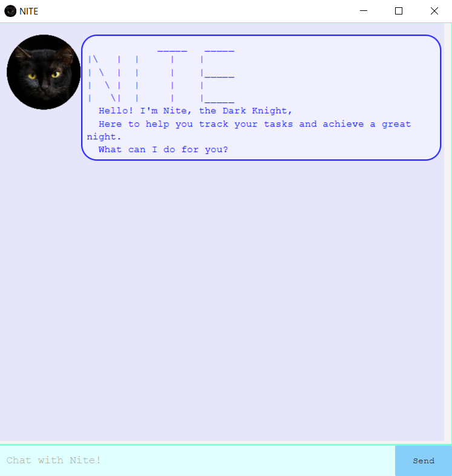

# Duke project template

This is a project template for a greenfield Java project. It's named after the Java mascot _Duke_. Given below are instructions on how to use it.

## Setting up in Intellij

Prerequisites: JDK 11, update Intellij to the most recent version.

1. Open Intellij (if you are not in the welcome screen, click `File` > `Close Project` to close the existing project dialog first)
1. Set up the correct JDK version, as follows:
   1. Click `Configure` > `Structure for New Projects` and then `Project Settings` > `Project` > `Project SDK`
   1. If JDK 11 is listed in the drop down, select it. If it is not, click `New...` and select the directory where you installed JDK 11
   1. Click `OK`
1. Import the project into Intellij as follows:
   1. Click `Open or Import`.
   1. Select the project directory, and click `OK`
   1. If there are any further prompts, accept the defaults.
1. After the importing is complete, locate the `src/main/java/nite.Nite.java` file, right-click it, and choose `Run nite.Nite.main()`. If the setup is correct, you should see something like the below:
   

## Acknowledgements
src/main/resources/audio/meow2.wav uses this sound from freesound:
Cat meow by wesleyextreme_gamer (https://freesound.org/people/wesleyextreme_gamer/sounds/530341/)

src/main/resources/images/blackcat_circle.png is edited from iStockPhoto:
Black cat by sarayut (https://www.istockphoto.com/photo/closeup-portrait-black-cat-the-face-in-front-of-eyes-is-yellow-halloween-black-cat-gm901574784-248725535)

src/main/resources/images/usercat_circle.png is edited from pixabay:
Cat by ArtTower (https://pixabay.com/illustrations/fractal-cat-feline-portrait-animal-681584/)
