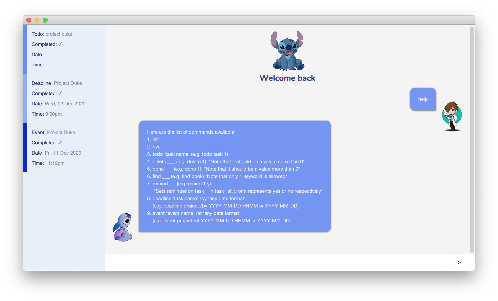

# Duke Chat Bot User Guide

## User Interface


## Features 

### Task Manager
Duke Chat Bot is a personal task manager. It allows users to add, delete and search tasks.

## Usage

### 1. `bye` - Exits application

Exits Duke Chat Bot application.

Example of usage: 

```
bye
```

Expected outcome:

Application closes

### 2. `deadline <description> /by <datetime>` - Adds a deadline

Adds a Deadline Task to task list.

Example of usage: 

```
deadline lab submission /by 2020-01-01 16:30
```

Expected outcome:

```
Got it! I've added this task:
[D][✘] lab submission (by: 1 Jan 2020 4:30pm)
Now you have 1 task in the list!
```

### 3. `delete <taskId>` - Deletes a task

Deletes a task from task list.

Example of usage:

```
delete 1
```

Expected outcome:

```
Noted! I've removed this task:
[D][✘] lab submission (by: 1 Jan 2020 4:30pm)
Now you have 0 tasks in the list!
```

### 4. `done <taskId>` - Marks a task as done

Marks a task as done in task list.

Example of usage: 

```
done 1
```

Expected outcome:

```
Nice! I've marked this task as done:
[D][✓] lab submission (by: 1 Jan 2020 4:30pm)
```

### 5. `event <description> /at <datetime>` - Adds an event

Adds an Event Task to task list.

Example of usage: 

```
event OP1 Presentation /at 2020-12-31 09:55
```

Expected outcome:

```
Got it! I've added this task:
[E][✘] OP1 Presentation (at: 31 Dec 2020 09:55am)
Now you have 2 tasks in the list!
```

### 6. `todo <description>` - Adds a Todo Task

Adds a Todo Task to task list.

Example of usage: 

```
todo read book
```

Expected outcome:

```
Got it! I've added this task:
[T][✘] read book
Now you have 3 tasks in the list!
```

### 7. `find <keyword>` - Searches tasks

Searches tasks by keyword in the task list.

Example of usage: 

```
find Presentation
```

Expected outcome:

```
Here are the matching tasks in your list:
1.[E][✘] OP1 Presentation (at: 31 Dec 2020 09:55am)
```

### 8. `list` - Lists tasks

Lists all tasks in the task list.

Example of usage: 

```
list
```

Expected outcome:

```
Here are the tasks in your list:
1.[D][✓] lab submission (by: 1 Jan 2020 4:30pm)
2.[E][✘] OP1 Presentation (at: 31 Dec 2020 09:55am)
```
