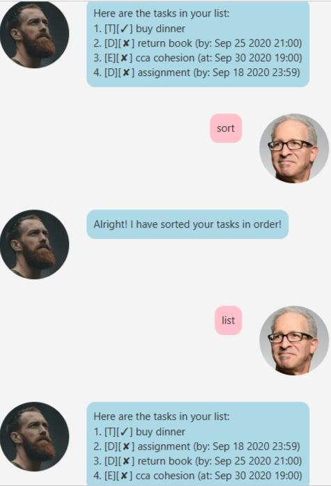

# Duke User Guide

## Features

### Add Todo Task
Adds a Todo Task to your list.

## Usage

### `todo DESCRIPTION`
Adds a Todo task where `DESCRIPTION` is the task name.

Example of usage: 

`todo buy dinner`

Expected outcome:

### Add Deadline Task
Adds a Deadline Task to your list.

## Usage

### `deadline DESCRIPTION /by dd/MM/yyyy HH:mm`
Adds a Deadline task where `DESCRIPTION` is the task name and `dd/MM/yyyy HH:mm` is the date time.
If the time `HH:mm` is not specified, it will be set to the end of the day i.e. 23:59.

Example of usage: 

`deadline return book /by 25/9/2020 21:00`

Expected outcome:

### Add Event Task
Adds an Event Task to your list.

## Usage

### `event DESCRIPTION /at dd/MM/yyyy HH:mm`
Adds an Event task where `DESCRIPTION` is the task name and `dd/MM/yyyy HH:mm` is the date time.
If the time `HH:mm` is not specified, it will be set to the end of the day i.e. 23:59.

Example of usage: 

`event cca cohesion /at 30/9/2020 19:00`

Expected outcome:

### Delete Task
Deletes a task in your list.

## Usage

### `delete INDEX`
Deletes the task where `INDEX` represents the task number in the list.

Example of usage: 

`delete 1`

Expected outcome:

### Mark task as done
Marks a task in your list as done.

## Usage

### `done INDEX`
Marks the task as done where `INDEX` represents the task number in the list.

Example of usage: 

`done 2`

Expected outcome:

### List tasks
Lists out all current tasks to the user.

## Usage

### `list`

Example of usage: 

`list`

Expected outcome:

### Find tasks using keywords
Finds all tasks matching the specified keyword.

## Usage

### `find KEYWORDS`
Finds all matching tasks to the specified `KEYWORDS`,
where `KEYWORDS` can contain 1 or more keywords.

Example of usage: 

`find book birthday`

Expected outcome:

### Sort tasks
Sorts all current tasks in chronological order.

## Usage

### `sort`

Example of usage: 

`sort`
Sorts all tasks according to their type in the following order: Todo, Deadline, Event.
Then, within each type of tasks, they are sorted in chronological order.

Expected outcome:

### Exit programme

## Usage

### `bye`
Exits the programme.

Example of usage: 

`bye`

Expected outcome:

Duke says goodbye and programme exits automatically after 2 seconds.