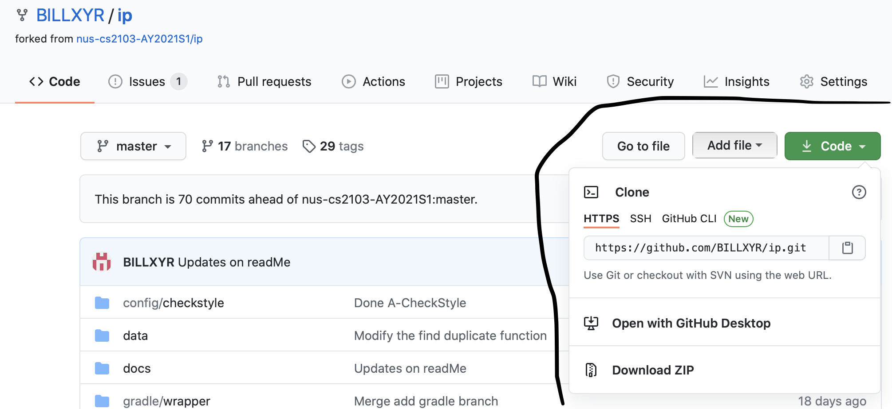

# User Guide for Project Bill

This is a desktop application that is designed for users to keep track
of the various tasks they want to do. It is under the assumption that 
Users prefer typing to speaking. Thus, this application does not support
voice command. User can use the various functions, such as "add" or "delete"
to help them keep track of their daily tasks. This application is optimized for use via Command Line Interface(CLI) and have
a beautiful Graphical User Interface(GUI). 

This project is modified and built from [Project Duke](https://nus-cs2103-ay1920s2.github.io/website/se-book-adapted/projectDuke/index.html)
and it is a very useful educational project designed to help fresh software
developer to horn their skills by slowing building the project and explore
the different software engineering principle along the way.

* [1. Quick Start](#1-quick-start)
   * [1.1 Run the project in intelliJ](#11-run-the-project-in-intellij)
   * [1.2 Run the project in terminal](#12-run-the-project-in-terminal)
* [2. Features and Usage](#2-features-and-usage)
   * [2.1 Find the list of command: help](#21-find-the-list-of-command-help)
   * [2.2 Save the task : save](#22-save-the-task--save)
   * [2.3 Add a general ToDo task : todo](#23-add-a-general-todo-task--todo)
   * [2.4 Add a Deadline task : deadline](#24-add-a-deadline-task--deadline)
   * [2.5 Adding an Event : event](#25-adding-an-event--event)
   * [2.6 Listing out all Tasks : list](#26-listing-out-all-tasks--list)
   * [2.7 Marking a Task as done : done](#27-marking-a-task-as-done--done)
   * [2.8 Delete the task : delete](#28-delete-the-task--delete)
   * [2.9 Find a certain task: find](#29-find-a-certain-task-find)
   * [2.10 Ending a session : bye](#210-ending-a-session--bye)
 
   

## 1. Quick Start

### 1.1 Run the project in intelliJ

Prerequisites: JDK 11, update Intellij to the most recent version.
  
  * For those new to git, please check this out on how to download the project: [Download and try the Project](#download-and-try-the-project)
  
1. Open Intellij (if you are not in the welcome screen, click File > Close Project to close the existing project dialog first)

2. Set up the correct JDK version, as follows:
   1. Click Configure > Structure for New Projects and then Project Settings > Project > Project SDK
   2. If JDK 11 is listed in the drop down, select it. If it is not, click New... and select the directory where you installed JDK 11
   3. Click OK
  
3.Import the project into Intellij as follows:

   * i.  Click Open or Import.
   * ii. Select the project directory, and click OK
   * iii. If there are any further prompts, accept the defaults.

4.After the importing is complete, locate the src/main/java/Launcher.java file, right-click it, and choose to Run Launcher. 

5.if everything is set up properly, you should be able to see the GUI in a few seconds

6.Now you can type the command and press Enter to excute it.

*Tutorial on how to download the project for those new to git:*

#### Download and try the Project

1. Navigate to the [main page](https://github.com/BILLXYR/ip)
2. Find the code download button. An example is shown here: 

3. You can choose to use any of the three options
4. Here i will explain more on the first option
   1. open your terminal and set up your git account
   2. use this command to clone the project down to your computer: git clone https://github.com/BILLXYR/ip.git

### 1.2 Run the project in terminal

1. Ensure that you have downloaded Java 11 in your computer. 

2. Download the latest **Bill.jar** file from [here](https://github.com/BILLXYR/ip/releases/tag/v0.2)

3. Navigate to any empty folder and place the downloaded file into that folder.

4. Navigate your terminal directory to the folder that contains your **Bill.jar** file

5. Type the following command to start the application: `java -jar Bill.jar`

6. You should expect to see a Graphical User Interface(GUI) appear in a few second

7. You should expect to see a window as shown below: 

8. You can enter the `help` command to find the list of commands you can use.

## 2. Features and Usage

### **2.1 Find the list of command: help**

This feature allows users to find the list of command to use

*Usage*: i want to add a task but i forgot how to use that, you can use help to help you

*Format*: `help`

*Examples*: `help`

*Expected Outcome*:

###  **2.2 Save the task : save**

This feature allows users to save the task after they have added them.

*Usage*: i have add some tasks and i want to add them now.

*Format*: `save`

*Examples*: `save`

*Expected Outcome*:

### **2.3 Add a general ToDo task : todo**

This feature allows users to add a ToDo task to our current list

*Usage*: we want to add an ip ToDo task into our list

*Format*: `todo [newTask]`

*Examples*: `todo ip`

*Expected Outcome*:

### **2.4 Add a Deadline task : deadline**

This feature allows users to add a task with deadline to our current list

*Usage*: we want to add an ip task to our list and there is a deadline 
for this task,eg: due on 2020 August 2, 7pm

*Format*: `deadline [newTask] /by [date] [time]`

*Examples*: `deadline ip /by 02/08/2020 1900`

*Expected Outcome*:

**Note:**
1. the date must be dd/mm/yyyy
2. for the day and month, it must be 
two digit, for example, 2 must be written as 02 instead of just 2.
3. the time must be 4 digit, for example, 8:12am must be written as 0812 instead of 812

### **2.5 Adding an Event : event**

This feature allows users to add an event to our current list.

*Usage*: we want to add an event to our list and there is a specific time for it.
For example, it happens on 2020 August 2, 7pm

*Format*: `event [newTask] /at [date] [time]`

*Examples*: `event assignment /at 02/08/2020 1900`

*Expected Outcome*:

**Note:**
1. the date must be dd/mm/yyyy
2. for the day and month, it must be 
two digits, for example, 2 must be written as 02 instead of just 2.
3. the time must be 4 digits, for example, 8:12am must be written as 0812 instead of 812

### **2.6 Listing out all Tasks : list**

This feature allows users to list out all the tasks added to the list in the order of the entry.

*Usage*: we want to check all the tasks that we have added

*Format*: `list`

*Examples*: `list`

*Expected Outcome*:

### **2.7 Marking a Task as done : done**

This feature allows users to mark certain tasks they have done.

*Usage*: i have previously add an ip task to the list and i have done it. Now, i want
to make the task as done.

*Format*: `done [task index]`

we first use list to find the index of the task. For example, in this case, the index 
for the ip task is taken as 2.

*Examples*: `done 2`

*Expected Outcome*:

### **2.8 Delete the task : delete**

This feature allows users to delete certain tasks.

*Usage*: i have previously add an ip task to the list. Now, i want
to delete the task.

*Format*: `delete [task index]`

we first use list to find the index of the task. For example, in this case, the index 
for the ip task is taken as 3.

*Examples*: `delete 3`

*Expected Outcome*:

### **2.9 Find a certain task: find**

This feature allows users to find a certain task from the list and look at the detail.

*Usage*: i want to find when is my ip due.

*Format*: `find [taskName]`

*Examples*: `find ip`

*Expected Outcome*:

###  **2.10 Ending a session : bye**

This feature allows users to quit the application after they have done what they want

*Usage*: i have done adding my task and now i want to quit the application.

*Format*: `bye`

*Examples*: `bye`
 
*Expected Outcome*: Your application should be closed in 1 second. 
