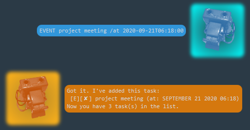
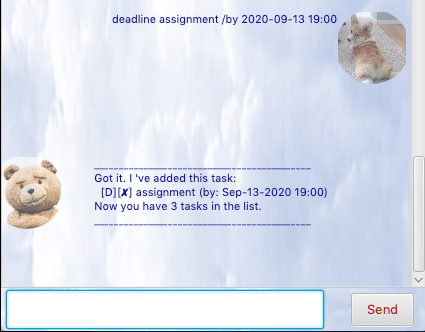
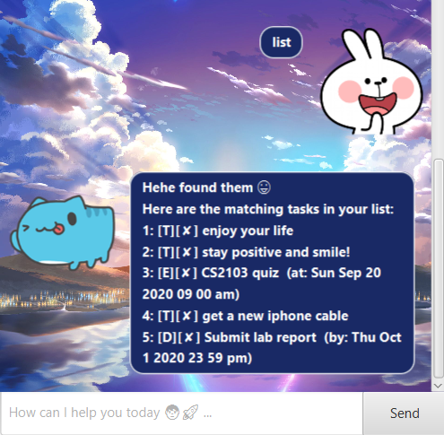
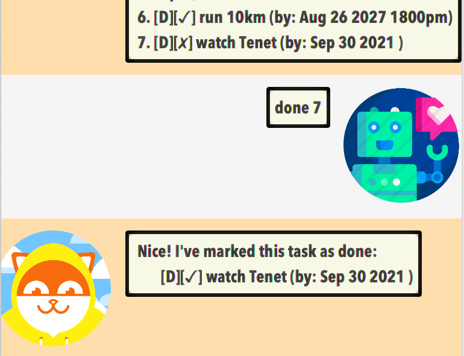
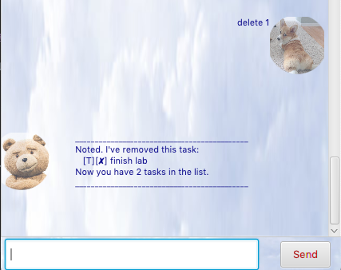
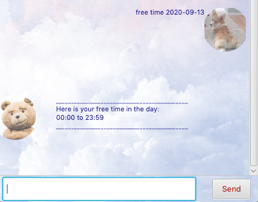
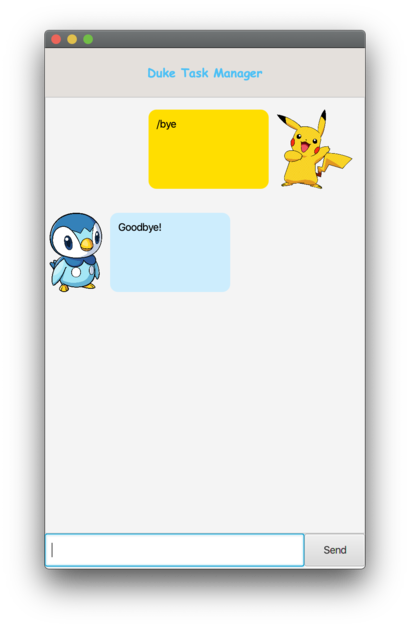

# User Guide
ByteMe is a **desktop scheduling app to help you manage your daily tasks**. It is **optimized for use via a Command Line Interface (CLI)**. Start your exciting journey with **ByteMe** from here!

## Table of Content
* [Quick Start](https://xz0127.github.io/ip/#quick-start)
* [Features](https://xz0127.github.io/ip/#features)
    * Adding a todo task
    * Adding an event
    * Adding a deadline
    * Listing all tasks
    * Marking a task as done 
    * Deleting a task
    * Finding a task
    * Finding free slots
    * Exiting programme
* [Usage](https://xz0127.github.io/ip/#usage)

## Quick Start
1. Ensure you have Java `11` or above installed on your computer.
2. Download release `V0.3` of `duke.jar` from [here](https://github.com/xz0127/ip/releases/tag/v0.3).
3. Copy the file to the folder of your choice
3. Double click on `duke.jar` to start the GUI.
    * Note that Duke will automatically create folder `data` 
      in the same directory of `duke.jar` to save the tasks.
    * The following GUI will appear: 
    
      
    * If the GUI cannot be started by double-clicking, open `duke.jar` in `Terminal/Command Prompt` depending on your system by the following command:
        * `cd` home directory of `duke.jar` 
        * `java -jar duke.jar`
4. Type the command in the text input field and press the `send` button to start your journey with ByteMe!
5. For all commands, please follow the correct `Format` specified.

## Features 
1. Adding a todo task `todo`
2. Adding an event `event`
3. Adding a deadline `deadline`
4. Listing all tasks `list`
5. Marking a task as done `done`
6. Deleting a task `delete`
7. Finding a task `find`
8. Finding free slots `free time`
9. Exiting programme `bye`

## Usage

1. ### `todo` - Adding a new todo task

    * Add a new todo task into your task list. A todo task requires a description only. 
    
    * Format
        * `todo DESCRIPTION`
        
    * Example of usage: 
        * `todo finish lab` creates new task named `finish lab` in list
        * `todo do assignment` creates new task named `do assignment` in list
        
        
    
2. ### `event` - Adding a new event with a specific time

    * Add a new event with a specific time into your task list. A event requires a `description` and a `date time`.
    
    * Format
        * `event DESCRIPTION /at YYYY-MM-DD HH:MM`
        
    * Example of usage: 
        * `event project meeting /at 2020-09-13 19:00` creates new event named `project meeting` happening on `2020-09-13 19:00`
    
        
    
3. ### `deadline` - Adding a new deadline with a specific time

    * Add a new new deadline with a specific time into your task list. A deadline requires a `description` and a `date time`.
    
    * Format
        * `deadline DESCRIPTION /by YYYY-MM-DD HH:MM`

    * Example of usage: 
        * `deadline assignment /by 2020-09-13 19:00` creates new deadline named `assignment` to be done by `2020-09-13 19:00`

        
    
4. ### `list` - Listing all the tasks.

    * Listing all the tasks.

    * Format
        * `list`
        
    * Example of usage: 
        * `list` lists all the tasks in your list
        
        

5. ### `done` - Marking a task at a specific index as done

    * Mark a task at a specific index in your task list as done. An index is required to specify the task. Index should be within the range of number of tasks.

    * Format
        * `done INDEX`
    * Example of usage: 

        * `done 4` marks the 4th task in your list as done
        
        

6. ### `delete` - Deleting a task at a specific index as done

    * Delete a task at a specific index in task list. An index is required to specify the task. Index should be within the range of the number of tasks.

    * Format
        * `delete INDEX`
        
    * Example of usage: 

        * `delete 4` deletes the 4th task in your list as done

        
    
7. ### `find` - Finding tasks by keywords

    * Find tasks by keywords in the list. A keyword is required to specify the tasks you are looking for.

    * Format
        * `find KEYWORD`
        
    * Example of usage: 

        * `find meeting` finds and lists all the tasks which names contains `meeting`
    
        
    
8. ### `free time` - Finding free time slots on a specific date

    * Find free time slots on a specific date. A `date time` is required. `Event` is assumed to have a duration of 1 hour at `v0.3`.
    
    * Format
        * `free time YYYY-MM-DD`
        
    * Example of usage: 

        * `free time 2020-09-13` returns the free time slot on `2020-09-13`
    
        
    
9. ### `bye` - Exiting the programme.

    * Exit ByteMe. Your input task will be automatically saved and stored in the `data` folder.
    
    * Format
        * `bye`
        
    * Example of usage: 

        * `bye` exits the programme.
        
        