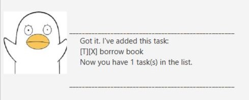
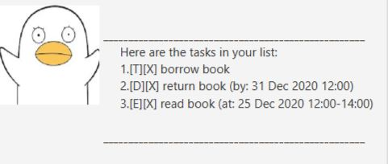
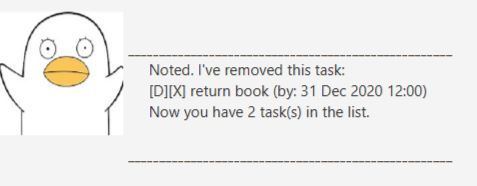

# User Guide
DukePenguin is a desktop app for managing tasks with the help of Graphical User Interface (GUI). It has fun and simple UI interaction during execution which makes it more user friendly than other similar GUI apps

# Table of contents
1. [Quick Start](#Quick Start)
1. [Features](#Features)
1. [Usage](#Usage)

## Quick Start
1. Ensure you have Java Version 11 or above on your computer. Click [here](https://www.oracle.com/java/technologies/javase/jdk11-archive-downloads.html) to download if not.
1. Download [DukePenguin_v0.2](https://github.com/Jaylenlee/ip/releases/tag/v0.2)
1. Open the DukePenguin_v0.2 to start using :)

Alternatively you can also open it with terminal:
1. Open up any terminal. For example, search "Command Prompt" on Windows search.
1. Change directory to where the DukePenguin_v0.2 Jar file is located. Example: cd Downloads
1. Type java -jar DukePenguin_v0.2.jar and enter.
1. You can now use DukePenguin.

## Features 

### Adding tasks:
#### Todo tasks: `todo`
 Adds a task to be done in the future without any time restriction.
 [API](#todo) 

 #### Deadline tasks: `deadline`
 Adds a task to be done in the future before a specific deadline.
 [API](#deadline) 
 
#### Event tasks: `event`
 Adds a task to be done in the future within a specific time range.
 [API](#event) 
 
### Displaying tasks:
#### List tasks: `list`
 Displays a indexed list of available tasks.
 [API](#list) 
 
#### Find tasks: `find`
 Finds a indexed list of available tasks with the given keyword.
 [API](#find) 
 
#### Sort tasks: `sort`
Sorts a indexed list of available tasks by their type and then description.
 [API](#sort) 
 
### Deleting tasks:
#### Delete tasks: `delete`
Deletes a task at a particular index of the list.
 [API](#delete) 
  
### Marking tasks:
#### Done tasks: `Done`
 Marks a task at a particular index of the list to be done. 
 [API](#done) 
  
### Terminating program:
#### Exit: `bye`
Terminates and exits the program. 
[API](#bye) 
   
## Usage
### `todo` 
 - adds a task without time restriction to list 

Format of command: `todo <description>`

Example of usage: `todo borrow book`

Expected outcome:

### `deadline` 
- adds a task that needed to be done before a certain deadline

Format of command: `deadline <description> /by <YYYY-MM-DD> <HHmm>`

Example of usage: `deadline return book /by 2020-12-31 1200`

Expected outcome:

### `event` 
- adds a task that needed to be done within a certain time period

Format of command: `event <description> /at <YYYY-MM-DD> <HHmm>-<HHmm>`

Example of usage: `event read book /at 2020-12-25 1200-1400`

Expected outcome:

### `list` 
- displays all tasks available

Format of command: `list`

Example of usage: `list`

Expected outcome:

### `find`  
- displays all tasks available with the given keyword

Format of command: `find <keyword>`

Example of usage: `find Dec`

Expected outcome:

### `sort` 
- sorts all tasks available by their task's type and then description alphabetically

Format of command: `sort`

Example of usage: `sort`

Expected outcome:

### `delete` 
- deletes a task at a particular index

Format of command: `delete <index>`

Example of usage: `delete 1`

Expected outcome:

### `done` 
- marks a task at a particular index done

Format of command: `done <index>`

Example of usage: `done 1`

Expected outcome:

### `bye` 
- terminates DukePenguin

Format of command: `bye`

Example of usage: `bye`

Expected outcome:

