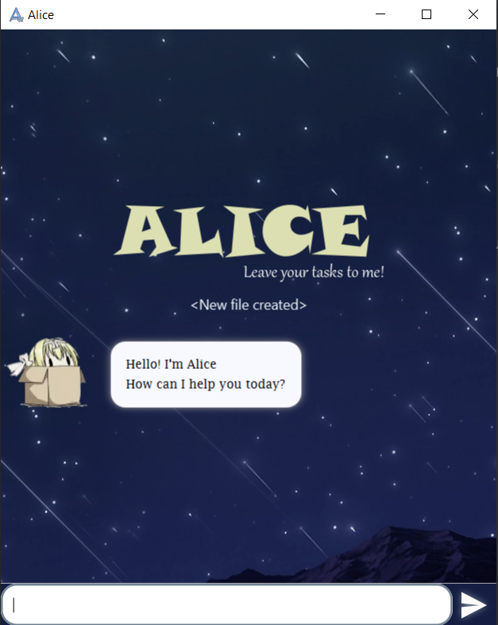

# User Guide
Alice is a **chatbot desktop app** that manages your tasks for you 
so that you can focus on the things that really matters.
It is optimized for use via a **Command Line Interface (CLI)**, so that 
you can get things done faster than any other traditional task management apps.

* Table of Contents
{:toc}

&nbsp;

&nbsp;

---
## Quick Start
1. Ensure that you have Java `11` or above installed in your Computer
2. Download the latest alice.jar from [here](https://github.com/jinhao-l/ip/releases)
3. Copy the file to the folder of your choice. This will be the *home folder* of Alice.
4. Double-click the file to start the app. The GUI that appears should be similar to the 
image below.

5. Type the command in the text input field and press Enter to execute. Entering `help` will
bring out the list of usable commands.  
Here are some example commands that you can try:
    * `todo setup` : Adds a new task named `setup` to the task list.
    * `event Tutorial /at now` : Adds a new `Tutorial` event that is happening at this 
    current date and time.
    * `list` : Lists all tasks.
    * `done 1` : Marks the first task as done
    * `delete 2` : Delete the second task
    * `clear all` : Delete all tasks
    * `bye` : Exit the app.
6. Refer to the [Usage](#usage) below to see more details of each command.

&nbsp;

---
## Features 
### 1. Task management

Execute simple task management with easy to use commands:
* Create tasks such as:
    * Simple todos, [`todo`](#add-a-todo---todo)
    * Tasks with deadlines, [`deadline`](#add-a-deadline---deadline)
    * Events to attend, [`event`](#add-an-event---event)
* Mark tasks as complete, [`done`](#mark-task-as-done---done)
* Delete tasks, [`delete`](#delete-a-task---delete-del-rm)
* Clear completed tasks, [`clear done`](#clear-tasks---clear-clr)

### 2. Task viewing
Get an overview of all tasks at hand with a simple [`list`](#list-all-tasks---list-ls) command.  
Alternatively, search for specific tasks by their description
using [`search`](#find-tasks-by-description---find-search) or [`find`](#find-tasks-by-description---find-search)

### 3. Date time support
Alice supports a wide range of date and time language so that you do not 
have to waste valuable time spelling everything out. Any unspecified date time
details will be smartly predicted by Alice. 
* Date and time should be separated by a single space
* Date is a compulsory field, hence if the date is unspecified, it will default to the nearest upcoming time (given by the user).
* If the year is unspecified, it will default to the current year
* Time will simply be ignored if not provided by the user.

#### 3.1 Formatted datetime
Some sample date time format that you can use: (Note: years are optional)

|Date formats|Time formats|
|:---|:---:|
|02/12/2020|2300|
|02-12-2020|11:00pm|
|12-02-2020|11pm|
|12/02/2020|
|2020/12/02|
|2020-12-02|
|02-Dec-2020|
|02-December-2020|

#### 3.2 Natural language
Use natural datetime language instead of spelling out actual date & time.

|Natural Date | Natural Time | Hybrid Date Time|
|:---:|:---:|:---:|
|Today | Morning (8AM) | Now|
|Tomorrow | Noon (12PM) | Tonight (Tomorrow Night)|
|Yesterday | Evening (7PM) ||
|Day of the week | Night (10PM) ||
|    | Midnight (11.59PM) ||

### 4. Auto save
There is no need to save manually. All data will be automatically saved after any command that alters the data.  

A green circle at the bottom right of the chat bubble indicates a successful save, 
and a red circle indicates an unsuccessful one.

&nbsp;

---

## Usage

**Notes about the command format:** 

* Words in `UPPER_CASE` are the parameters to be supplied by the user. 
  e.g. in `todo DESC`, `DESC` is a parameter which can be used as `todo do homework`.

* Items in brackets are optional. 
  e.g `find KEYWORD (MORE_KEYWORDS)…` can be used as `find apple book` or as `find apple`.

* Items with `…` after them can be used multiple times including zero times. 
  e.g. `(MORE_KEYWORDS)…` can be used as ` ` (i.e. 0 times), `lecture`, `book` etc.

* Words in square brackets means choose either one. 
  e.g. `clear [all, done]` can be used as `clear all` or `clear done`  
  e.g. `[list, ls]` as the command phrase means that you can use `list` or `ls` to execute the command.
  

&nbsp;

&nbsp;

### Viewing help - `help`

Shows the list of commands and use format.

Format: `help`

&nbsp;

### Add a todo - `todo`

Create a task to be done and add it to the task list.

Format: `todo DESC`

* `DESC` cannot be empty

Examples:
* `todo finish project` creates a new todo task named `finish project`
* `todo eat` creates a new todo task named `eat`

&nbsp;

### Add an event - `event`

Create a task happening at the specified time and add it to the task list.

Format: `event DESC /at DATETIME`

* `DESC` cannot be empty
* Either a `DATE` or `TIME` must be included under `DATETIME`
* Date and time should be separated by a whitespace eg. `DATE TIME`
* If `DATE` is not specified, the `DATE` will default to today or tomorrow depending on the current time of the day
* If `TIME` is not specified, it will not be included in the task creation
* Natural datetime language is [supported](#32-natural-language)

Examples:
* `event lecture /at today` creates a new party event happening `Today`
* `event lunch /at tomorrow noon` creates a new lunch event happening tomorrow at `12PM`
* `event party /at 24-8-2020 night` creates a new party event happening on `Monday, Aug 24 2020, 10PM`

&nbsp;

### Add a deadline - `deadline`

Create a task to be done by the specified time and add it to the task list.

Format: `deadline DESC /by DATETIME`

* `DESC` cannot be empty
* Either a `DATE` or `TIME` must be included under `DATETIME`
* Date and time should be separated by a whitespace eg. `DATE TIME`
* If `DATE` is not specified, the `DATE` will default to today or tomorrow depending on the current time of the day
* If `TIME` is not specified, it will not be included in the task creation
* Natural datetime language is [supported](#32-natural-language)

Examples:
* `deadline finish homework /by today` creates a new `finish homework` deadline to be done by today
* `deadline submission /by 2200` creates a new `submission` deadline to be done by today 10PM or tomorrow 10PM 
depending on the time of creation
* `deadline homework /by 3/4 2pm` creates a new `homework` deadline to be done by Apr 03, 2PM of the current year

&nbsp;

### Mark task as done - `done`

Marks the specified task as completed.

Format: `done TASK_NUMBER`

* Mark the task at the specified `TASK_NUMBER` as done.
* The `TASK_NUMBER` refers to the index number shown when `list` or `find` command is called. 
* The `TASK_NUMBER` is relative to the task position in the list
* The `TASK_NUMBER` must be a positive integer 1, 2, 3, ...

Example:
* `done 3` marks the 3rd task in the list as done

&nbsp;

### Delete a task - `[delete, del, rm]`

Deletes the specified person from the address book.

Format: `delete TASK_NUMBER`

* Deletes the task at the specified `TASK_NUMBER`.
* The `TASK_NUMBER` refers to the index number shown when `list` or `find` command is called. 
* The `TASK_NUMBER` is relative to the task position in the list
* The `TASK_NUMBER` must be a positive integer 1, 2, 3, ...

Examples:
* `delete 4` deletes the 4th task in the list

&nbsp;

### List all tasks - `[list, ls]`

Shows a list of all tasks in the address book.

Format: `list`

&nbsp;

### Find tasks by description - `[find, search]`

Find all the tasks whose description contains any of the given keywords.

Format: `find KEYWORD (MORE_KEYWORDS)…`

* The search is case-insensitive, e.g `lecture` will match `Lecture`
* Order of keywords does not matter, e.g `book practice` will match `practice book`
* Only the description of the task will be searched
* Only full words will be matched, e.g `book` will not match `books`
* Tasks that matches any keyword will be returned
* Tasks will be returned with their corresponding task number (relative to their position in the list)

Examples:
* `find homework` returns `Do Homework` and `submit homework`
* `find meeting book` returns `return book` and `project meeting`

&nbsp;

### Clear tasks - `[clear, clr]`

Clear tasks from the task manager.

Format: `clear [all, done]`

* The keywords `all` and `done` are case-insensitive

Examples:
* `clear all` clears all tasks in the list
* `clear done` clears only the completed tasks from the list.

&nbsp;

### Exit the program - `[bye, exit]`

Exits the program.

Format: `bye`

&nbsp;

---

## Command summary

Action | Command word | Format, Examples
--------|--------|------------
**Todo** | `todo` |`todo DESC`   e.g., `todo Homework`
**Event** | `event` |`event DESC /at DATETIME`   e.g., `event Movie /at tomorrow 8pm`
**Deadline** | `deadline` |`deadline DESC /by DATETIME`   e.g., `deadline Finalise product /by 04-Aug 2359`
**Done** | `done` |`done TASK_NUMBER`  e.g., `done 2`
**Delete** | `delete`, `del`, `rm` |`delete TASK_NUMBER`  e.g., `delete 3`
**List** | `list`, `ls`|`list`
**Find** | `find`, `search`|`find KEYWORD (MORE_KEYWORDS)…`  e.g., `find work lecture`
**Clear** | `clear`, `clr` |`clear [all, done]`  e.g., `clear done`
**Help** | `help` |`help`
**Exit** | `bye`, `exit` | `bye`