# User Guide

Duke is a Command Line Input (CLI)-based interactive list management application
that runs on [Java 11 or higher](https://www.oracle.com/java/technologies/javase-downloads.html).

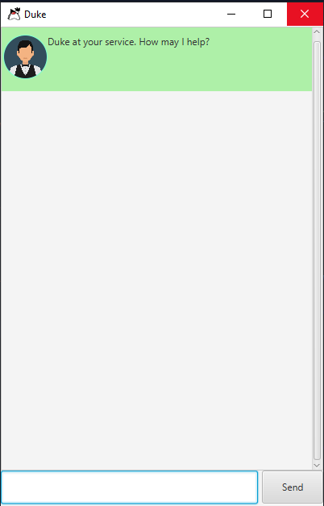

## Features 

### Create a task-list

Create a task-list where you can add, delete, update and view various tasks,
automatically storing the list at the location of your choice.

#### Usage

When you are just starting out on a new task-list, and want a convenient way
to keep track of to-dos, deadlines and events.

#### `CREATE TASK <filepath>`

Creates the task-list at the filepath specified by the user.

Example of usage: 

`CREATE TASK data/tasks.txt`

Expected outcome:

A new task-list is created in the file named `tasks.txt` in the folder `/data`.
If the folder `/data` does not exist where the `.jar` file is located, then the
folder is first created and then the file is created in the folder.

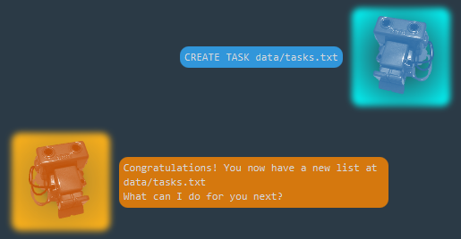

### Add a task

Add a new to-do, deadline or event to the task-list.

#### Usage

When you have a new task you want to add to the task-list.

#### `TODO`, `DEADLINE`, `EVENT`

Example of usage:

`TODO read book`

`DEADLINE return book /by next Monday`

`EVENT project meeting /at 2020-09-21T06:18:00`

Expected outcome:

The respective tasks are added to the task-list.

### Mark a task as done

Tick off a task that you have completed.

#### Usage

When you have completed a certain task on your task-list.

#### `DONE <index>`

Example of usage:

`DONE 1`

Expected outcome:

The first task in the list is marked as done.

### Delete a task

Delete a task from the task-list.

#### Usage

When you no longer want to keep track of a particular task, or simply want to
delete a wrong entry.

#### `DELETE <index>`

Example of usage:

`DELETE 3`

Expected outcome:

The third task in the list is deleted.

### View all current tasks

Get a view of all the current tasks in your task-list, including whether they
are done or not.

#### Usage

When you want to view all the tasks in your list, or verify the index of the
task you want to delete or edit.

#### `LIST`

Example of usage:

`LIST`

Expected outcome:

All the tasks in the task-list listed by rows.

### Search by keyword

Search for a task or multiple tasks containing a keyword.

#### Usage

When you want to view specific related tasks that contain the same word instead
of all the tasks in your list.

#### `FIND <keyword>`

Example of usage:

`FIND book`

Expected outcome:

All the tasks in the task-list containing the keyword `"book"`, listed by rows.

### Close the application

Close the application using a command, and receive a greeting from Duke.

#### Usage

When you are done with the current session and want to close the application.

#### `BYE`

Example of usage:

`BYE`

Expected outcome:

Duke replies with a greeting, and the application closes shortly after.

### Load a task-list

Load a task-list that was previously created.

#### Usage

When you start a new session and want to resume the task-list from a previous
session, or when you are working with one list and want to swap to another list.
(See `UNLOAD`)

#### `LOAD TASK <filepath>`

Example of usage:

`LOAD TASK data/tasks.txt`

Expected outcome:

The existing task-list stored in `data/tasks.txt` is loaded to the current session.

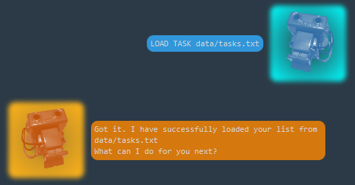

### Unload the current list

Unload the list you are working with in the current session.

#### Usage

When you want to move on to a different file without restarting the session.

#### `UNLOAD`

Example of usage:

`UNLOAD`

Expected outcome:

The current working list is unloaded from the session so that another list can
be loaded.

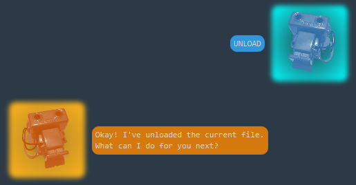

### Start a finance log

Create a finance log where you can add or delete categories, increase or decrease
the amount in each category, and view a summary sheet of the categories and their
totals, and automatically store this data at the location of your choice.

#### Usage

When you want to keep track of your financial data, such as expenses.

#### `CREATE FINANCE <filepath>`

Example of usage:

`CREATE FINANCE data/finances.txt`

Expected outcome:

A new finance log is created in the file named `finances.txt` in the folder
`/data`. If the folder `/data` does not exist where the `.jar` file is located,
then the folder is first created and then the file is created in the folder.

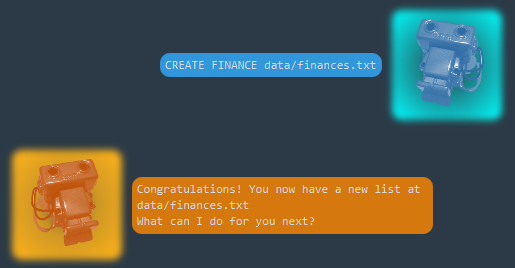

### Add a category

When you are just starting a new finance log, or want to add a new category to
aggregate your financial data.

#### Usage

#### `NEW <category_name>`

Example of usage:

`NEW Food`

Expected outcome:

The category `Food` is added to the finance log, with a starting amount of $0.

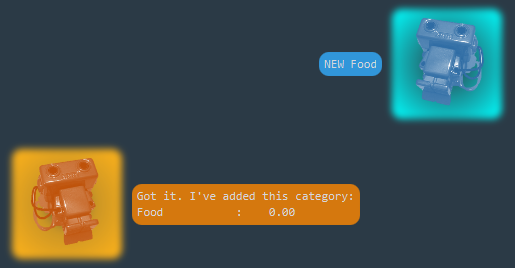

### Increase/Decrease the amount

Increase (or decrease) the amount in a particular category.
(Note that the minimum amount in a category is $0.)

#### Usage

#### `ADD`, `REDUCE`

Example of usage:

`ADD Food 4.50`

`REDUCE Allowance 10`

Expected outcome:

The amount in the `Food` category increases by $4.50, while the amount in
the `Allowance` category decreases to $0 (since the amount deducted exceeded
the base amount).

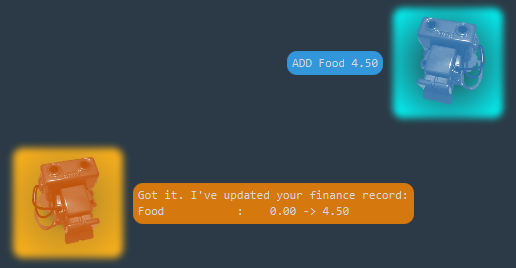

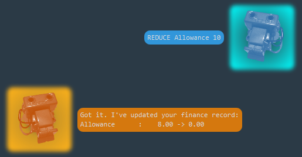

### Rename a category

Rename a particular category in the finance log.

#### Usage

When you made a typo in the naming of a category, or maybe you want to broaden
or restrict the category (e.g. `Food` -> `Lunch`)

#### `RENAME <category_name> <new_name>`

Example of usage:

`RENAME Trnasport Transport`

`RENAME Food Lunch`

Expected outcome:

The `Trnasport` category is changed to `Transport`, while the category
previously named `Food` is renamed `Lunch`.

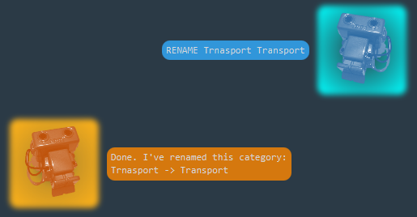

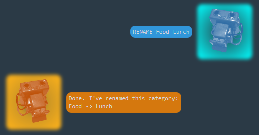

### Remove a category

Remove a particular category from the finance log.

#### Usage

When you want to completely remove a category and any amount associated with it
from the finance log.

#### `REMOVE <category_name>`

Example of usage:

`REMOVE Transport`

Expected outcome:

The category `Transport` is completely removed from the finance log.

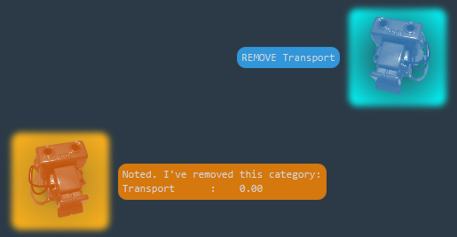

### View all finances

View a summary of the categories and their amounts.

#### Usage

When you want to take a look at all the categories currently in the finance log
and see how much is in each category.

#### `DISPLAY`

Example of usage:

`DISPLAY`

Expected outcome:

All the respective categories and their amounts are neatly presented in a table
format.

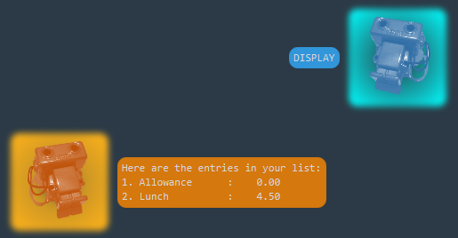