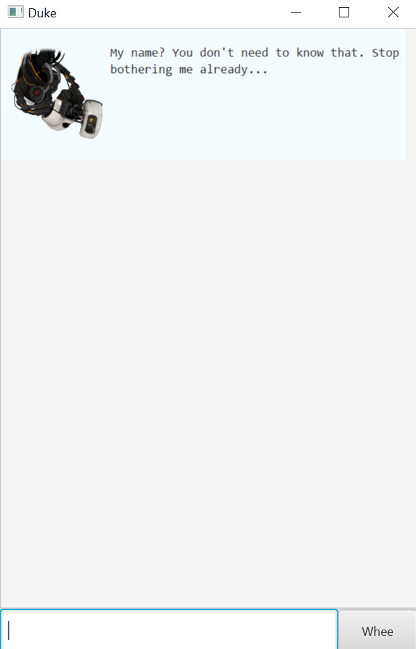

# User Guide

Welcome to Duke Task Manager 2.0, the tired, sarcastic, done-with-life version 
that encourages you to be your worst self! Enjoy :)

## Quick Start
1. Ensure you have Java `11` or above installed in your Computer.
2. Download the latest `duke.jar` from [here](https://github.com/porkeypine/ip/releases/tag/A-Release).
3. Copy the file to the folder you want to use as the home folder for your `Duke`.
4. Double-click the file to start the app. The GUI similar to the below should appear in a few seconds. 

5. Type a command in the command box and press Enter to execute it.
   See below for the commands you can try.

## Features & Usage
### Summary of Commands
|Feature | Command | Example Usage |
|--------|---------|---------------|
|Adding Todo task|`todo <description>`|`todo submit 2103t ip`|
|Adding Deadline task|`deadline <description> /by <date>`|`deadline return book /by 2020-09-23`|
|Adding Event task|`event <description> /at <date>`|`event party /at 2020-09-30`|
|Listing all tasks|`list`|`list`|
|Marking task as done|`done <task number>`|`done 1`|
|Deleting a task|`delete <task number>`|`delete 1`|
|Finding all tasks with `keyword`|`find <keyword>`|`find party`|
|Updating a task's description|`update <task number> <new description>`|`update 3 New Years' Party`|
|Exiting app|`bye / toodles / sayonara / farewell`|`toodles`|

### `todo <description>` - Add Todo task

Adds a new Todo item to current list of tasks, with description as specified.

Example of usage: 

`todo submit 2103t ip`

Expected outcome:

```
You're making me feel tired... But if you insist, I've added this:`

[T][:(] submit 2103t ip

You now have 1 thing in your list.
```

### `deadline <description> /by <date>` - Add Deadline task

Adds a new Deadline item to current list of tasks, with description and date as specified.

*Date must be in YYYY-MM-DD format.*

Example of usage: 

`deadline return book /by 2020-09-30`

Expected outcome:

```
You're making me feel tired... But if you insist, I've added this:

[D][:(] return book (by: WEDNESDAY, Sep 30 2020)

You now have 2 things in your list.
```

### `event <description> /at <date>` - Add Event task

Adds a new Event item to current list of tasks, with description and date as specified.

*Date must be in YYYY-MM-DD format.*

Example of usage: 

`event party /at 2020-09-23`

Expected outcome:

```
You're making me feel tired... But if you insist, I've added this:

[E][:(] party (at: WEDNESDAY, Sep 23 2020)

You now have 3 things in your list.
```
### `list` - List all tasks

Displays a list of all tasks currently existing.

Example of usage: 

`list`

Expected outcome:

```
1. [T][:(] submit 2103t ip
2. [D][:(] return book (by: WEDNESDAY, Sep 30 2020)
3. [E][:(] party (at: WEDNESDAY, Sep 23 2020)

I wouldn't bother about them if I were you.

You now have 3 things in your list.
```
### `done <task number>` - Mark a task as done

Marks as done the task specified by the task number.

*Numbering is as shown with a `list` command.*

Example of usage: 

`done 1`

Expected outcome:

```
Oh goody... You actually accomplished something!!!
  [T][:)] submit 2103t ip
```

### `delete <task number>` - Delete a task

Deletes a task from current list of tasks, as specified by the task number.

*Numbering is as shown with a `list` command.*

Example of usage: 

`delete 1`

Expected outcome:

```
Oh, getting lazy are we? I approved. I've removed this:
  [T][:)] submit 2103t ip

You now have 2 things in your list.
```
### `find <keyword>` - Find tasks related to `keyword`

Gives a list of tasks that contain `keyword` in their description.

Example of usage: 

`find party`

Expected outcome:

```
1. [E][:(] party (at: WEDNESDAY, Sep 23 2020)

I wouldn't bother about them if I were you.
```
### `update <task number> <new description>` - Updates description of a task

Updates the description of a task (as specified by `task number`) to `new description`.

*Numbering is as shown with a `list` command.*

Example of usage: 

`update 2 New Years' Party`

Expected outcome:

```
Donezorimasu. Your task is now:
 [E][:(] New Years' Party (at: WEDNESDAY, Sep 23 2020)
```
### `bye / toodles / sayonara / farewell` - Exits app

Exits the app and saves current list of tasks.

Example of usage: 

`toodles`

Expected outcome:

```
Finally... don't come back if you can possibly help it, please.
```
##FAQ
**Q:** How do I transfer my data to another Computer?

**A:** Install the app in the other computer and overwrite the empty data file it creates in 
the data folder with the file that contains the data of your previous `Duke` app.
