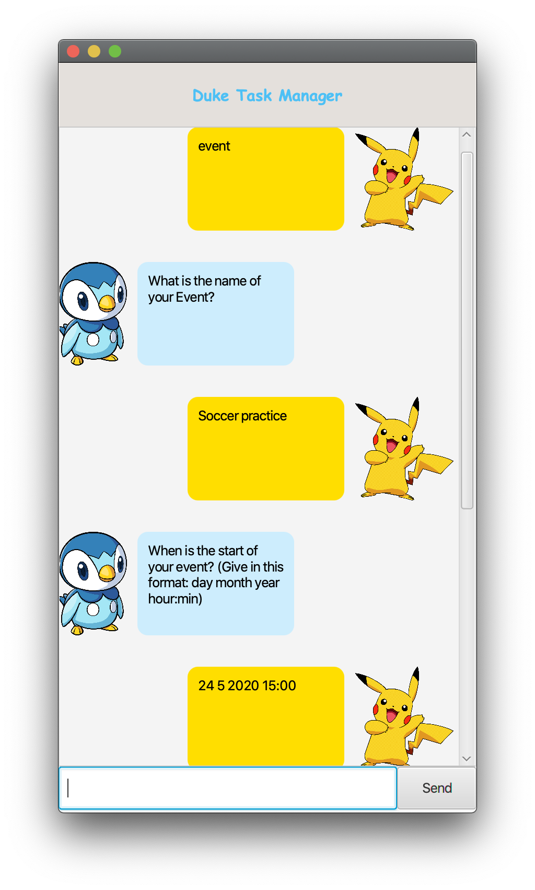
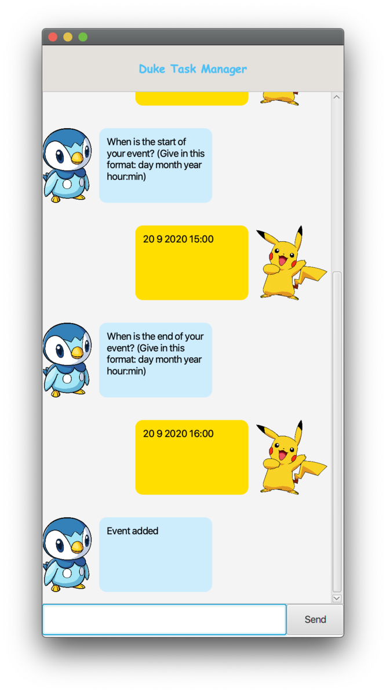
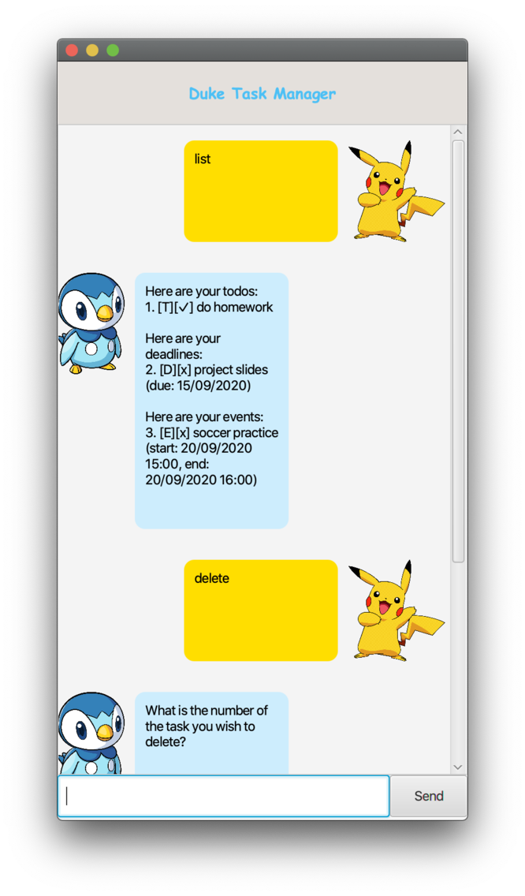
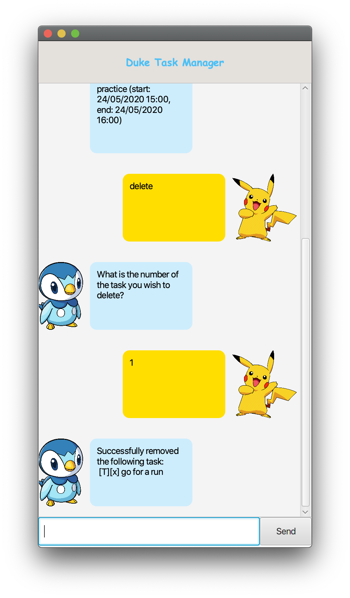
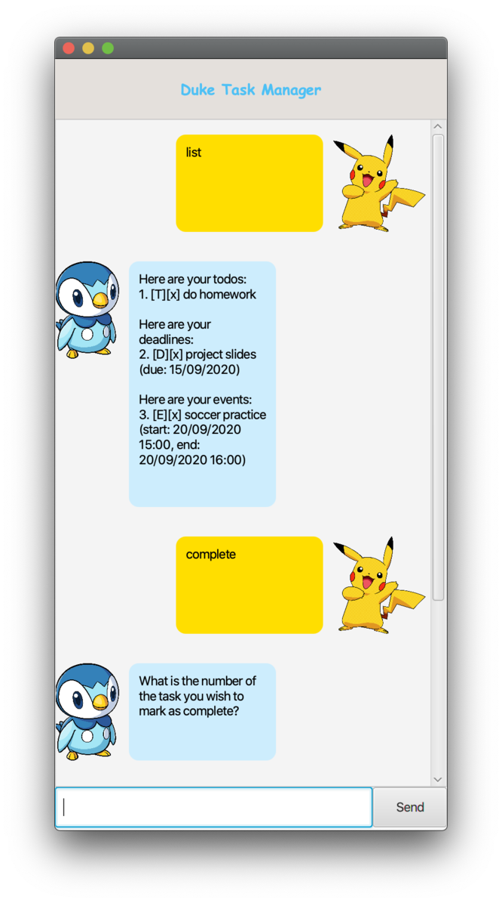
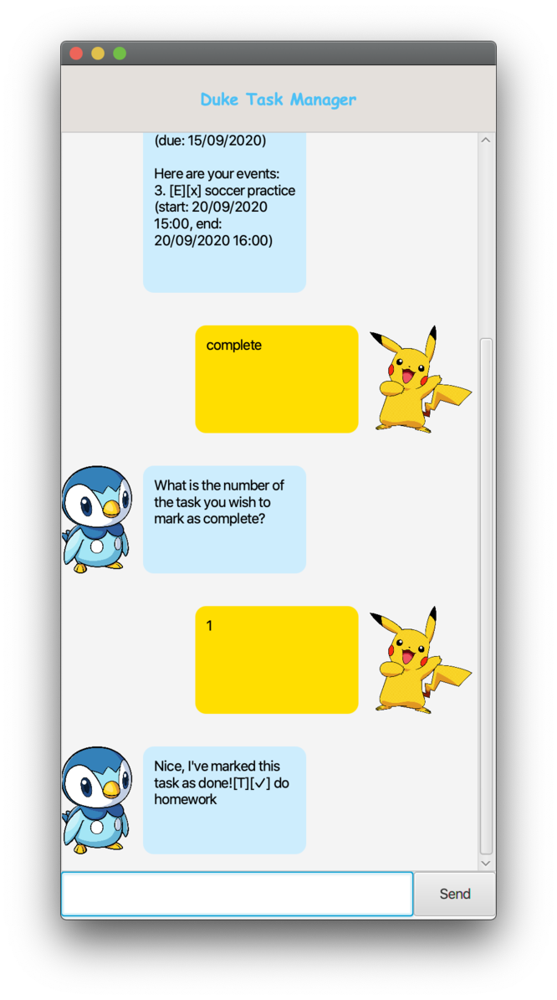

# User Guide
Duke is a simple task manager that can help you keep track of your todos,
deadlines and events.

## Quick Start
1. Ensure that you have Java `11` or above installed in your Computer.
2. Download the latest Duke.jar from here.
3. Copy the file to the folder you want to use as the home folder for Duke.
4. Double-click the file to start the app. 
5. Talk to Duke to manage your tasks.
6. Refer to [Features](#features) below for details of each command.

## Features 
1. [Add a todo](#add-a-todo)
2. [Add a deadline](#add-a-deadline)
3. [Add an event](#add-an-event)
4. [List all tasks](#list-all-tasks)
5. [Delete a task](#delete-a-task)
6. [Mark a task as complete](#mark-task-complete)
7. [Exit](#exit)

### Add a todo
Adds a todo

Format: `todo`, `<todo name>`

Example:

### Add a deadline
Adds a deadline.

Format: `deadline`, `<deadline name>`, `<deadline due date>`

Deadline due date should be given in this format: `dd mm yyyy`

Example:

### Add an event
Adds an event

Format: `event`, `<event name>`, `<event start time>`, `<event end time>`

Event timings should be given in this format: `dd mm yyyy HH:mm`

Example:

 

### List all tasks
Lists all tasks

Format: `list`

Example:

### Delete a task
Deletes a task. Task is indicated by its number in the list.

The number can be checked with the command `list`.

Format: `delete`, `<task number>`

Example:

 

### Mark task complete
Marks a task as completed. Task is indicated by its number in the list.

The number can be checked with the command `list`.

Format: `complete`, `<task number>`

Example:

 

### Exit
Exits the application.

Format: `bye`

Example:
