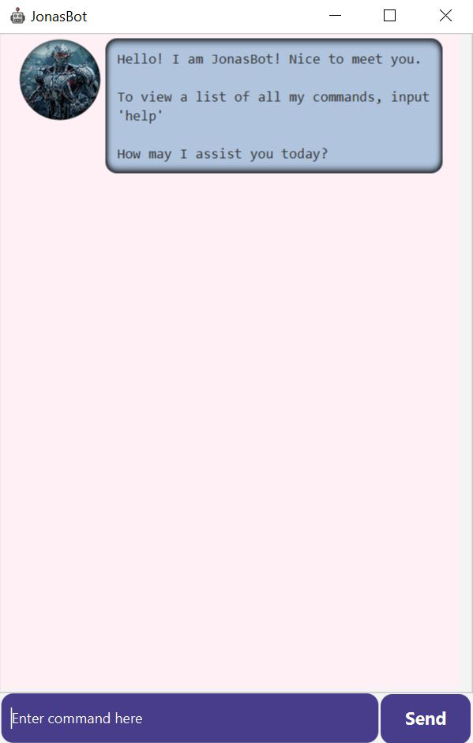

# Duke User Guide

## Introduction
Duke (a.k.a JonasBot) is a personalised chat bot that functions as a task manager, allowing
users to perform a variety of task related functions.
Duke is optimized for use via a **Command Line Interface** (CLI) 
while still having the benefits of a Graphical User Interface (GUI).

## Getting Started
1. Ensure that you have Java `11` or above installed in your computer.
2. You can find the latest version of Duke [here](https://github.com/jonasngs/ip/releases/tag/A-Release).
3. Download the `Duke.jar` file and copy the jar file to the folder you want to use as the home folder for Duke.
4. Double click the file to start the application.
4. You should be able to see the following application in a few seconds:


5. Enter commands into the command box located at the bottom of the application and click `Send` to execute it.
6. Refer to the functions below for details of each command.

## Duke Functions and Commands

### 1. Create a `todo` task 
**Command**: `todo <description>` <br/>
**Function**: Creates a new todo task and adds it to the user's list of tasks. <br/>
**Example of usage**: 
```
todo eat 
```
**Expected outcome**: 
```
Success! This task has been added:
[T][✗] eat
You have 1 tasks in your list now. 
```

### 2. Create a `deadline` task 
**Command**: `deadline <description> /by <date and time>` <br/>
**Note:** <br/> 
Date and time has to be in the format: dd/mm/yyyy hh:mm <br/>
**Function**: Creates a new deadline task and adds it to the user's list of tasks. <br/>
**Example of usage**: 
```
deadline finish quiz /by 1/10/2020 18:00 
```
**Expected outcome**: 
```
Success! This task has been added:
[D][✗] finish quiz (by: Thu, Oct 01 2020, 06:00 PM)
You have 1 tasks in your list now.
```

### 3. Create an `event` task 
**Command**: `event <description> /at <date and time>` <br/>
**Note:** <br/> 
Date and time has to be in the format: dd/mm/yyyy hh:mm <br/>
**Function**: Creates a new event task and adds it to the user's list of tasks. <br/>
**Example of usage**: 
```
event attend meeting /at 10/9/2020 12:00 
```
**Expected outcome**: 
```
Success! This task has been added:
[E][✗] attend meeting (at: Thu, Sep 10 2020, 12:00 PM)
You have 1 tasks in your list now.
```

### 4. Mark a task as `done` 
**Command**: `done <task ID>` <br/>
**Function**: Marks a task as completed. <br/>
**Example of usage**: 
```
done 1 
```
**Expected outcome**: 
```
Nice! I've marked this task as done:
[E][✓] attend meeting (at: Thu, Sep 10 2020, 12:00 PM)
```

### 5. `Delete` a task
**Command**: `delete <task ID>` <br/>
**Function**: Deletes a task from the user's list of tasks. <br/>
**Example of usage**: 
```
delete 1 
```
**Expected outcome**: 
```
Found it! This task has been successfully deleted: 
[E][✓] attend meeting (at: Thu, Sep 10 2020, 12:00 PM)
You have 0 tasks in your list now.
```

### 6. `Find` a task by `keyword`
**Command**: `find <keyword>` <br/>
**Function**: Finds and displays all tasks containing the search keyword. <br/>
**Example of usage**: 
```
find meeting 
```
**Expected outcome**: 
```
Here are the tasks that I have found:
1. [E][✓] attend meeting (at: Thu, Sep 10 2020, 12:00 PM)
```

### 7. `Find` a task by `date`
**Command**: `find_by_date <date>` <br/>
**Note:** <br/>
Date has to be in the format: dd/mm/yyyy <br/>
**Function**: Finds and displays all tasks matching the search date. <br/>
**Example of usage**: 
```
find_by_date 10/9/2020 
```
**Expected outcome**: 
```
Here are the tasks that I have found:
1. [E][✓] attend meeting (at: Thu, Sep 10 2020, 12:00 PM)
```

### 8. `Tag` a task 
**Command**: `tag <task ID> <tag>` <br/>
**Function**: Attaches a tag to the desired task. <br/>
**Example of usage**: 
```
tag 1 fun
```
**Expected outcome**: 
```
Nice! I've added the tag to your task:
[E][✓][#fun] attend meeting (at: Thu, Sep 10 2020, 12:00 PM)
```

### 9. `List` out all tasks 
**Command**: `list` <br/>
**Function**: List out all the user's tasks. <br/>
**Example of usage**: 
```
list
```
**Expected outcome**: 
```
Here are the tasks that I have found:
1. [E][✓][#fun] attend meeting (at: Thu, Sep 10 2020, 12:00 PM)
2. [D][✗] finish quiz (by: Thu, Oct 01 2020, 06:00 PM)
3. [T][✗] eat
```

### 10. Seek `help` for functions and commands 
**Command**: `help` <br/>
**Function**: List out all of Duke's functions and their respective commands. <br/>
**Example of usage**: 
```
help
```
**Expected outcome**: 
```
Below is a list of all the commands for my functions: 

1. Create a new task: 

1.1 Todo: 'todo <task description>'. For eg, todo eat 

1.2 Deadline: 'deadline <task description> /by <deadline date>'. Input the date using the format: dd/mm/yyyy hh:mm. For eg, deadline return book /by 12/2/2020 13:00 

1.3 Event: 'event <task description> /at <event date>'. Input the date using the format: dd/mm/yyyy hh:mm. For eg, event project meeting /at 1/3/2020 12:00 

2. To display all tasks in your list: 'list' 

3. To mark a task as completed: 'done <task ID>'. For eg, done 2 

4. To delete a task: 'delete <task ID>'. For eg, delete 2 

5. To search for a task by keyword: 'find <keyword>'. For eg, find book

6. To search for a task by date: 'find_by_date <date>'. Input the date using the format: dd/mm/yyyy. For eg, find_by_date 12/2/2020

7. To tag a task: 'tag <task ID> <tag>'. For eg, tag 1 fun

8. To end this chat: 'bye'.
```

### 11. `Exit` the session with Duke 
**Command**: `bye` <br/>
**Function**: Terminates the session with Duke. <br/>
**Example of usage**: 
```
bye
```
**Expected outcome**: 
```
Goodbye... For now.
```
