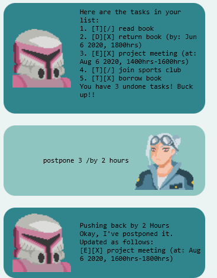
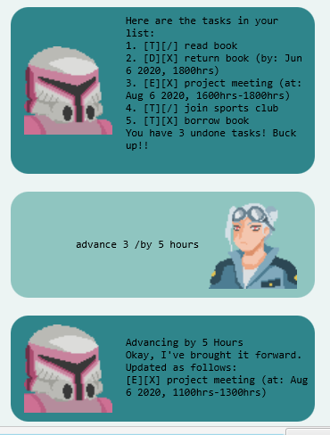

# User Guide
**Alpha** is a **desktop chatbot app for managing tasks**, 
optimized for use via a Command Line Interface. 
Use Alpha to quickly get your life on-task! Here's a 
quick breakdown of Alpha's features.
 
## Features

### Add a task
Alpha supports 3 types of tasks:
1. To-do (basic task)
2. Deadline (to-do with a deadline)
3. Event (has a start and end time) 

#### Add to-do: `todo`
Adds a to-do to the task list.

Format: `todo <Description>`

Examples: 
* `todo finish Sci-Fi readings for class`
* `todo buy eggs and chicken` 

#### Add deadline: `deadline`
Adds a deadline to the task list.

Format: `deadline <Description> /by <Time>`

_Note: Time format =_ `Date Time` = `YYYY-MM-dd HHmm`

Examples: 
* `deadline Philosophy essay /by 2020-09-18 2359`
* `deadilne Figma UI markup /by 2020-09-25 1800`

#### Add event: `event`
Adds an event to the task list.

Format: `event <Description> /at <Time>`

_Note: Time format =_ `Date startTime-endTime` = `YYYY-MM-dd HHmm-HHmm`

Examples: 
* `event Art Exhibition Opening /at 2020-09-20 1800-2200`
* `event Ultra Hackathon /at 2020-10-14 0800-2300`

### View task list: `list`
Lists out all tasks in the task list.

Example of usage: `list`

Expected outcome: 

### Removing a task: `delete`
**Removes** a task from the task list.

Format: `delete <index>`
* Tasks are identified by index
* The index refers to the index number shown in the displayed task list.
* Index begins from 1. It needs to be a positive integer.

Examples:
* `delete 1` 
* `delete -1` -> `ERROR` 

### Mark task as complete: `done`
Marks a task as **completed**.

Format: `done <index>`
* Tasks are identified by index
* The index refers to the index number shown in the displayed task list.
* Index begins from 1. It needs to be a positive integer.

Examples:
* `done 1` 
* `done -1` -> `ERROR` 

### Find a task: `find`
Find a task whose description contains the given search term.

Format: `find <Search Term>`
* search term is a `String` searching for a match amongst the task descriptions
* search term is case-insensitive

Example of usage: 
* `find ultra`
* `find book`

Expected outcome: 

### Postpone a deadline/event: `postpone`
Postpone a deadline or event.

Format: `postpone <index> /by <amount> <time unit>`

Supported time units: 
* `year(s)`
* `month(s)`
* `day(s)`
* `hour(s)`
* `minute(s)`

Example of usage: `postpone 3 /by 2 hours`

Example of outcome:

 

### Advance a deadline/event: `postpone`
Advance (brings forward) a deadline or event.

Format: `advance <index> /by <amount> <time unit>`

Supported time units: 
* `year(s)`
* `month(s)`
* `day(s)`
* `hour(s)`
* `minute(s)`

Example of usage: `advance 3 /by 2 hours`

Example of outcome:

 

## Command Summary

Action | Format, Examples
___|___
Add To-do |  `todo <Description>` E.g.: `todo finish Sci-Fi readings for class` 
Add Deadline | `deadline <Description> /by <Time>` 
E.g.: `deadline Philosophy essay /by 2020-09-18 2359`
Add Event |  `event <Description> /at <Time>` 
E.g.: `event Art Exhibition Opening /at 2020-09-20 1800-2200`
List | `list`
Delete | `delete <index>`
Done | `done <index>`
Find |  `find <search term>`
Postpone | `postpone <index> <amount> <time unit>` 
E.g.: `postpone 3 /by 2 hours` 
Advance | `advance <index> <amount> <time unit>` 
E.g.: `advance 3 /by 2 hours` 
