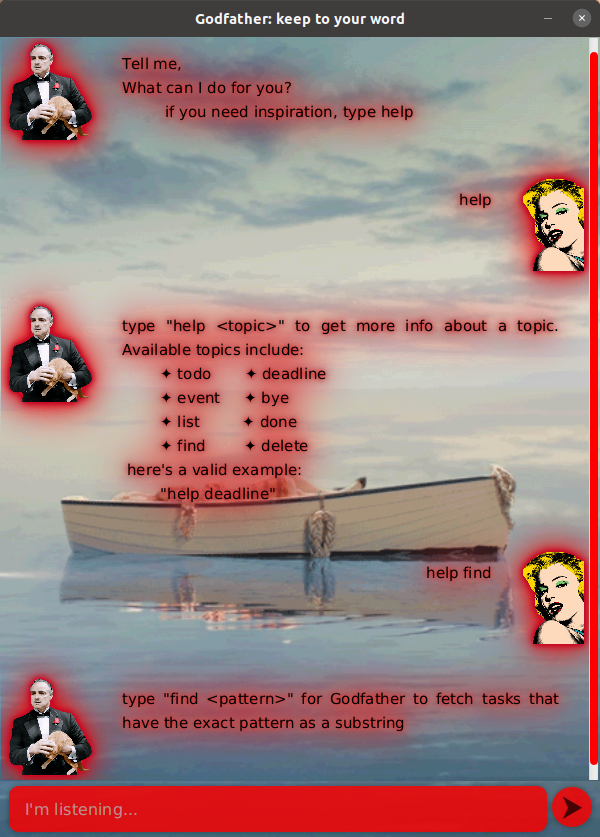
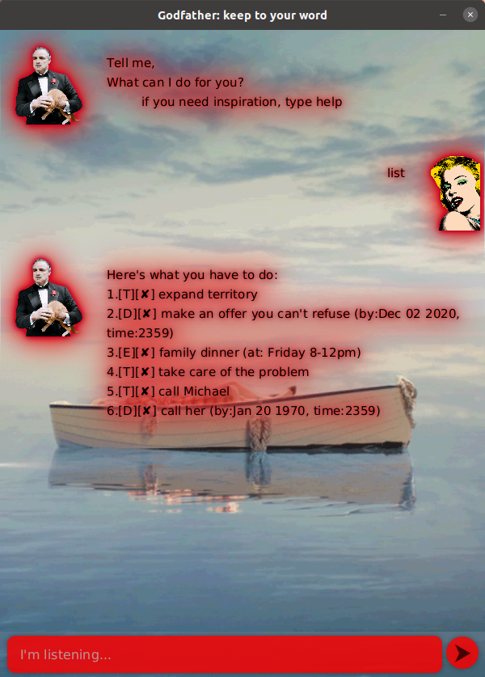
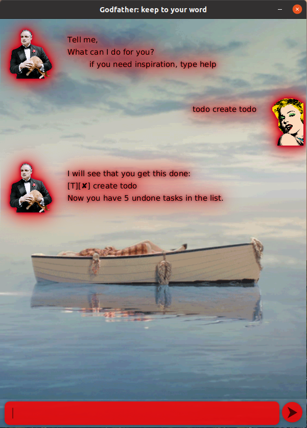
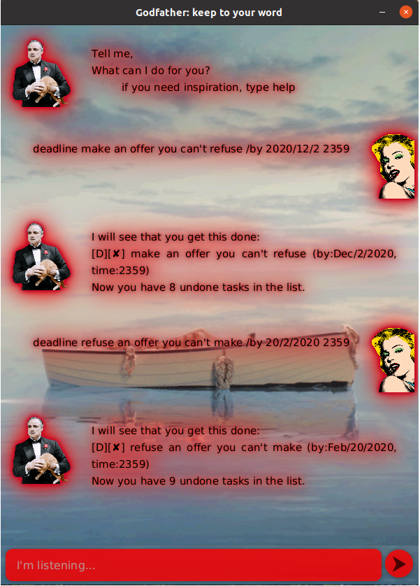
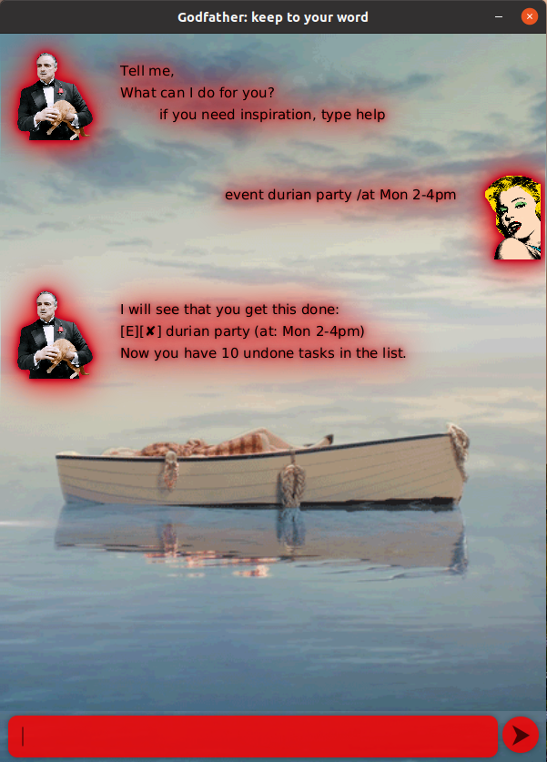
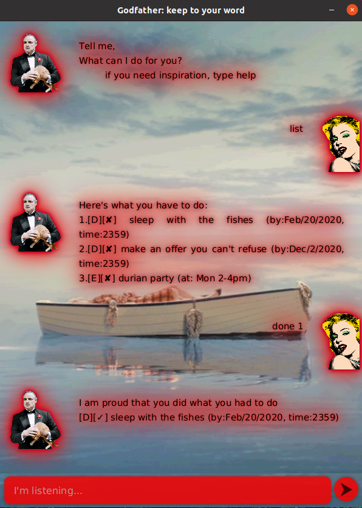
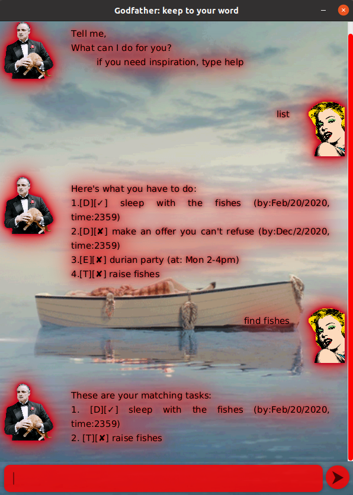
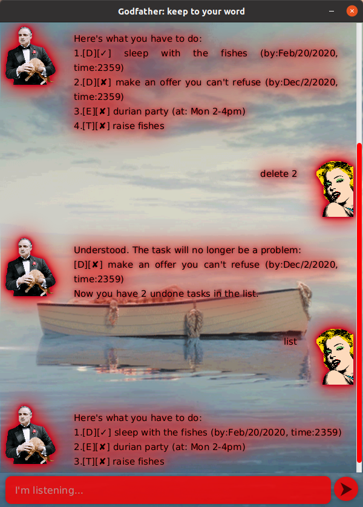

# User Guide

> This individual project is a 
  *greenfield project* as part of **CS2103: Software Engineering**. It is inspired by Marlon Brando's 
  depiction of the titular character of ***The Godfather***, Vito Corleone. A person of poise, control and composure; users of this application
  may find themselves emulating him after keeping track of their tasks.

***Godfather*** makes sure you stick to your word and complete the tasks that you want to get done. 
Be it your todos you've yet to do, your deadlines that you've promised to keep to or events that you have to attent,
let the _Capo_, ***Vito Corleone*** know and he'll make sure you don't miss it. 

Here's how someone might use ***The Godfather***:
 

# Contents

- [User Guide](#user-guide)
- [Contents](#contents)
- [Features](#features)
  - [Seeking Help](#seeking-help)
    - [`help` - get help on syntax](#help---get-help-on-syntax)
  - [Listing All Data](#listing-all-data)
    - [`list` - list all tasks](#list---list-all-tasks)
  - [Exiting the Program](#exiting-the-program)
    - [`bye` - terminate the program](#bye---terminate-the-program)
  - [Creating TODOs](#creating-todos)
    - [`todo TASK_DESCRIPTION` - create tasks](#todo-task_description---create-tasks)
  - [Creating Deadlines](#creating-deadlines)
    - [`deadline DEADLINE_DESCRIPTION /by DATE TIME` - Create deadline](#deadline-deadline_description-by-date-time---create-deadline)
  - [Creating Events](#creating-events)
    - [`event EVENT_DESCRIPTION /at  DATE_STRING START_TIME-ENDTIME` - create event](#event-event_description-at-date_string-start_time-endtime---create-event)
  - [Completing your Tasks](#completing-your-tasks)
    - [`done TASK_ID` - mark the task as done](#done-task_id---mark-the-task-as-done)
    - [Finding your Tasks](#finding-your-tasks)
    - [`find SEARCH_TERM` - Describe action](#find-search_term---describe-action)
  - [Deleting your Tasks](#deleting-your-tasks)
    - [`delete TASK_ID` - deletes specified task](#delete-task_id---deletes-specified-task)
  - [Saving your Data](#saving-your-data)
- [How it Works](#how-it-works)
- [Coming Soon!](#coming-soon)
- [Acknowledgements](#acknowledgements)

# Features 
Below are some features that ***Godfather*** supports. You may type out commands in any case you wish. He understands that
`hElP`,`HELP` and `help` mean the same thing.

## Seeking Help 
***Godfather*** helps you remember the syntax for various commands. It is no disrespect to forget the nitty-gritty details but 
finding out how to get it done is important. 

### `help` - get help on syntax

Calling `help` will return a generic help page, passing it a command word, `help find`, will give specific
help.

**Example of usage:** 

`help (COMMANDWORD)`

**Expected Outcome:**

## Listing All Data 
Godfather can give you all your remaining undone and done tasks in one go for you to see what you've promised to do.

### `list` - list all tasks

Lists all remaining undone and done tasks that haven't been deleted.

**Example of usage:** 

`list`

**Expected Outcome:**

## Exiting the Program 
Helps you terminate the program safely.

### `bye` - terminate the program

Simply exits the java application.

**Example of usage:** 

`bye`

**Expected Outcome:**

Program termination.

## Creating TODOs 
Todos help loosely keep track of what tasks need to be done in the future.

### `todo TASK_DESCRIPTION` - create tasks

Create a todo action by passing in a description for the task

**Example of usage:** 

`todo create todo`

**Expected Outcome:**

## Creating Deadlines 
Deadlines help keep track of tasks that have to be done by a particular date and time.

### `deadline DEADLINE_DESCRIPTION /by DATE TIME` - Create deadline

**Example of usage:** 
`deadline make an offer you can't refuse /by 2020/12/2 2359`

* ***Godfather*** can handle multiple date formats. Currently supported date formats:
    * `d/M/yyyy` e.g. `20/01/2020`
    * `yyyy/M/d` e.g. `2020/01/20`
    
    For the technically savvy, these formats are outlined in the `DateTimeFormat.java` enumeration class, and allows 
    anyone to add other DateTimeFormats of their choice. Custom date formats can be used because of this easy extensibility.
    
* ***Godfather*** currently accepts only `HHmm` as the time format e.g. `2359`. Similar to Date formats, custom
time formats may be added in the `DateTimeFormat.java` enumeration class. 

**Expected Outcome:**

## Creating Events 
Events happen on a particular date and time

### `event EVENT_DESCRIPTION /at  DATE_STRING START_TIME-ENDTIME` - create event

**Example of usage:** 

`event durian party /at Mon 2-4pm`

**Expected Outcome:**

## Completing your Tasks
Once you're done with you task, you'd want to mark them as done.

### `done TASK_ID` - mark the task as done

Marks the task as done whereby the task is displayed with a preceding ✓ (for done) instead of ✘ symbol. 

**Example of usage:** 

`done 1`

**Expected Outcome:**

### Finding your Tasks

***Godfather*** can find your tasks for you as long as you know what you're looking for.

### `find SEARCH_TERM` - Describe action

Finds the tasks with descriptions that match the exact search term, case sensitive, that the user passes in.

**Example of usage:** 

`find fishes`

**Expected Outcome:**

## Deleting your Tasks 
***Godfather*** believes there's no need to remember things that have no effect on us. Hence, tasks ought to 
be delete-able.

### `delete TASK_ID` - deletes specified task

Deletes a single task of that ID.

**Example of usage:** 

`delete 2`

**Expected Outcome:**

## Saving your Data

***Godfather*** never fails to safely store your data. Your battery may die or you may spill coffee on your device,
your data will still be safe.

# How it Works
todo

# Coming Soon!
todo

# Acknowledgements

***Images and Tools Used:***
* Demonstration GIFs have been captured using [OBS Studio](https://obsproject.com/)
* Gifs cropped from [this online tool](http://gifgifs.com/crop/)
* Background GIF taken from [Christian Blanchard](http://christianblanchard.com/hs-cinemagraph/)
* Marilyn Monroe's picture from [PNG Guru](https://www.pngguru.com/free-transparent-background-png-clipart-zpbso)
* Marlon Brando's picture from [??? todo](https://example.com)
 

