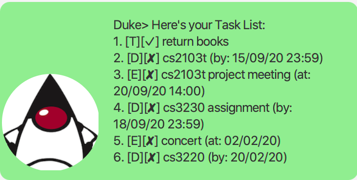
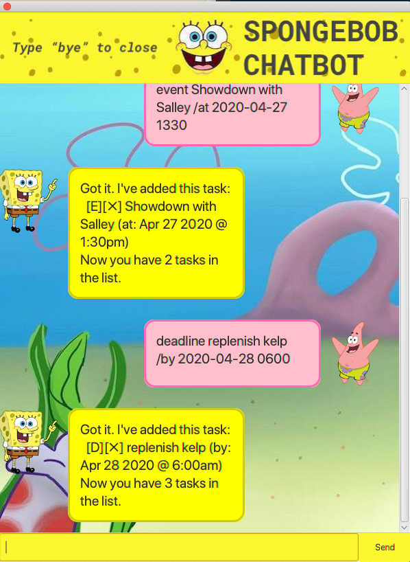
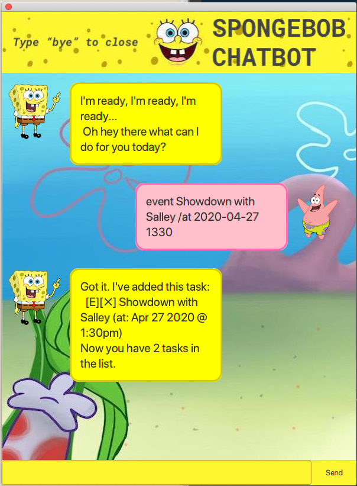
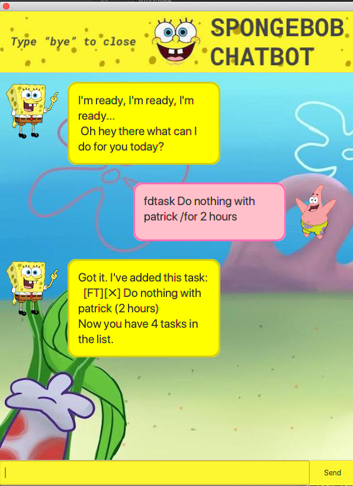
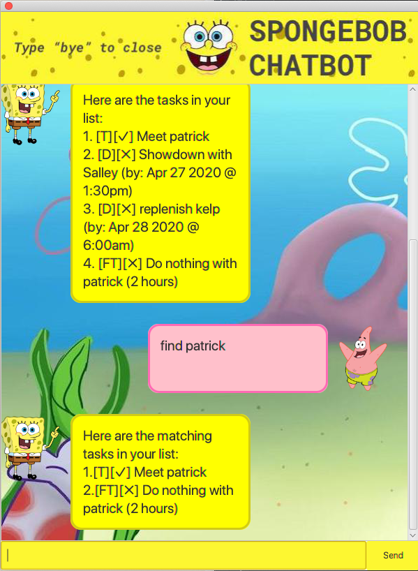
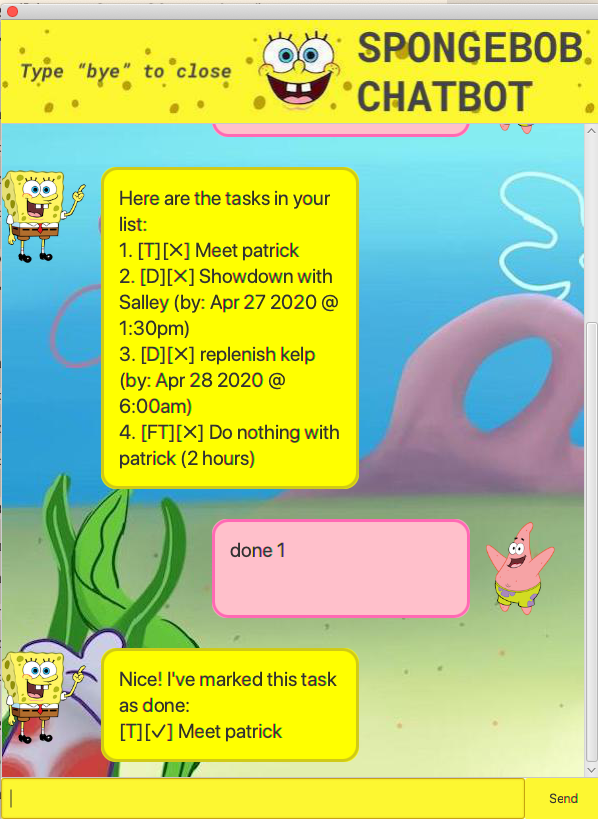
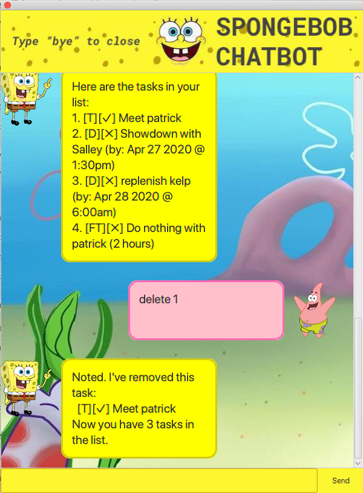

# User Guide

Spongebob, the highly efficient/reknowned employee of the fine establishment that is the Krusty Krab, is now offering his services as your personal assistant to help you through this arduous CS life.

## Features 

### Multi-purpose Tasklist
In this tasklist you will be able to add, delete different types of tasks in your tasklist. This includes:
- TODOS -- A simple task such as "Feed Gary" or "Complete CS2103 IP submission"
- FIXED_DURATION_TASKS -- For tasks with fixed durations "Complete 5x Burgers in 2hours)
- DEADLINES -- For tasks with deadline, "Replenish Kelp stock by 20 March 2020"
- EVENTS -- For events such as "Do nothing with patrick on 31 Feb 2020"

Youll be able to mark these tasks as done once you are done with them (Integrity please.)

### Search through your Tasklist
Spongebob can also help you quickly find tasks by keywords.

### Duplicate Tasks
Spongebob ensures that you do not accidentally add duplicate tasks so as to not artificially inflate your tasklist.

### Saves Tasklist on computer
Spongebob saves your tasklist on your computer so that no one can see your private tasks ;)

## Usage

### `list` - View all tasks

This allows you to view all tasks

Example of usage: 

`list`

Expected outcome:

### `bye` - Closing Spongebob

Closes the program

Example of usage: 

`bye`

Expected outcome:

`Program Closes.`

### `todo TASK_DESCRIPTION` - Create new TODO task.

Creates a new TODO task.

Example of usage: 

`todo buy kelp`

Expected outcome:

`outcome`

### `deadline TASK_DESCRIPTION /by YYYY-MM-DD HHmm` - Create new DEADLINE task.

Creates a new DEADLINE task.

Example of usage: 

`deadline replenish kelp /by 2020-04-28 0600`

Expected outcome:

### `event TASK_DESCRIPTION /at YYYY-MM-DD HHmm` - Create new EVENT task.

Creates a new EVENT task.

Example of usage: 

`event Showdown with Salley /at 2020-04-27 1330`

Expected outcome:

### `fdtask TASK_DESCRIPTION /for TASK_DURATION` - Create new FIXED_DURATION_TASK task.

Creates a new FIXED_DURATION_TASK task.

Example of usage: 

`fdtask Do nothing with patrick /for 2 hours`

Expected outcome:

### `find QUERY` - Completes a task.

Searches through your tasklist to find tasks whose description contains your query

Example of usage: 

`find patrick`

Expected outcome:

### `done TASK_ID` - Completes a task.

Marks a Task as done. TASK_ID can be found using `list`

Example of usage: 

`done 1`

Expected outcome:

### `delete TASK_ID` - Deletes a task.

Deletes a task. TASK_ID can be found using `list`

Example of usage: 

`delete 1`

Expected outcome:

