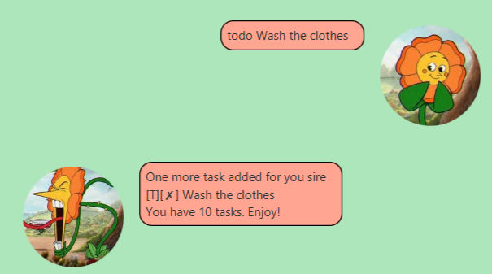
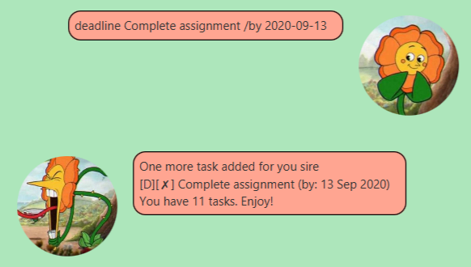
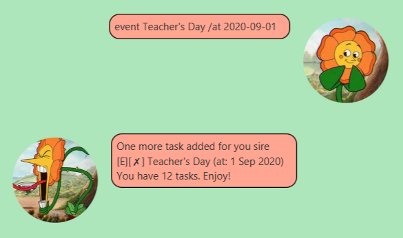
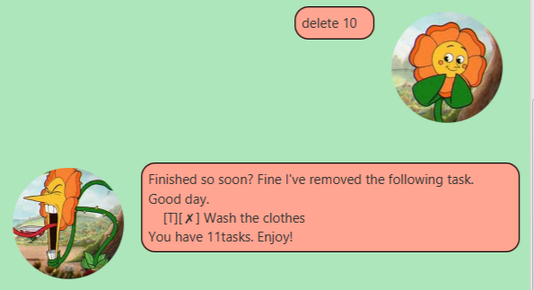
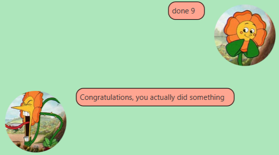
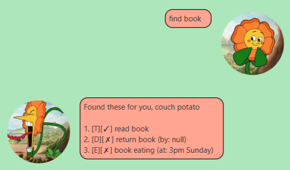
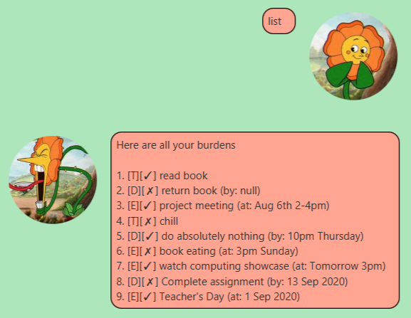
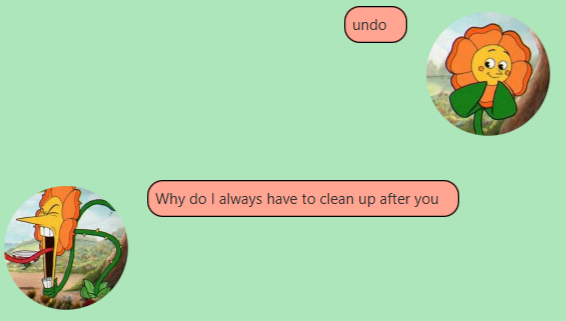

# User Guide
The Duke is a chatbot which can manage your tasks and deadlines effectively which great control
given to the users. It is particularly targeted to fast typers who will be able to maximise its
usage of various commands.

Its aggressive and unmotivational personality is given to provide the user "someone they can prove wrong",
and serves as a further motivation for them to complete their tasks.
## Features 

### Feature 1 `todo`
Add a Todo task to your list of tasks

## Usage

### `todo <taskname>` - Add a Todo task

Add's a Todo task to the task list. The taskname argument provides the name that will be
given to the Todo task.

Example of usage: 

### Feature 2: `deadline`
Add a Deadline task to the task list.

## Usage

### `deadline <taskname> /by <deadline>` - Add a Deadline task

Add's a Deadline task to the task list. The taskname argument provides the name that will be
given to the Deadline task.

The deadline argument provides the information for when the Deadline task is due.
If it is formatted in a YYYY-MM-DD style, the bot will display it in a more readable format.

Example of usage: 

### Feature 3: `event`
Add an Event task to the task list.

## Usage

### `event <taskname> /by <event date>` - Add an Event task

Add's an Event task to the task list. The taskname argument provides the name that will be
given to the Event task.

The event data argument provides the information for when the Event task will occur.
If it is formatted in a YYYY-MM-DD style, the bot will display it in a more readable format.

Example of usage:
 

### Feature 4: `delete`
Delete a task from the task list.

## Usage

### `delete <task number>` - Delete a task

Delete's a task from the task list. Task deleted is given by the task number argument.

Example of usage:
 

### Feature 5: `done`
Marks a task as completed.

## Usage

### `done <task number>` - Mark a task as completed

Mark's a task as completed. The Task to be marked is given by the task number argument.

Example of usage:
 

### Feature 6: `find`
Find a task containing a keyword in the list of tasks

## Usage

### `find <keyword>` - Find task by keyword

Find's tasks in the list of tasks which match the given keyword.

Example of usage:
 

### Feature 7: `list`
List all tasks.

## Usage

### `list` - List all tasks

List's all the tasks.

Example of usage:
 

### Feature 8: `undo`
Undo the last command. 

## Usage

### `undo` - Undo last command

Undoes the last command that was given among the following commands

* `todo`
* `deadline`
* `event`
* `delete`
* `done`

Example of usage:
 
