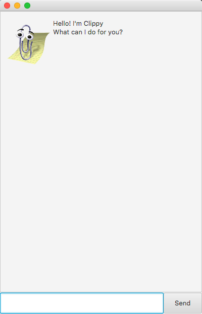

# Clippy User Guide
Clippy is a desktop app for managing tasks, optimized for use via a Command Line Interface (CLI). You can keep track of 
your day-to-day tasks, search for specific tasks by keywords and update details of tasks. If you can type fast, Clippy 
can help you keep track of your tasks faster than traditional GUI apps.

# Table of Content
1. About this document
2. Quick start
3. Features
    1. Viewing help : `help`
    2. Adding a task: `todo`, `deadline`, `event`
        1. Adding a todo task: `todo`
        2. Adding a deadline task: `deadline`
        3. Adding an event task: `event`
    3. Listing all tasks : `list`
    4. Updating a task : `update`
    5. Marking a task as done: `done`
    6. Searching for a task by keyword: `find`
    7. Deleting a task : `delete`
    8. Exiting the program : `bye`
    9. Saving the data
4. FAQ
5. Command Summary

# 1. About this document
This document shows you all the features in Clippy and helps you familiarise with the commands. 

Note the following symbols and formatting used in this document:

: This symbol indicates important information
   
`list`: Words in grey mark-up indicates that this is a command that you can type into the command line and executed.
   
`<task description>`: Words in grey mark-up and within angled brackets are the parameters to be supplied by you.

e.g. in `find <keyword>`, `<keyword>` is a parameter which can be used as `find exercise`.
   
Items separated by `|` are alternatives, and the usage depends on the scenario.

e.g `update <task index> <new task description> [/by|/at <new time/date>]` can be used as 

`update 2 java workshop /at Tuesday 6-7pm` if the 2nd task in the list is an event, 

or

`update 3 sign up for lesson /by 2020-09-30` if the 3rd task in the list is a deadline.
   
Items in square brackets are optional.

e.g `update <task index> <new task description> [/at <new time/date>]` can be used as 

`update 2 java workshop`

or 

`update 2 java workshop /at Tuesday 6-7pm`.

# 2. Quick start
1. Ensure you have Java 11 or above installed in your Computer.
2. Download the latest clippy.jar from https://github.com/wang-jun-hao/ip.
3. Copy the file to the folder you want to use as the home folder for your Clippy.
4. Double-click the file to start the app. The GUI similar to the below should appear in a few seconds.   
5. Type the command in the command box and press Enter to execute it.  e.g. typing `help` and pressing Enter will open the help window.
6. Refer to the Features below for details of each command.

# 3. Features 
## 3.1 Viewing help: `help`
Displays a message explaining how to access the user guide.
### Format
`help`

Expected outcome:

## 3.2 Adding a task: `todo`, `deadline`, `event`
Adds a task for Clippy to keep track of.

## 3.2.1 Adding a todo task: `todo`
Adds a todo task for Clippy to keep track of. You should add a task as a todo when the task does not have a date/time attached to it.
### Format
`todo <task description>`
### Usage
Example of usage:
* `todo exercise at the gym`

Expected outcome:

## 3.2.2 Adding a deadline task: `deadline`
Adds a deadline task for Clippy to keep track of. You should add a task as a deadline when the task needs to be done 
before a specific date.
### Format
`deadline <task description> /by <YYYY-MM-DD>`

: You have to provide the date in the exact `YYYY-MM-DD` format.
### Usage
Example of usage:
* `deadline sign up for hackathon /by 2020-09-30`

Expected outcome:

## 3.2.3 Adding an event task: `event`
Adds an event task for Clippy to keep track of. You should add a task as an event when the task occurs 
at a specific date/time period.
### Format
`event <task description> /at <date/time period>`

: You do not have to follow any format for `<date/time period>`.
### Usage
Example of usage:
* `event java workshop /at Tuesday 6-7pm`

Expected outcome:

## 3.3 Listing all tasks: `list`
Shows a list of all tasks being managed by Clippy.
### Format
`list`

Expected outcome:

## 3.4 Updating a task: `update`
Updates the details of an existing task being managed by Clippy. Suppose you made a mistake when entering the description of an event. You can use `update` to edit the event’s description.
### Format
`update <index> <new task description> [/by|/at <new time/date>] `

* Updates the task at the specified `index`. 
* The `index` refers to the index number shown in the displayed tasks list after using the list command. 
* The `index` must be a positive integer 1, 2, 3, ...
* Existing description will be updated to the input description.
* Optional: `/by` or `/at` command can be added at the end, followed by `<new date/time>`, if you want to update the description and date/time of a deadline or event task.
*  Note the following:
  * A todo task does not have a date/time and the `/by` or `/at` command cannot be used when updating a todo
  * Use `/by` command when the task is a deadline
  * Use `/at` command when the task is an event

### Usage
Example of usage:
* `event birthday party /at 25 Nov 1-4pm`   `update 1 19th birthday party`   updates the description of the 1st task in the list to 19th birthday party.

Expected outcome:

* `update 1 19th birthday party /at 25 Nov 5-10pm`   updates the description and date/time of the 1st task in the list to 19th birthday party at 25 Nov 5-10pm.

Expected outcome:

## 3.5 Marking a task as done: `done`
Marks a task as done when you have completed the task. This helps you to keep track of which tasks are done and not done.
### Format
`done <index>`
* Marks the task at the specified `index` as done. 
* The `index` refers to the index number shown in the displayed tasks list after using the list command. 
* The `index` must be a positive integer 1, 2, 3, ...
* Clippy will change the status icon of the specified task from [✗] to [✓]

### Usage
Example of usage:
* `done 2` marks the 2nd task in the list as completed

Expected outcome:

## 3.6 Searching for a task by keyword: `find`
Finds tasks whose description contains the given keyword.
### Format
`find <keyword>`

* The search is case-sensitive. e.g. if ‘exercise’ tasks exists, `find Exercise` will not be able to find this task. `find exercise` will return the task.
* Searches through only the description of tasks.
* Words that contain the keyword as a prefix will be matched e.g. `exer` will match `exercise`.
* All tasks matching the keyword prefix will be returned.

### Usage
Example of usage:
* `todo buy xbox`   `todo buy ps5`   `find buy`   returns 2 tasks with description ‘buy xbox’ and ‘buy ps5’

Expected outcome:

## 3.7 Deleting a task: `delete`
Deletes the specified task from Clippy.
### Format
`delete <index>`

* Deletes the task at the specified `index`.
* The `index` refers to the index number shown in the displayed tasks list after using the list command. 
* The `index` must be a positive integer 1, 2, 3, …​

### Usage
Example of usage:
* `list` followed by `delete 2` deletes the 2nd task in the task list.

Expected outcome:

## 3.8 Exiting the program: `bye`
Exits the program.
### Format
`bye`

## 3.9 Saving the data
Clippy’s data is saved in the hard disk automatically after any command that changes the data. There is no need to save manually.

# 4. FAQ
Q: How do I transfer my data to another Computer?

A: Install the app in the other computer and overwrite the empty data file it creates with the file that contains the data of your previous Clippy home folder.

# 5. Command Summary

Action | Format, Example usage
------ | ------
Add | `todo <task description>`   `deadline <task description> /by <YYYY-MM-DD>`   `event <task description> /at <date/time period>`   e.g. `event java workshop​ /at Tuesday 6-7pm`
List | `list`
Update | `update <task index> <new task description> [/by (OR) /at <new time/date>]`   e.g. `update 1 19th birthday party /at 25 Nov 5-10pm`
Mark as done | `done <index>`   e.g. `done 2`
Find | `find <keyword>`   e.g. `find workshop`
Delete | `delete <index>`   e.g. `delete 5`
Help | `help`