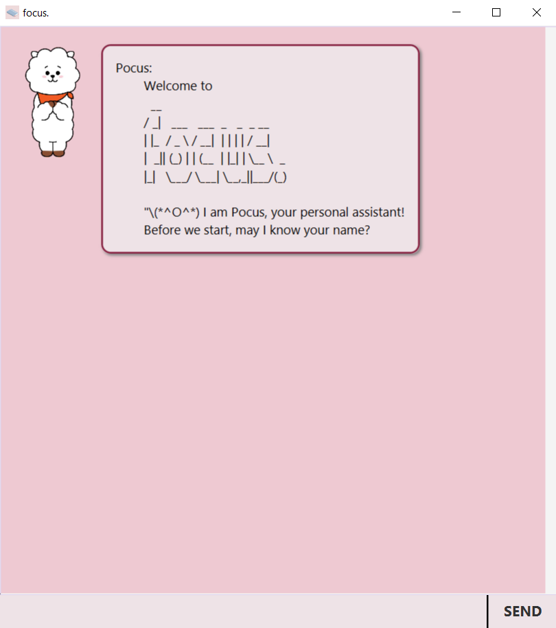
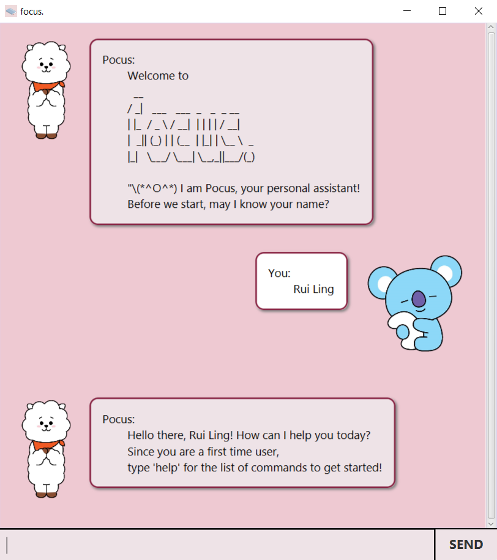
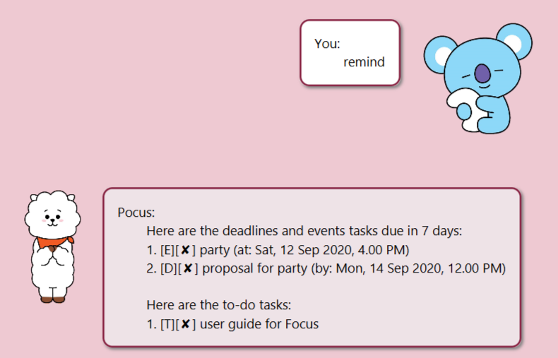
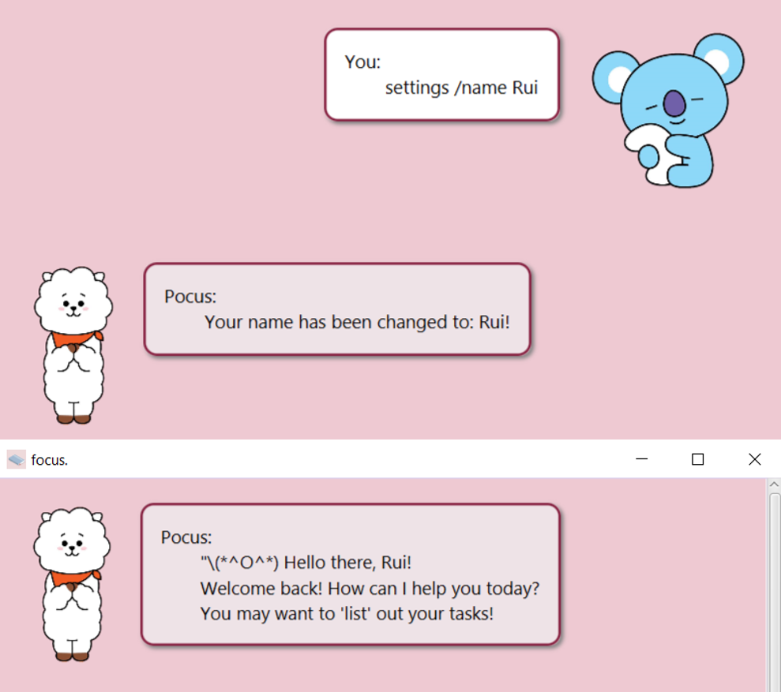
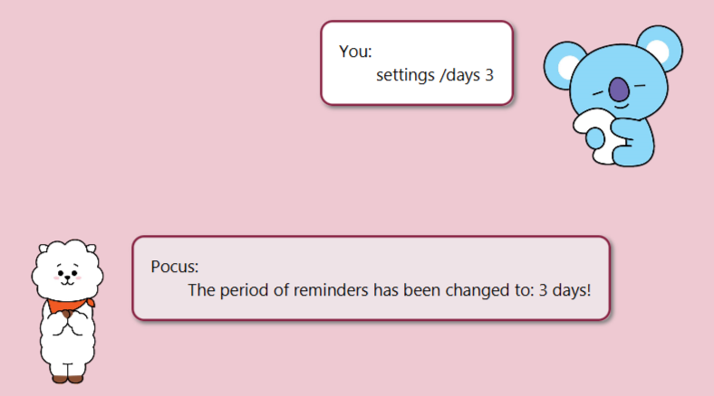
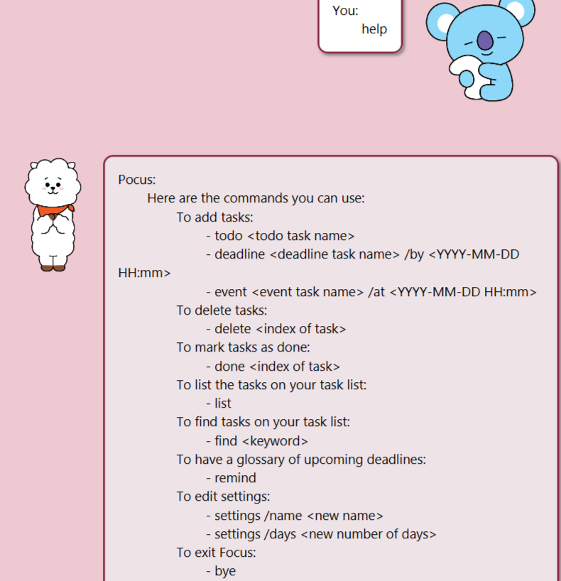
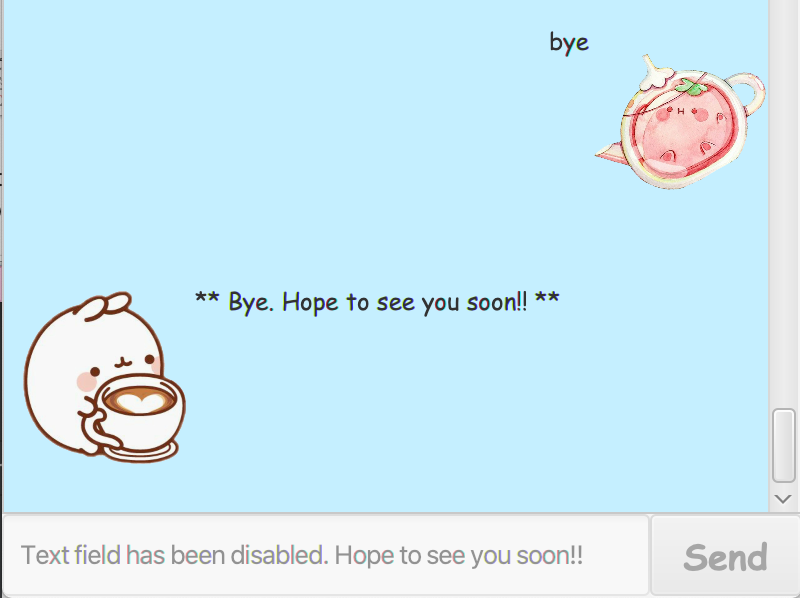

# User Guide to Focus

## Content Page
1. [Introduction](#introduction)
2. [Getting Started](#getting-started)
3. [Features](#features)
4. [Additional Help](#additional-help)
5. [Acknowledgements](#acknowledgements)

## Introduction
Meet Pocus in Focus! An all-in-one task manager to help you better plan your time.
With a simple interface and easy-to-use commands, you would be able to use Focus effectively!

## Getting Started
1. Ensure that you have at least **Java 11** installed in your laptop.
2. Download **v0.2 focus.jar** file [here](https://github.com/ruilingk/ip/releases/tag/A-Release).
3. Once downloaded, double-click it to run.
4. You should see something like this:  

5. Start by typing in your name!  

6. Next, start talking to Pocus and manage your tasks!

## Features 
1. [Add tasks of different types](#feature-1)
2. [Mark tasks as done](#feature-2)
3. [List tasks](#feature-3)
4. [Delete tasks](#feature-4)
5. [Find tasks with specified keyword](#feature-5)
6. [Reminder within specified period](#feature-6)
7. [Settings](#feature-7)
8. [List commands available](#feature-8)
9. [Exit Focus](#feature-9)

### Feature 1
Pocus helps you to add 3 different types of tasks, namely ToDo, Deadline and Event.

#### Usages

##### 1. Add ToDo tasks - `todo TODO_DESCRIPTION`
Adds a todo task to your task list, with no specific deadlines attached to it.

Example of usage: 
`todo user guide for Focus`

Expected outcome:  

##### 2. Add Deadline tasks - `deadline DEADLINE_DESCRIPTION /by YYYY-MM-DD HH:mm`
Adds a deadline task to your task list, with a deadline attached to it.

Example of usage: 
`deadline iP /by 2020-09-18 23:59`

Expected outcome:  

##### 3. Add Event tasks - `event EVENT_DESCRIPTION /at YYYY-MM-DD HH:mm`
Adds an event task to your task list, with a date and time attached to it.

Example of usage: 
`event Christmas Party /at 2020-12-25 18:00`

Expected outcome:  

### Feature 2
Pocus helps you to mark the tasks that you have completed as done.

#### Usage

##### Mark tasks as done - `done TASK_NUMBER`
Marks the task with the task number you have specified to be done.

Example of usage: 
`done 2`

Expected outcome:  

### Feature 3
Pocus helps you to list out the tasks you have in your task list.

#### Usage

##### List tasks - `list`
Displays the tasks that you have in your task list regardless of whether you have completed or not.

Example of usage: 
`list`

Expected outcome:  

### Feature 4
Pocus helps you to delete the tasks that you no longer need.

#### Usage

##### Delete tasks - `delete TASK_NUMBER`
Deletes the task with the task number you have specified.

Example of usage: 
`delete 3`

Expected outcome:  

### Feature 5
Pocus helps you to find the tasks which contain the keyword you want.

#### Usage

##### Find tasks with specified keyword -`find KEYWORD`
Finds the tasks which has KEYWORD as a description.

Example of usage: 
`find party`

Expected outcome:  

### Feature 6
Pocus reminds you of the tasks which are due soon (within your specified period of days).

#### Usage

##### Reminder within specified period -`remind`
Reminds you of tasks within specified period of days. Default is 7 days.

Example of usage: 
`remind`

Expected outcome:  

### Feature 7
Pocus helps you to change your name, or the number of days you want for reminders.

#### Usages

##### 1. Settings to change name - `settings /name YOUR_NEW_NAME`
First-time users will be prompted to add a name, but you can change it afterwards.

Example of usage: 
`settings /name Rui`

Expected outcome:  

##### 2. Settings to change reminder period -`settings /days NUMBER_OF_DAYS`
Default number of days is 7, but you can change it if you like.

Example of usage: 
`settings /days 3`

Expected outcome:  

### Feature 8
Pocus helps you to list out the available commands. Good for first-time users!

#### Usage

##### List commands available -`help`
Helps you to get used to the commands Pocus can recognise.

Example of usage: 
`help`

Expected outcome:  

### Feature 9
Pocus helps you to exit the application.

#### Usage

##### Exit Focus -`bye`
Exits the application, and the window will close in 5 seconds automatically.

Example of usage: 
`bye`

Expected outcome:  

## Additional Help
Q: Why am I unable to run the JAR file?  
A: Please ensure that your laptop supports at least Java 11.  
  
Q: What if I am changing my laptop?  
A: Don't worry! At the current directory you are at right now, you should see a data folder created for you. 
Simply copy the folder into your new laptop, and run the JAR file in the same directory, and Focus will 
retrieve all the data for you!  

If you have any further questions, please do not hesitate to contact me via [Github](https://github.com/ruilingk)!