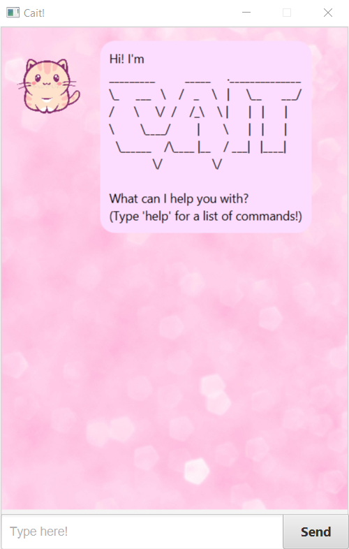
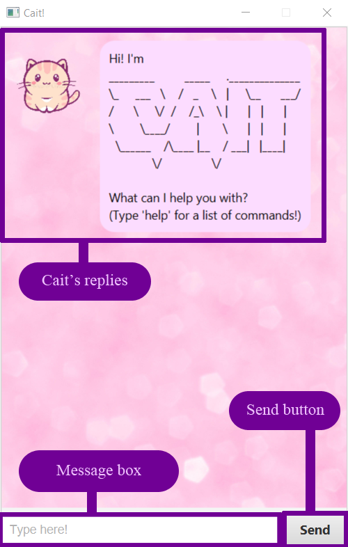

# User Guide

## What is Cait?

**Cait** is a Personal Assistant Chatbot that can help you to **keep track of your tasks**, such as todos, events, and deadlines. This desktop application lets you manage your tasks via a **Command Line Interface (CLI)**, such as inserting tasks into a list, setting the tasks to done when you have completed them, and deleting the tasks when you do not need them anymore. This application is similar to a chat, where you type your commands into a message box, as if you are speaking to Cait.

This is what you should see when you start up Cait:
 
 

 
 
 
Here is a brief explanation of Cait's UI:
 
 

 
## Quick start

1. Make sure that you have Java `11` or above installed in your computer.
2. Download the latest `Cait.jar` [here](https://github.com/caitlinjee/ip/releases/tag/v0.2).
3. Copy the file to the folder you want to use as the _home folder_ for Cait.
4. Double-click the file to start the app.
5. Type the command in the message box and press Enter to execute it. e.g. typing `help` and pressing Enter will list out the commands you can use.
6. You can refer to the Features below for details of each command.
  
  
## Features

### `help`
Shows the commands you can use.

## Usage

### `help` - Viewing help

Lists out all the commands you can type.

Example of usage: 

- `help`

Expected outcome:

 

### `todo`
Adds a todo to your saved tasks.

## Usage

### `todo <task>` - Adding a todo

Adds a todo to your list of tasks.

Example of usage: 

- `todo read book`

- `todo eat eat eat`

Expected outcome:

 

### `event`
Adds a event to your saved tasks.

## Usage

### `event <task> /at <yyyy-mm-dd>` - Adding an event

Adds a event to your list of tasks at a specified date.

Example of usage: 

- `event day6 concert /at 2019-10-05`

- `event dance /at 2020-12-29`

Expected outcome:

 

### `deadline`
Adds a deadline to your saved tasks.

## Usage

### `deadline <task> /by <yyyy-mm-dd>` - Adding an deadline

Adds a deadline to your list of tasks by a specified date.

Example of usage: 

- `deadline eat cake /by 2020-09-04`

- `deadline finish work /by 2020-12-25`

Expected outcome:

 

### `list`
Shows your saved tasks.

## Usage

### `list` - View your task list

Lists out all your tasks that you have added.

Example of usage: 

- `list`

Expected outcome:

 

### `done`
Finishes a task.

## Usage

### `done <list index(es)>` - Setting a task to done

Sets the task at the specified list index(es) to done.

Example of usage: 

- `done 1`

- `done 4 5 6`

Expected outcome:

 

### `delete`
Deletes a task.

## Usage

### `delete <list index(es)>` - Deleting a task

Deletes the task at the specified list index(es).

Example of usage: 

- `delete 1`

- `delete 3 5 `

Expected outcome:

 

### `find`
Finds the tasks with a keyword.

## Usage

### `find <keyword>` - Finding tasks

Lists out all the tasks whose description contains the specified keyword.

Example of usage: 

- `find eat`

Expected outcome:

 

### `bye`
Shuts down the application.

## Usage

### `bye` - Saying bye

Shuts down the application, while all the tasks and whether they're done are still saved.

Example of usage: 

- `bye`

Expected outcome:

- Cait will shut down
 

### Command summary

Action | Format, Examples
------------ | -------------
Help | `help`
List | `list`
Todo | `todo <task>`   eg, `todo read book`
Event | `event <task> /at <yyyy-mm-dd>`   eg, `event day6 concert /at 2019-10-05`
Deadline | `deadline <task> /by <yyyy-mm-dd>`   eg, `deadline eat cake /by 2020-09-04`
Done | `done <list index(es)>`   eg, `done 4 5 6`
Delete | `delete <list index(es)>`   eg, `delete 1`
Find | `find <keyword>`   eg, `find cake`
Bye | `bye`
