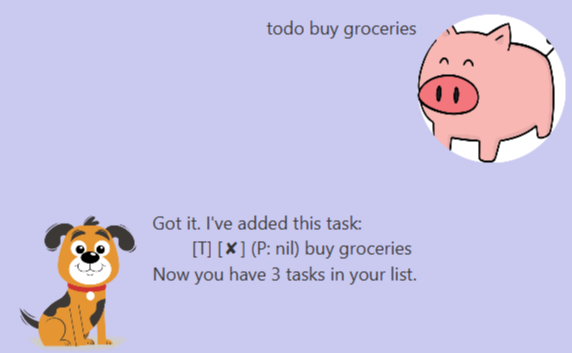
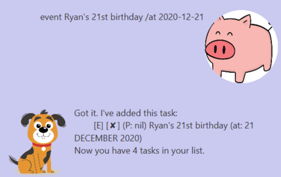
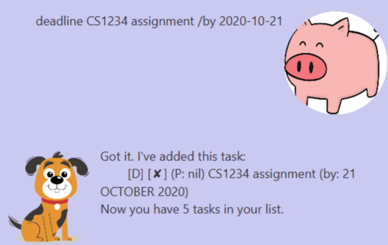
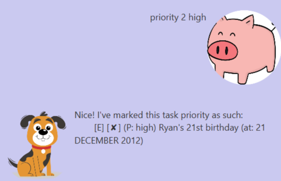

# DukeBB User Guide
Dukenizer is a desktop app for <strong>managing your tasks</strong> optimized for use via a Command Line Interface (CLI). There is also a  Graphical User Interface (GUI) to enhance the visuals and enhance the visuals for task managing. 

## Features 

### List all commands `help`
Shows full list of commands available.  
Format: `help`

### List current tasks: `list`
Shows a list of all current tasks in DukeBB.  
Format: `list`  

### Adding a to-do task: `todo`
Adds a to-do task with a description to DukeBB  
Format: `todo <description>`  
Example of usage: `todo buy groceries`

### Adding an event task: `event`
Adds an event task with a description and due date to DukeBB  
Format: `event <description> /at <due_date>`  
*Note: Date must be in YYYY-MM-DD format.*   
Example of usage: `even Ryan's 21st birthday /at 2020-09-12` 

### Adding a deadline task: `deadline`
Adds a deadline task with a description and due date to DukeBB  
Format: `deadline <description> /by <due_date>`  
*Note: Date must be in YYYY-MM-DD format.*   
Example of usage: `deadline CS1234 assignment /by 2020-09-21`

### Deleting a task: `delete`
Delete a task from a specific index in DukeBB.  
Format: `delete <index>`  
Example of usage: `delete 2` deletes the 2nd task in DukeBB.

### Mark as completed: `done`
Marks a task from a specific index as completed.  
Format: `done <index>`  
Example of usage: `done 2` marks the 2nd task in DukeBB as completed.

### Mark task priority: `priority`
Set a priority type in a task in DukeBB.  
Format: `priority <index> <priority_type>`  
Example of usage: `priority 1 high` marks the 1st task's priority as 'high'.

### Search for a task: `find`
Search for a task in DukeBB.  
Format: `find <keyword>`  
Example of usage: `find birthday` deletes the 2nd task in DukeBB.

### Exit program: `bye`
Exits the program.  
Format: `bye`  

