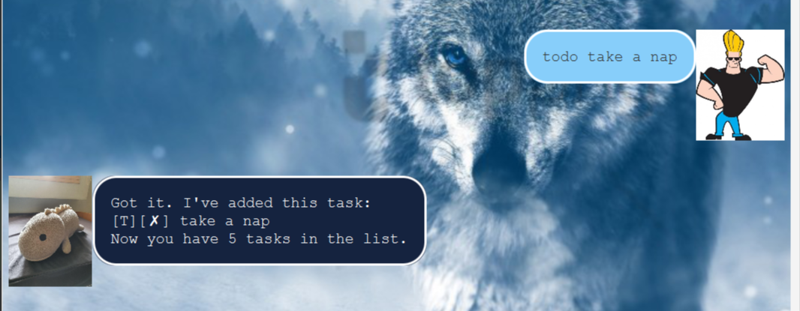
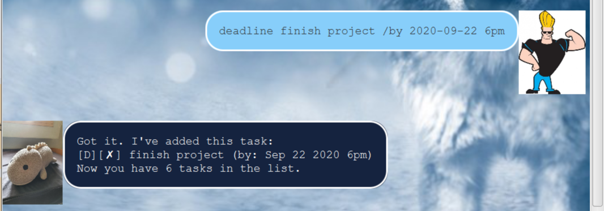
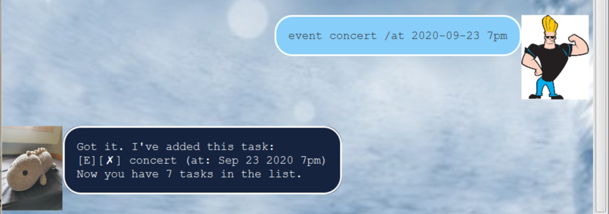
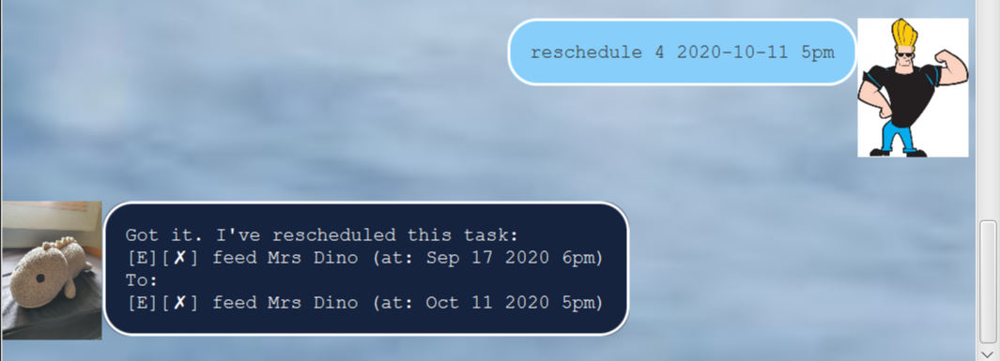

# Mrs Dino User Guide

## Features 

### Add Todo Task

## Usage

### `todo DESCRIPTION` - Adds a new todo task with DESCRIPTION as the task name

Example of usage: 

`todo take a nap`

Expected outcome:

### Add Deadline Task

## Usage

### `deadline DESCRIPTION /by YYYY-MM-DD time` - Adds a new Deadline task with DESCRIPTION as the task name and YYYY-MM-DD as the date and time as the time due 

Example of usage: 

`deadline finish project /by 2020-09-22 6pm`

Expected outcome:

### Add Event Task

## Usage

### `event DESCRIPTION /at YYYY-MM-DD time` - Adds a new Event task with DESCRIPTION as the task name and YYYY-MM-DD as the date and time as the time event occurs 

Example of usage: 

`event concert /at 2020-09-23 7pm`

Expected outcome:

### List all Tasks

## Usage

### `list` - Lists all tasks currently in the task list

Example of usage: 

`list`

Expected outcome:

### Find tasks by keyword

## Usage

### `find KEYWORDS` - Finds tasks that matches all KEYWORDS given

Example of usage: 

`find concert`

Expected outcome:

### Delete task

## Usage

### `delete INDEX` - Deletes task corresponding to the INDEX

Example of usage: 

`delete 5`

Expected outcome:

### Mark task as done

## Usage

### `done INDEX` - Marks task corresponding to the INDEX as done

Example of usage: 

`done 5`

Expected outcome:

### Reschedule task

## Usage

### `reschedule INDEX YYYY-MM-DD TIME` - Reschedules task with given INDEX to new date using YYYY-MM-DD and TIME given

Example of usage: 

`reschedule 4 2020-10-11 5pm`

Expected outcome:

### Exit the program

## Usage

### `bye` - Exits the program

Example of usage: 

`bye`

Expected outcome:

Program exits

# Save and Load tasks from external file

Tasks are saved in the `data.txt` file in the `data` directory. The file is updated whenever the task list is modified.

