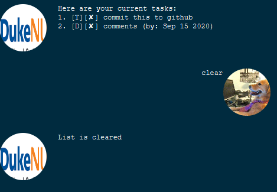

# Duke NUS User Guide

## Features

### Clear Command 
Clear the task list.

#### Usage

#### `clear`
Example of usage: 

`clear`

Shortcut: `c`

Expected outcome:

### Deadline Command 
Creates new Deadline tasks with due date.

#### Usage

#### `deadline <description> /by yyyy-mm-dd`
Example of usage: 

`deadline upload this guide /by 2020-09-15`

Shortcut: `de`

Expected outcome:

### Delete Command 
Delete the task specified.

#### Usage

#### `delete <index to delete`
Example of usage: 

`delete 1`

Shortcut: `d`

Expected outcome:

### Done Command 
Mark the task specified as done.

#### Usage

#### `done <index to mark as done>`
Example of usage: 

`done 2`

Shortcut: `do`

Expected outcome:

### Event Command 
Creates a new event task with the event date.

#### Usage

#### `event <description> /on yyyy-mm-dd`
Example of usage: 

`event CS2103T tutorial /on 2020-09-17`

Shortcut: `e`

Expected outcome:

### Exit Command 
Quits Duke

#### Usage

#### `bye`
Example of usage: 

`bye`

Shortcut: `b`

Expected outcome:

]

### Find Command 
Find the task specified by the keyword.

#### Usage

#### `Find <Keyword to find>`
Example of usage: 

`find tutorial`

Shortcut: `f`

Expected outcome:

### Done Command 
List all the tasks remembered by duke.

#### Usage

#### `list`
Example of usage: 

`list`

Shortcut: `l`

Expected outcome:

### Todo Command 
Creates a generic task todo.

#### Usage

#### `todo <description>`
Example of usage: 

`todo sleep more`

Shortcut: `t`

Expected outcome:

