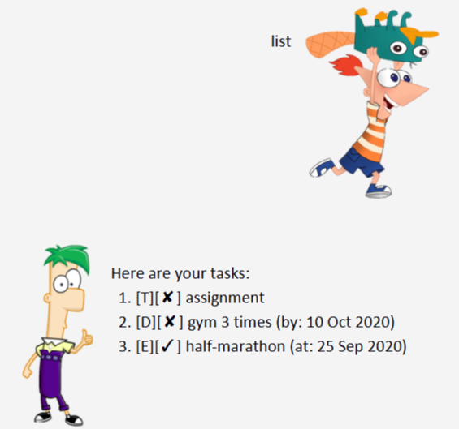
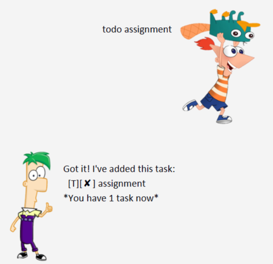
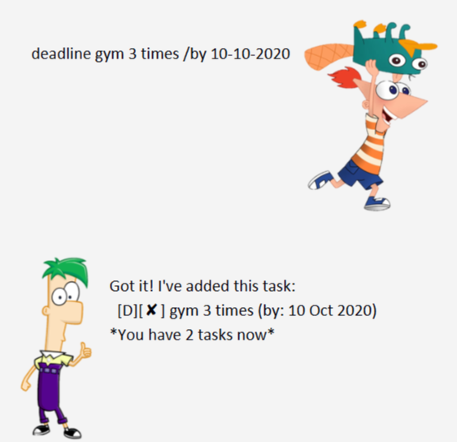
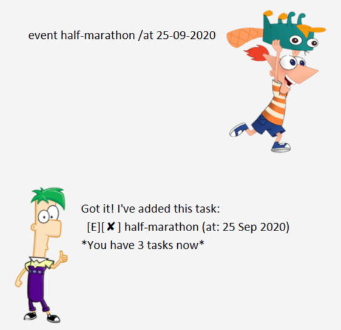
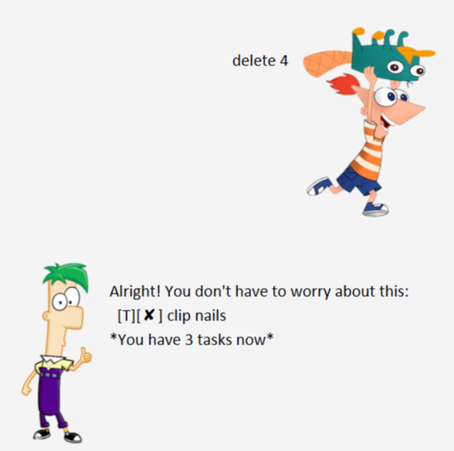
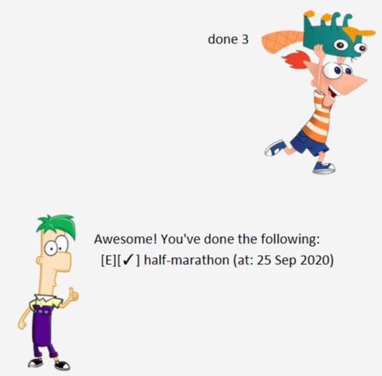
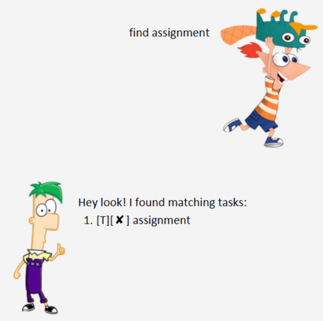
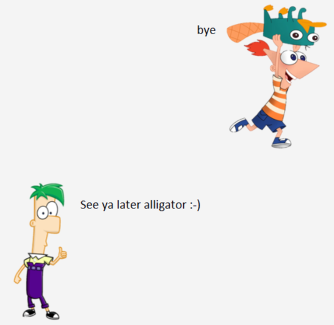

# FerBot - User Guide

FerBot is a chat bot for you to manage your day-to-day tasks.

## Features summary

Feature | Description | Example
---|---|---
list|Lists all existing tasks in FerBot|list
todo|Adds a new ToDo task into the list|todo assignment
deadline|Adds a new Deadline task into the list|deadline gym 3 times /by 10-10-2020
event|Add a new Event task into the list|event half-marathon /at 25-09-2020
delete|Deletes the specified task from the list|delete 4
done|Marks the specified task as done in the list|done 3
find|Finds tasks in Duke that contains the keyword|find assignment
bye|Saves your existing task list and exits FerBot|bye

### Feature 1 

<h4>View existing tasks</h4>

To view all the tasks that you currently have in FerBot.

Example of usage: 

    list

    
Expected outcome:

### Feature 2

<h4>Create a ToDo task</h4>

Adds a ToDo task into FerBot.

Example of usage: 

If you want to add a ToDo task for doing an upcoming assignment:

    todo assignment

Expected outcome:

### Feature 3

<h4>Create a Deadline task</h4>

Adds a Deadline task into FerBot.

Example of usage: 

If you want to add a deadline task to gym 3 times by 10th October 2020:

    deadline gym 3 times /by 10-10-2020

Expected outcome:

### Feature 4

<h4>Create an Event task</h4>

Adds an Event task into FerBot.

Example of usage: 

If you want to add an event task for a half-marathon on 25th September 2020:

    event half-marathon /at 25-09-2020

Expected outcome:

### Feature 5

<h4>Delete a Task</h4>

Delete a task from FerBot.

Example of usage: 

If you want to delete the 4th task from FerBot:

    delete 4

Expected outcome:

### Feature 6

<h4>Complete a Task</h4>

Mark a specified task as done in FerBot.

Example of usage: 

If you want to mark the 3rd task as done in FerBot:

    done 3

Expected outcome:

### Feature 7

<h4>Finding tasks</h4>

Find tasks in FerBot that contains the keyword that you input.

Example of usage: 

If you want to find tasks that contains the keyword "assignment":

    find assignment

Expected outcome:

### Feature 8

<h4>Exit FerBot</h4>

To save your existing task list and exit FerBot.

Example of usage: 

    bye

Expected outcome:

