# DukeBT: User Guide
## Introduction
DukeBT is a chat-bot-style task manager which can interact with users via different commands. 
It could help users to keep track of different kinds of tasks.
  
Below are the 3 types of tasks supported in DuekBT:
1. [T] To-dos: tasks without a specific date-time to complete
2. [D] Deadlines: tasks with a specific date-time as deadline
3. [E] Events: tasks with a specific date-time to indicate when the event will occur

## Getting started
1. Download the latest version of DukeBT file.
2. Double click the jar file to run the application.
3. Welcome page will be automatically loaded (Shown below).
4. Enter a command to start chatting with DukeBT.
  
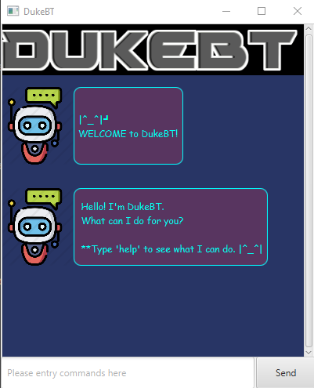

## Features 
1. [**Add new tasks:**](#add-tasks)
   1. [**`todo`** - Add ToDo task](#add-todo-tasks)
   2. [**`deadline`** - Add Deadline task](#add-deadline-tasks)
   3. [**`event`** - Add Event task](#add-event-tasks)
2. [**`delete`** - Delete a task](#delete-tasks)
3. [**`done`** - Mark a task as done](#done-task)
4. [**`list`** - List all existing tasks](#list-tasks)
5. [**`find`** - Find tasks with a keyword](#find-tasks)
6. [**Archive:**](#archive) 
   1. [**`archive`** - Archive a task](#archive-task)
   2. [**`archive all`** - Archive all tasks](#archive-all-tasks)
   3. [**`list archive`** - List all archived tasks](#list-archived-tasks)
7. [**`help`** - List all commands](#help)
8. [**`bye`** - Exit DukeBT](#exitProgram)

###Feature 1: Add tasks
  User can create a new task based on the task type.
####Feature 1.1: Add ToDo task 
This command adds a ToDo task (without a specific date-time to complete) into the list.

##### Usage:

##### `todo <task description>`

Example of usage: 

`todo math homework`

Expected outcome:

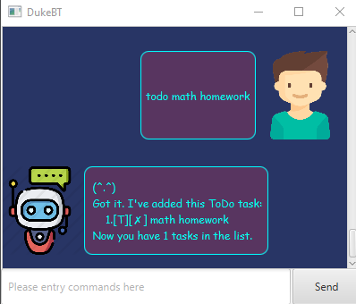

####Feature 1.2: Add Deadline tasks
This command adds a deadline task (with a specific date-time as deadline) into the list.

Date-Time formatting: yyy-MM-dd HH:mm

##### Usage:

##### `deadline <task description> /by <task deadline - 'yyyy-MM-dd HH:mm'>`

Example of usage: 

`deadline programming quiz 1 /by 2020-08-10 21:00`

Expected outcome:

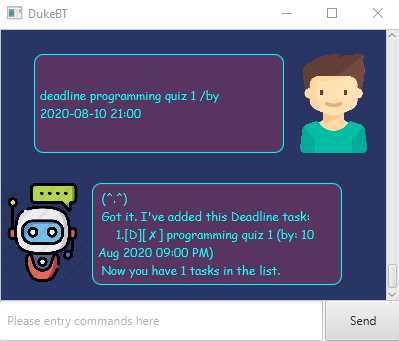

####Feature 1.3: Add Event tasks
This command adds a deadline task (with a specific date-time to indicate when the event will occur) into the list.

Date-Time formatting: yyy-MM-dd HH:mm
##### Usage:

##### `event <event description> /at <event timing - 'yyyy-MM-dd HH:mm'>`

Example of usage: 

`event family dinner /at 2020-04-10 08:00`

Expected outcome:

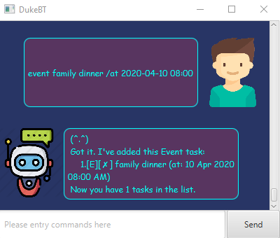

###Feature 2: Delete a task
This command deletes a specific task from the list.
##### Usage:

##### `delete <task index>`

Example of usage: 

`delete 1`

Expected outcome:

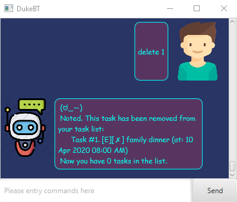

###Feature 3: Mark a task as done
This command marks a specific task as completed.
##### Usage:

##### `done <task index>`

Example of usage: 

`done 1`

Expected outcome:

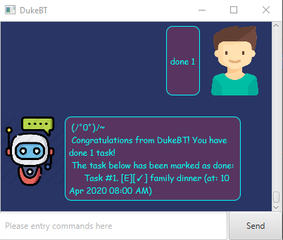

###Feature 4: List all existing tasks
This command lists out all existing tasks in the active task list.
##### Usage:

##### `list`

Example of usage: 

`list`

Expected outcome:

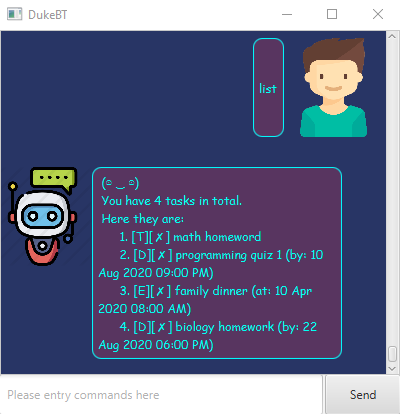

###Feature 5: Find tasks with a keyword
This command lists out all existing tasks which contains the keyword(s).
##### Usage:

##### `find <keyword(s)>`

Example of usage: 

`find homework`

Expected outcome:

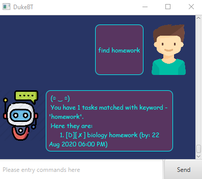

###Feature 6: Archive
Archive function provides a way to archive tasks from the active task list, 
so that the user can remove tasks from the list but still keep a record of them in the archive task list.
####Feature 6.1: Archive a task
This command removes a specific task from the active task list, and adds it to the archived task list.
##### Usage:

##### `archive <task index>`

Example of usage: 

`archive 1`

Expected outcome:

####Feature 6.2: Archive all tasks
This command removes all tasks from the active task list, and adds them to the archived task list.
##### Usage:

##### `archive all`

Example of usage: 

`archive all`

Expected outcome:

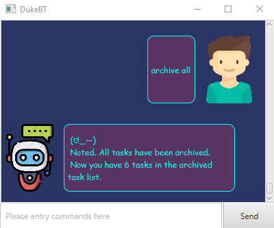

####Feature 6.3: List all archived tasks
This command lists out all archived tasks in the archived task list.

##### Usage:

##### `list archive`

Example of usage: 

`list archive`

Expected outcome:

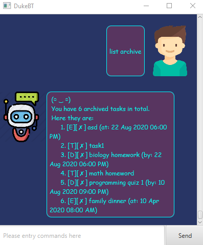

###Feature 7: List all commands
This command lists out all commands which are supported by DukeBT.
##### Usage:

##### `help`
Example of usage: 

`help`

Expected outcome:

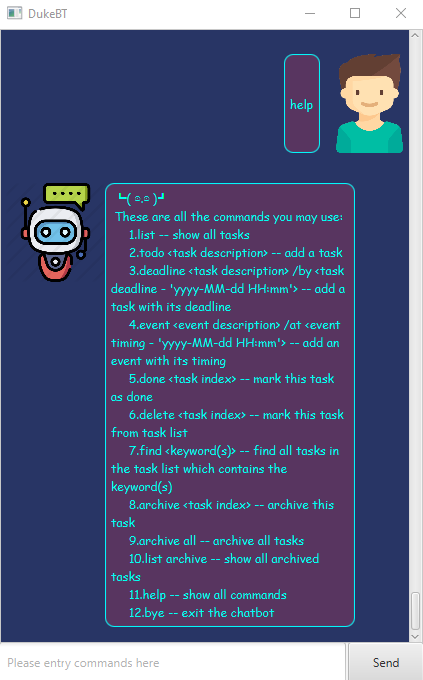

###Feature 8: Exit DukeBT
This command closes the application.
  
The UI window will be closed after 2 seconds (starts from the moment user key in the bye command).

##### Usage:

##### `bye`
Example of usage: 

`bye`

Expected outcome:

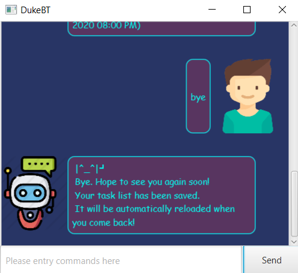

### Command Summary

Task | Command format
------------ | -------------
add | 1. `todo <task description>`   2. `deadline <task description>`   3. `event <event description> /at <event timing - 'yyyy-MM-dd HH:mm'>`
delete | `delete <task index>`
done | `done <task index>`
list | `list`
find | `find <keyword(s)>`
archive | 1. `archive <task index>`   2. `archive all`   3. `list archive`
help | `help`
bye | `bye`