# Bit Chatbot User Guide
1. [Introduction](#1-introduction)

2. [Quick start guide](#2-quick-start-guide)

3. [features](#3-features)

   3.1. [Listing of tasks: `list`](#31-listing-of-tasks-list)
   
   3.2. [Adding a task](#32-adding-a-task)
   
   3.3. [Marking a task as completed: `done`](#33-marking-a-task-as-completed-done)
   
   3.4. [Deleting a task: `delete`](#34-deleting-a-task-delete)
   
   3.5. [Finding a task by a keyword: `find`](#35-finding-a-task-by-a-keyword-find)
   
   3.6. [Finding a task by date: `date`](#36-finding-a-task-by-date-date)
   
   3.7. [Adding an alias to map to command: `alias`](#37-adding-an-alias-to-map-to-command-alias)
   
   3.8. [Deleting an alias: `deletealias`](#38-deleting-an-alias-deletealias)
   
   3.9. [Exiting the program: `bye`](#39-exiting-the-program-bye)
 
## 1. Introduction

Welcome to the Bit Chatbot User Guide! Bit Chatbot are meant for users who prefer to use a desktop application for their 
task management.The Bit Chatbot is primarily targeted at users who prefer to use a Chatbot interface. Duke Chatbot has 
several features to help you get started with managing your tasks. 

## 2. Quick start guide

* Ensure that you have `java 11` installed on your computer.

* Download the `BitBot.jar` file [here]().

* Double-click on the `BitBot.jar` file.

* The chatbot should appear after a while as shown below.

## 3. Features

### <ins>3.1 Listing of tasks:`list`</ins>

##### Description

List all of your tasks that has been saved.

##### Usage format

>`list`

##### Example of usage

### <ins>3.2 Adding a task</ins>

##### Description

Add a new task to your existing list of task. A new task is marked as incomplete (&#x2718;) upon creation.
All task created will be saved for future reference.

There are 3 kinds of tasks:

1. **Todo task**

2. **Event task**

3. **Deadline task**

#### <ins>3.2.1 Todo task `todo`</ins>

##### usage format

>`todo <TASK_DESCRIPTION>`
>
>`t <TASK_DESCRIPTION>`

##### example of usage

* `todo task1`

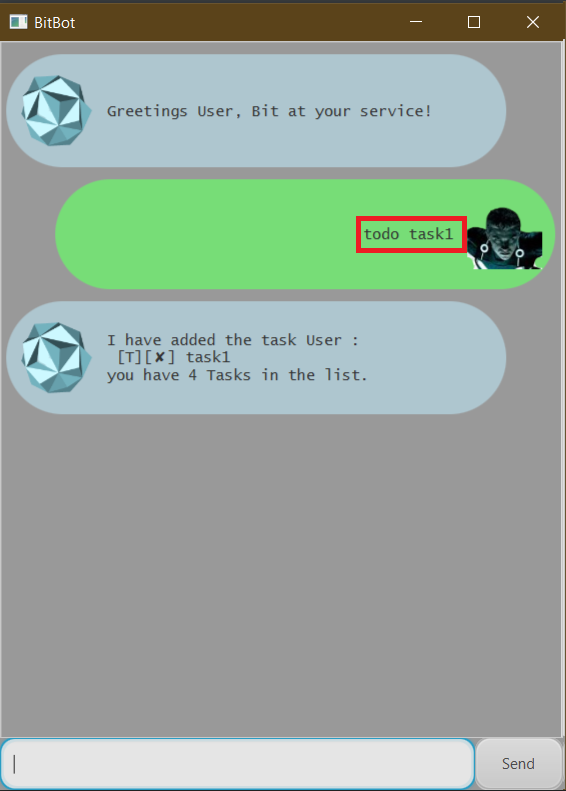

#### <ins>3.2.2 Event task `event`</ins>

##### usage format

>`event <TASK_DESCRIPTION> /at <DATE> <TIME>` 
>
>`e <TASK_DESCRIPTION> /at <DATE> <TIME>`

* format for `<DATE>`: `DD-MM-YYYY`

* format for `<TIME>`: `HHMM` (24 hour format)

##### example of usage

* `event task2 /at 18-09-2020 1900`

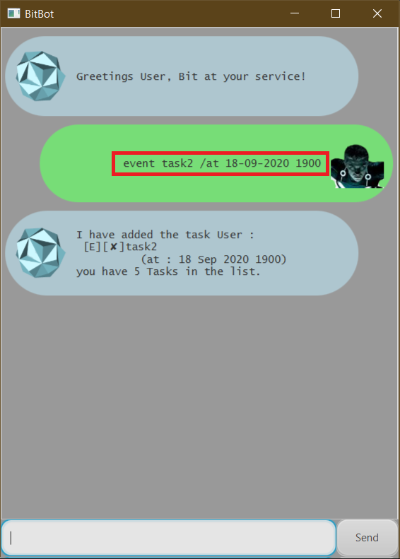

#### <ins>3.2.3 Deadline task `deadline`</ins>

##### usage format

>`deadline <TASK_DESCRIPTION> /by <DATE> <TIME>`
>
>`d <TASK_DESCRIPTION> /by <DATE> <TIME>`

* format for `<DATE>`: `DD-MM-YYYY`

* format for `<TIME>`: `HHMM` (24 hour format)

##### example of usage

* `event task3 /by 18-09-2020 1900`

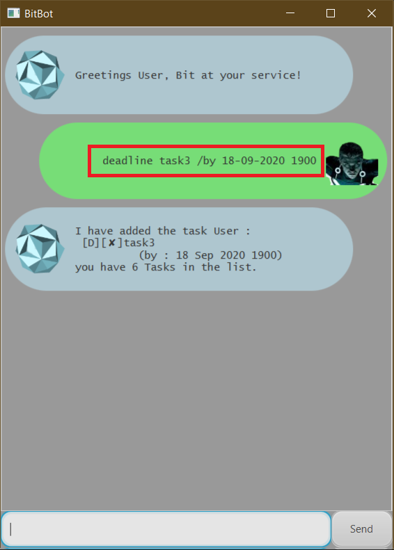

### <ins>3.3 Marking a task as completed: `done`</ins>

##### Description

Marks a specified task on the list as done.

##### Usage format

>`done <TASK_INDEX>`
>
>`md <TASK_INXDEX>`

##### Example of usage

* `done 1`

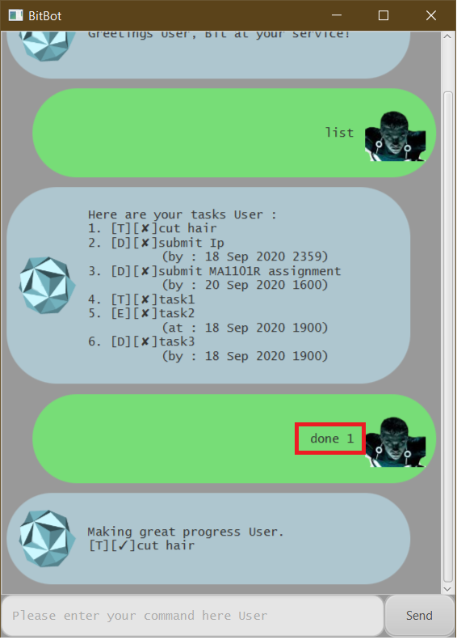

### <ins>3.4 Deleting a task: `delete`</ins>

##### Description

Deletes a specified task on the list as done.

##### Usage format

>`delete <TASK_INDEX>`
>
>`del <TASK_INDEX>`

##### Example of usage

* `delete 1`

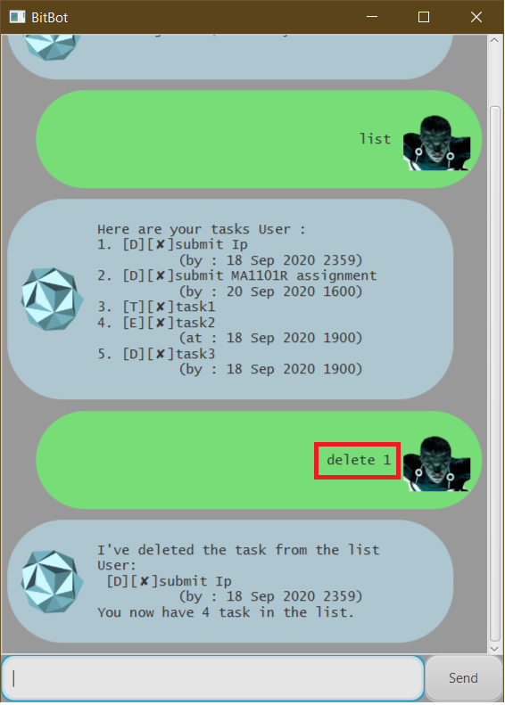

### <ins>3.5 Finding a task by a keyword: `find`</ins>

##### Description

Finds and displays all tasks containing a specified keyword.

##### Usage format

>`find <KEYWORD>`
>
>`f <KEYWORD>`

##### Example of usage

* `f task`

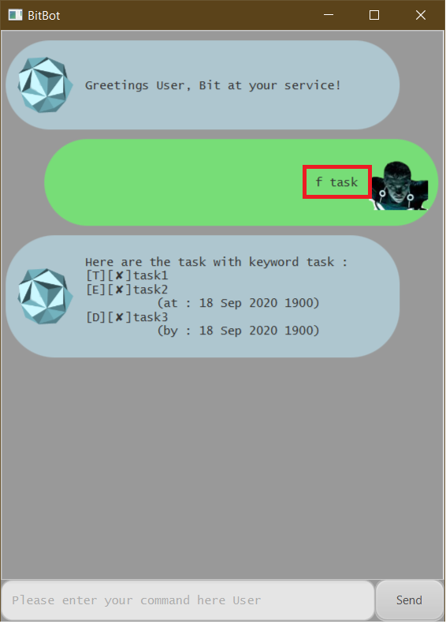

### <ins>3.6 Finding a task by date: `date`</ins>

##### Description

Finds and displays all tasks that is due/occurring on a specified date.

##### Usage format

>`date <DATE>`

* format of `<DATE>`: `DD-MM-YYYY`

##### Example of usage

* `date 18-09-2020`

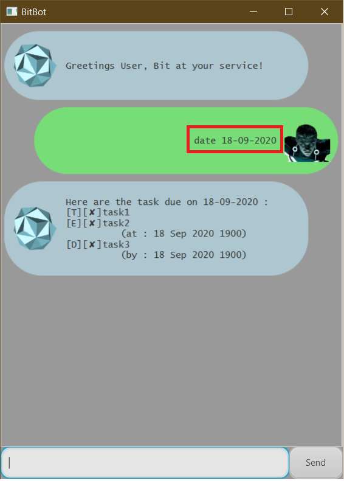

### <ins>3.7 Adding an alias to map to command: `alias`</ins>

##### Description

Create an alias which maps to a command. This helps user customize their own commands to their liking. 
Alias created will be saved for future use.

##### Usage format

>`alias <ALIAS_NAME> <COMMAND>`

:warning: `<COMMAND>` must be the same as the commands in this [list]().

##### Example of usage

* `alias fd date`

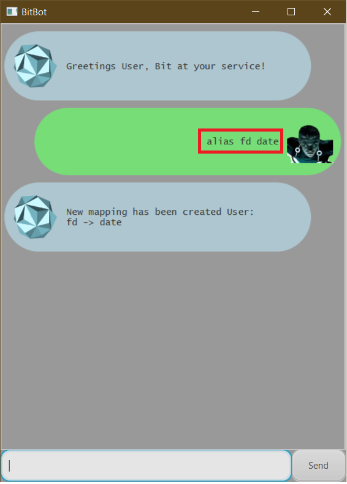

* use of alias `fd` as though it is a `date` command.

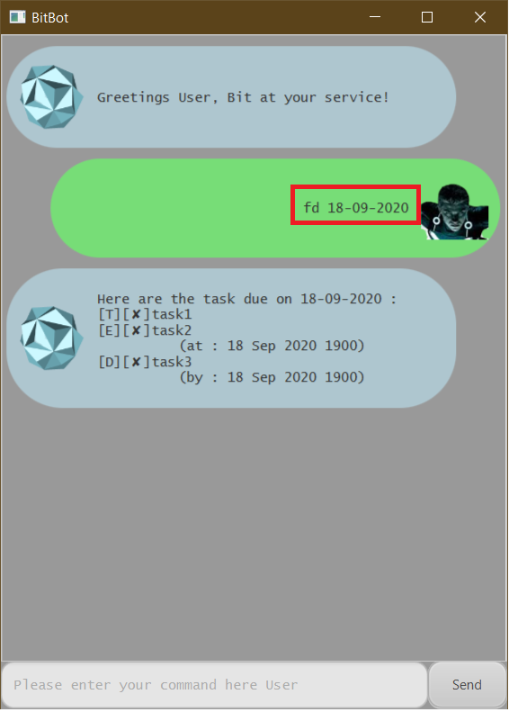

### <ins>3.8 Deleting an alias: `deletealias`</ins>

##### Description

Delete an existing alias which maps to a command.

##### Usage format

>`deletealias <ALIAS_NAME>`
>
>`da <ALIAS_NAME>`

##### Example of usage

* `deletealias fd`

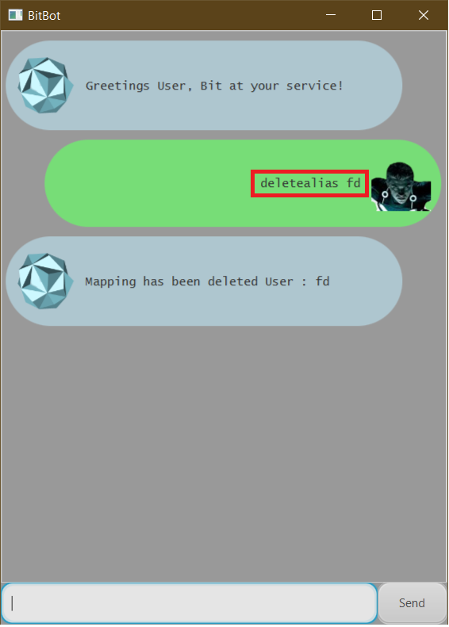

* no longer able to use alias `fd`. Bit shows an invalid command error dialog.

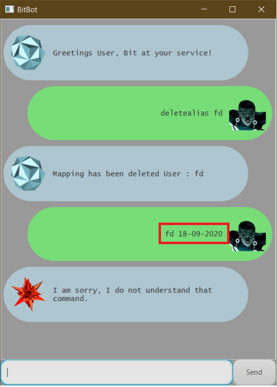

### <ins>3.9 Exiting the program: `bye`</ins>

##### Description

Ends the Chatbot. Window will close automatically in a 1 second.

##### Usage format

>`bye`

##### Example of usage

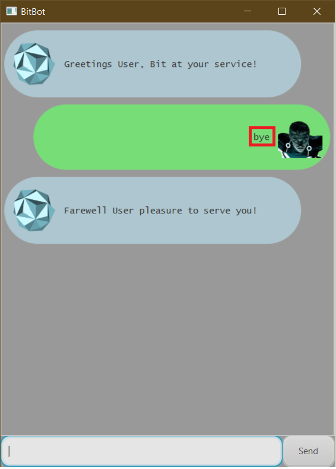

