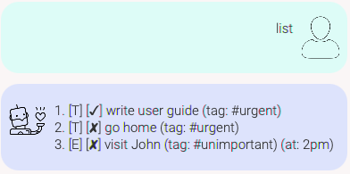
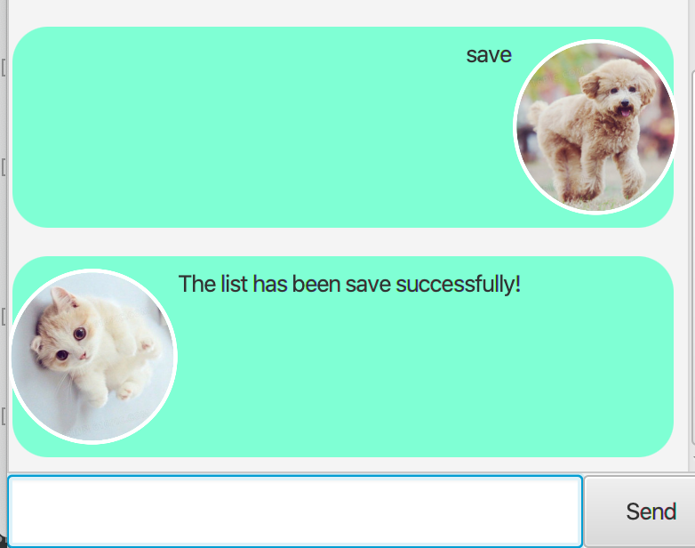
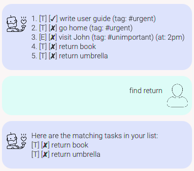
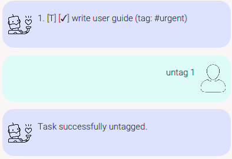
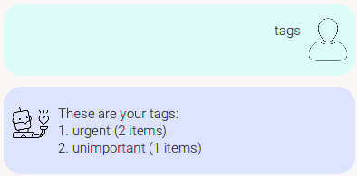

# Sam's Duke User Guide

## Features 

### Add Todo items
Have a task you need to get done? Add it to Duke so that you won't forget it.

### Add events
Have an event coming up? Duke allows you to create events. You can add a title and event timing too.

### Add deadlines
Duke allows you to add deadlines to your task list. You can include a deadline description and
ISO-8601 compliant date.

### View items
Duke allows you to view all your added items in a list-view.

### Delete items
Duke allows you to delete any of the items from your task list.

### Mark items as done
You can mark any of the items in your task list as done.

### Search for items
Duke allows you to search your task list by keywords.

### Tag/untag your items
Duke allows you to tag your items as a way to categorize your tasks.

### View your tags
Duke allows you to view the list of tags you have and the no. of items in each tag.

### Save your task list
Duke knows you probably want to save your task list. It allows you to do so and automatically loads that
saved list the next time it starts up.

## Basic Usage

### `todo` - Create a todo

Adds a new todo item to Duke's task list.

Format: `todo {todo description}`

Example of usage: 

`todo write a user guide`

Expected outcome:

### `event` - Create an event 

Adds a new event item to Duke's task list.

Format: `event {event description} /at {event timing}`

Example of usage: 

`event sam's birthday /at 6pm tonight`

Expected outcome:

### `deadline` - Create a deadline

Adds a new deadline to Duke's task list.

Format: `deadline {deadline description} /by {ISO-8601 date string}`

Example of usage: 

`deadline return book /by 2020-12-12`

Expected outcome:

### `delete` - Delete an item 

Removes an item from Duke's task list.

format: `delete {index in list}`

Example of usage: 

`delete 1`

Expected outcome:

### `done` - Mark an item as done 

Marks an item in Duke's task list as "done".

format: `done {index in list}`

Example of usage: 

`done 1`

Expected outcome:

### `list` - View all items

Displays all added items in a list-view.

format: `list`

Example of usage: 

`list`

Expected outcome:

### `save` - Save your task list

Saves your current task list to your disk. Duke will load this when it starts
up the next time.

format: `save`

Example of usage: 

`save`

Expected outcome:

## Advanced usage

### `find` - Search by keyword

Search your task list for items.

Note: An item only appears in the search results if its description contains
the search keyword.

format: `find {search keyword}`

Example of usage:
`find return`

Expected outcome:

### `tag` - Tag an item 

Tags an item with a tag.

format: `tag {item's index in list} {tag name}`

Example of usage: 

`tag 1 urgent`

Expected outcome:

### `untag` - Untag an item 

Removes the tag from a tagged item.

format: `untag {item's index in list}`

Example of usage: 

`untag 1`

Expected outcome:

### `tags` - View all tags

Display all tags and the no. of items in each tag.

format: `tags`

Example of usage: 

`tags`

Expected outcome:

