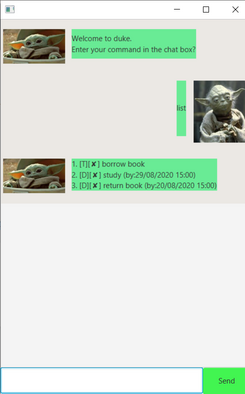

# User Guide for Duke
## Introduction
Duke is a schedule managing application that helps you track all your tasks. Duke supports the user by tracking 4 main types of tasks.
 * ToDos
 * Events
 * Deadlines
 * DoWithins
 


The specifications of each task and some additional functionality are discussed in the Features section.
## Feature List

1.`todo` 

2.`event` 

3.`deadline` 

4.`do` 

5.`done` 

6.`delete` 

7.`list` 

8.`find` 

9.`bye` 

Note that tasks are case-insensitive to make it for users to type in commands.

##Usage
### `todo` - Create a new To Do task
The `todo` command creates a new todo task with no date or time specification. 
#### Format
`todo <description>`
#### Example input
`todo Homework assignment` 
#### Example output
```
Got it I've now added this Task:
[T][✘] Homework assignment
Now you have 1 tasks in the list.
```
### `event` - Create a new Event task 
The `event` command creates a new event task with the date, and the time period of the event specified. 
#### Format
`event <description> /on <date (YYYY-MM-dd)> /at <start (HH:mm)>-<end(HH:mm)>`
#### Example input
`event Dad's Birthday /at 2020-08-10 /on 15:30-18:00` 
#### Example output
```
Got it I've now added this Task:
[E][✘] Dad's Birthday(on: Aug 10 2020 at: 15:30 - 18:00)
Now you have 2 tasks in the list.
```
### `deadline` - Create a new Deadline task 
The `deadline` command creates a new deadline task with the deadline date specified. 
#### Format
`deadline <description> /by <date (YYYY-MM-dd)>`
#### Example input
`deadline CS2103 IP /by 2020-09-17`
#### Example output
```
Got it I've now added this Task:
[D][✘] CS2103 IP (by: Sep 17 2020)
Now you have 2 tasks in the list.
```
### `do` - Create a new Do Within task
The `do` command creates a new DoWithin task with the start and end date specified. 
#### Format
`do <description> /within <start(YYYY-MM-dd)>:<end(YYYY-MM-dd)>`
#### Example input
`do CS2103 quiz /within 2020-09-10:2020-09-17`
#### Example output
```
Got it I've now added this Task:
[W][✘] CS2103 quiz (within: Sep 10 2020 - Sep 17 2020)
Now you have 7 tasks in the list.
```
### `done` - Set a task as done
The `done` command sets a specified task as done
#### Format
`done <task number>`
#### Example input
`done 2`
#### Example output
```
Nice! I've marked this task as done: 
[E][✓] Dad's Birthday(on: Aug 10 2020 at: 15:30 - 18:00)
```
### `delete` - Delete a task from Duke
The `delete` command deletes a specified task
#### Format
`delete <task number>`
#### Example input
`delete 1`
#### Example output
```
Noted. I've removed this task: 
[T][✘] homework assignment
Now you have 3 tasks in the list.
```
### `list` - List all tasks managed by Duke
The `list` lists all tasks managed by duke.
#### Format
`list`
#### Example input
`list`
#### Example output
```
Here are the tasks in your list:
1.[E][✓] Dad's Birthday(on: Aug 10 2020 at: 15:30 - 18:00)
2.[D][✘] CS2103 IP (by: Sep 17 2020)
3.[W][✘] CS2103 quiz (within: Sep 10 2020 - Sep 17 2020)
```
### `find` - Find a task managed by Duke
The `find` lists all the tasks which are similar to the hint provided
#### Format
`find <hint>`
#### Example input
`find Dad`
#### Example output
```
Here are the matching tasks in your list:
1.[E][✓] Dad's Birthday(on: Aug 10 2020 at: 15:30 - 18:00)
```
### `bye` - Save your tasks
The `bye` command says goodbye to duke and saves all your tasks
#### Format
`bye`
#### Example input
`bye`
#### Example output
`Bye. Hope to see you again soon!`
