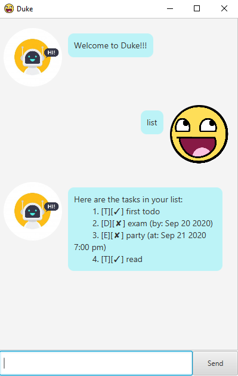

# User Guide
Duke is a convenient task manager that allow users to add, store, delete, and find tasks so that they can better manage their time!

## Features 

### Add Tasks 
Users can add a todo task, a task with deadline, a task that will happen at a fixed time, and a task with a fixed duration into Duke.

### View Tasks
Users can view the list of tasks.

### Mark as Done
Users can mark a certain task as done.

### Delete Tasks
Users can delete a particular task.

### Search Tasks
User can search a task by typing in a keyword.

## Usage

### `list` - view the task list

this comamnd is for viewing the task list.

Example of usage: 

`list`

Expected outcome:

```1.[T][Y] task1```

### `done NUMBER` - mark a task as done

this comamnd is for changing the status of a task to done. A success message will be sent after execution. 

**Example of usage:** 

`done 1`

**Expected outcome:**
```
Nice! I've marked this task as done:
1.[T][Y] task1
```

### `delete NUMBER` - delete a task

this comamnd is for deleting a task. A success message with the number of remaining tasks will be sent after execution.

**Example of usage:** 

`delete 1`

**Expected outcome:**
```
Noted. I've removed this task:
1.[T][Y] task1   
Now you have 2 tasks in the list.
```

### `todo TASK_NAME` - add a todo task

this comamnd is for adding a todo task. A success message with the number of remaining tasks will be sent after execution. 

**Example of usage:**

`todo task`

**Expected outcome:**
```
Got it. I've added this task:
1.[T][N] task 
Now you have 2 tasks in the list.
```

### `deadline TASK_NAME /by DD/MM/YYYY/ HHMM` - add a deadline task

this comamnd is for adding a dealine task. A success message with the number of remaining tasks will be sent after execution.

**Example of usage:** 

**Format:** deadline name /by day/month/year time

`deadline task /by 1/1/2020 1200`

**xpected outcome:**

```
Got it. I've added this task:`
1.[D][N] task (by: JAN 1 2020 12:00)
Now you have 2 tasks in the list.
```   

### `event TASK_NAME /at DD/MM/YYYY/ HHMM` - add an event task

this comamnd is for adding an event task. A success message with the number of remaining tasks will be sent after execution.

**Example of usage:** 

**Format:** event name /at day/month/year time

`event task /at 1/1/2020 1200`

**Expected outcome:**
```
Got it. I've added this task:
1.[E][N] task (at: JAN 1 2020 12:00) 
Now you have 2 tasks in the list.
```

### `durationtask NUMBER` - add a duration task

this comamnd is for adding a duration task with a number indicating the duration time. A success message with the number of remaining tasks will be sent after execution.

**xample of usage:** 

`durationtask task 10`

**Expected outcome:**
```
Got it. I've added this task:
1.[U][N] task (10 hours) 
Now you have 2 tasks in the list.
```

### `find KEYWORD` - find a matched task

this comamnd is for finding a matched task. A list of matched results will be shown.

**Example of usage:** 

`find task`

**Expected outcome:**

```
Here are the matching tasks in your list:
1.[U][N] task (10 hours) 
```

### `bye` - exit the program

this comamnd is for exiting the program. The program will exit and nothing will be shown.

**Example of usage:** 

`bye`


