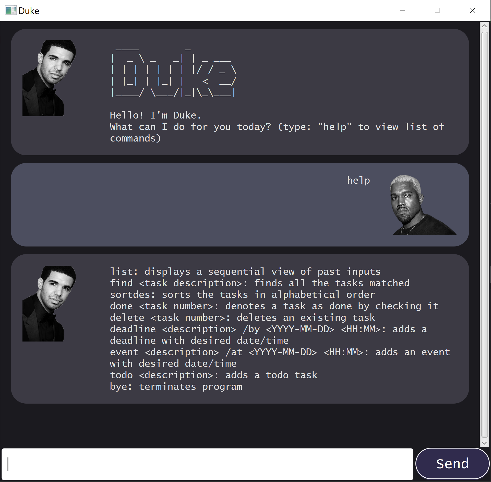

# User Guide

## Features 

### Feature 1:
 View available commands

#### Usage

#### `help` - View available commands

Example of usage: 

`help`

Expected outcome:

---

### Feature 2:
Add todo task, deadline task or event task.

#### Usage

#### `todo {task description}` - Adds a task with given description

Example of usage: 

`todo Buy bread`

Expected outcome:

`The following task has been added: 1. [T][X] Buy bread`

---

#### `deadline {task description} /by {yyyy-MM-DD HHMM}` - Adds a task with given description and deadline

Example of usage: 

`deadline Prepare for CS2103 exam /by 2020-10-20 1200`

Expected outcome:

`The following task has been added: 2. [D][X] Prepare for CS2103 exam (by: 20 Oct 2020 12:00PM)`

---

#### `event {task description} /at {yyyy-MM-DD HHMM}` - Adds a task with given description and event time

Example of usage: 

`event Birthday Party /at 2020-10-21 1700`

Expected outcome:

`The following task has been added: 3. [E][X] Birthday Party (at: 21 Oct 2020 5:00PM)`

---

### Feature 3:
List all current tasks

#### Usage

#### `list` - Lists all current tasks

Example of usage: 

`list`

Expected outcome:

`Here are your current tasks: 1. [T][X] Buy bread 2. [D][X] Prepare for CS2103 exam (by: 20 Oct 2020 12:00PM) 3. [E][X] Birthday Party (at: 21 Oct 2020 5:00PM)`

---

### Feature 4:
Delete task

#### Usage

#### `delete {task number}` - Delete given task

Example of usage: 

`delete 1`

Expected outcome:

`The following task has been deleted: 1. [T][X] Buy bread`

---

### Feature 5:
Mark task as done

#### Usage

#### `done {task number}` - Mark given task as done

Example of usage: 

`done 1`

Expected outcome:

`The following task has been marked as done: 1. [D][X] Prepare for CS2103 exam (by: 20 Oct 2020 12:00PM)`

---

### Feature 6:
Tag task with one tag

#### Usage

#### `tag {task number} {tag name}` - Tag task with given tag and replaces existing tag on the task if any

Example of usage: 

`tag 1 urgent`

Expected outcome:

`The following task has been tagged: 1. [D][X] Prepare for CS2103 exam #urgent (by: 20 Oct 2020 12:00PM)`

---

### Feature 7:
Delete tag from task

#### Usage

#### `tag {task number} delete` - Deletes tag from the given task 

Example of usage: 

`tag 1 delete`

Expected outcome:

`The following task's tag has been removed: 1. [D][X] Prepare for CS2103 exam (by: 20 Oct 2020 12:00PM)`

---

### Feature 8:
Find tasks based on query

#### Usage

#### `find {query}` - Finds and lists all tasks that matches the query

Example of usage: 

`find Party`

Expected outcome:

`Here are your search results: 3. [E][X] Birthday Party (at: 21 Oct 2020 5:00PM)`

---

### Feature 9:
Exit application

#### Usage

#### `bye` - Exits the application

Example of usage: 

`bye`

Expected outcome:

Closes the GUI and stops running the application
