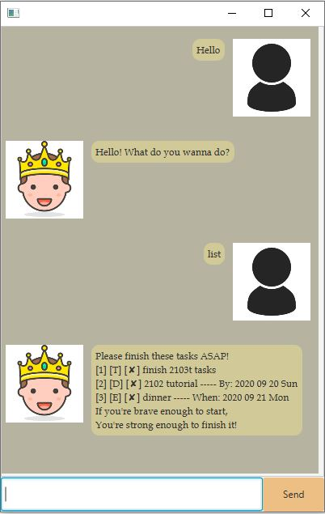

# User Guide

## A. Quick Start
1. Ensure you have Java 11 or above installed in your Computer.

2. Download the latest duke.jar from the releases page of this repo.

3. Copy the file to the folder you want to use as the home folder to run Duke.

4. Double-click the file to start the app. The GUI similar to the below should appear in a few seconds.

## B. Features 
- Add a task that can either be a todo, deadline, or event.
- Delete any of the tasks added.
- View all the tasks you have keyed in.
- Mark any task done. 
- Take down any quick short notes. 
- Save these tasks to you computer

## C. Usage

#### 1. Greet Duke

Say Hi to Duke!

Example of usage:  
`hi` , `yo` , `hello`

Expected outcome:  
`outcome`

#### 2. Add a task

A task can either be a todo, deadline or event.  
A todo needs the description of the task.  
A deadline needs both the description of the task and the deadline to complete it by.  
An event needs both the description of the task and the date of the event. 

Format  
1. To add a todo: `todo (description)`
2. To add a deadline: `deadline (description) / (date)`
3. To add an event : `event (description)  / (date)`

Example of usage:  
`todo finish cs2103t tasks`   
Adds a todo with the description "finish cs2103 tasks"  
`deadline finish cs2103t tasks / 18092020`   
Adds a deadline with the description "finish cs2103 tasks" by the deadline 18-09-2020 
`event cs2103t team meeting / 20092020`   
Adds a event with the description "cs2103t team meeting" on the date 18-09-2020 

Ensure your date is keyed in `ddmmyyyy` format. 

Expected outcome: 
`outcome`

#### 3. Lists all tasks

This lists all the tasks currently stored. 

Example of usage:  
`list`

Expected outcome: 
`outcome`

#### 4. Marks a specific task done

This marks the specified task done, regardless of which type of task it is (i.e. works for todo, deadline, event).
You need to know the number of the task you wish to mark done, which can be found by the list command. 
The number should be a positive number and within than the number of tasks you have. 

Format:   
 `done INDEX`   
 This marks the task done at the specified index.
 
Example of usage:  
`done 1`   
This marks the first task done. 
`done 13`  
This marks the 13th task done.

Expected outcome: 
`outcome`

#### 5. Deletes a specific task

This deletes the specified task, regardless of which type of task it is (i.e. works for todo, deadline, event).
You need to know the number of the task you wish to delete, which can be found by the list command. 
The number should be a positive number and within than the number of tasks you have. 
 
Format:   
`delete INDEX`  
This deletes the task at the specified index
 
Example of usage:  
`delete 1`   
This deletes the first task. 
`delete 13`  
This deletes the 13th task.
 
Expected outcome: 
`outcome`

#### 6. Finds a task

This helps you search for a task that matches your input.

Format:  
`find (input)`  
`search (input)`
This helps you search for a task that matches the input given.

Example of usage:  
`find cs2103t` 
This finds all tasks that includes cs2103t.

Expected outcome: 
`outcome`

#### 7. Leave the conversation

Say bye to duke.

Example of usage:  
`bye` , `cya`

Expected outcome: 
`outcome`
