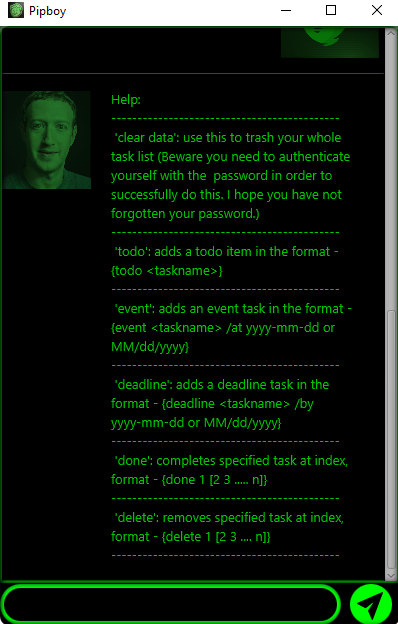

# User Guide for Duke
 | 

## Features 
 - Saving passwords
 
### Saving your user password

Upon startup, if you have never saved a password before(a new user),
Duke will prompt you to enter a password and ask you again to confirm the password.

### Delete entire list - `clear data`

You have the option to purge the entire tasklist. Before doing so 
you will be prompted for your password.

### Saving tasks - `todo | event | deadline`

You can save tasks in the form of todo, event or deadline to your list.
Todo tasks requires no dates as compared to the other two.

Example of usage: 

`keyword (optional arguments)`

Expected outcome:

`outcome`
