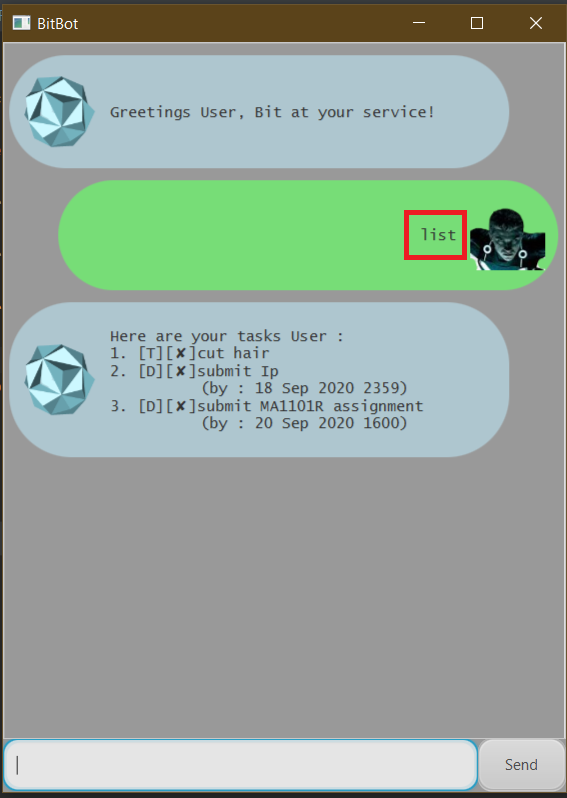

# Bit Chatbot User Guide
1. [Introduction](#1-introduction)

2. [Quick start guide](#2-quick-start-guide)

3. [features](#3-features)

   3.1. [Listing of tasks: `list`](#31-listing-of-tasks-list)
   
   3.2. [Adding a task](#32-adding-a-task)
   
      3.2.1. [Todo task](#321-todo-task)
        
      3.2.2. [Event task](#322-event-task)  
        
      3.2.3. [Deadline task](#323-deadline-task)
   
   3.3. [Marking a task as completed: `done`](#33-marking-a-task-as-completed-done)
   
   3.4. [Deleting a task: `delete`](#34-deleting-a-task-delete)
   
   3.5. [Finding a task by a keyword: `find`](#35-finding-a-task-by-a-keyword-find)
   
   3.6. [Finding a task by date: `date`](#36-finding-a-task-by-date-date)
   
   3.7. [Adding an alias to map to command: `alias`](#37-adding-an-alias-to-map-to-command-alias)
   
   3.8. [Deleting an alias: `deletealias`](#38-deleting-an-alias-deletealias)
   
   3.9. [Exiting the program: `bye`](#39-exiting-the-program-bye)
   
4. [Miscellaneous]()
 
## 1. Introduction

## 2. Quick start guide

## 3. Features

### 3.1 Listing of tasks `list`

##### Description

List all of your tasks that has been saved.

##### Usage

`list`

##### Example of usage
* `list`

### 3.2 Adding a task

##### Description

Add a new task to your existing list of task. A new task is marked as incomplete (&#x2718;) upon creation.

There are 3 kinds of tasks:

1. **Todo task**

2. **Event task**

3. **Deadline task**

#### 3.2.1 Todo task

### 3.3 Marking a task as completed: `done`

##### Usage

`list`

##### Description
List all of your tasks that has been saved.

#### Example of usage
* `list`

### 3.4 Deleting a task: `delete`

#### Usage

`list`

#### Description
List all of your tasks that has been saved.

#### Example of usage
* `list`

### 3.5 Finding a task by a keyword: `find`

#### Usage

`list`

#### Description
List all of your tasks that has been saved.

#### Example of usage
* `list`

### 3.6 Finding a task by date: `date`

#### Usage

`list`

#### Description
List all of your tasks that has been saved.

#### Example of usage
* `list`

### 3.7 Adding an alias to map to command: `alias`

#### Usage

`list`

#### Description
List all of your tasks that has been saved.

#### Example of usage
* `list`

### 3.8 Deleting an alias: `deletealias`

#### Usage

`list`

#### Description
List all of your tasks that has been saved.

#### Example of usage
* `list`

### 3.9 Exiting the program: `bye`

#### Usage

`list`

#### Description
List all of your tasks that has been saved.

#### Example of usage
* `list`

