# User Guide

Duke is a desktop chat bot that can help you manage your tasks. It is optimized by a 
Command Line interface and automatic save such that you can note it faster than conventional 
task manager application.  

&nbsp;

------------------------------------------------------------------------------

## Features 

### 1. Task assignment
Add tasks conveniently with easy commands:
* Assign
    * Simple todo tasks, `todo`.
    * Tasks with deadline, `deadline`.
    * Events to attend, `event`.
* Mark tasks as done, `done`.
* Delete tasks, `delete`.

&nbsp;

### 2. Task view
View all tasks via `list`.

&nbsp;

### 3. Various time format support
Use different time format for the convenience of time.
Supported formats: 

&nbsp;

|Format | user input time | output|
|:----- | :-----: | ----: |
|HHmm | 2359 | Wednesday_Sep_16_2020_23:59| 
|d | 16 | Wednesday_Sep_16_2020_00:00|
|d_HHmm | 16_2300 | Wednesday_Sep_16_2020_23:00|
|M/d | 9/16 | Wednesday_Sep_16_2020_00:00|
|M-d | 9-16 | Wednesday_Sep_16_2020_00:00|
|M/d_HHmm | 9/16_2300 | Wednesday_Sep_16_2020_23:00|
|M-d_HHmm | 9-16_2300 | Wednesday_Sep_16_2020_23:00|
|yyyy-M/d | 2020/9/16 | Wednesday_Sep_16_2020_00:00|
|yyyy-M-d | 2020-9-16 | Wednesday_Sep_16_2020_00:00|
|yyyy/M/d_HHmm | 2020/9/16_2300 | Wednesday_Sep_16_2020_23:00|
|yyyy-M-d_HHmm | 2020-9-16_2300 | Wednesday_Sep_16_2020_23:00|

&nbsp;

------------------------------------------------------------------------------

## Usage

Command format:  
Words surrounded by `<>` are the input from the users. 
Words surrounded by `[]` are the command from the users. 
e.g. `[todo] <detail>` means the user needs to type `todo detail`, such as `todo work`.

&nbsp;

### View all functions
Show all the functions and respective usage, `help`.

&nbsp;

### `todo` - Create a todo task

Format: `[todo] <detail>`

Example:
* `todo homework` creates a new todo task `homework` that is yet done.

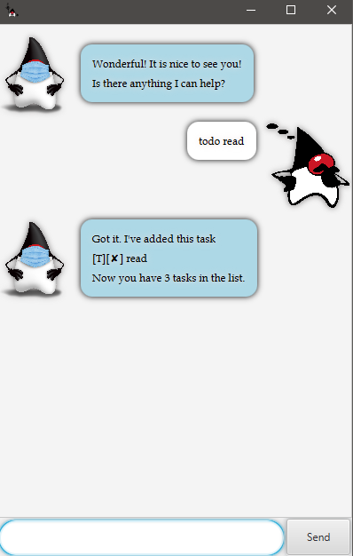

&nbsp;

### `deadline` - Create a task with a deadline

Format: `[deadline] <space> <detail> <space> </by> <Date and/or time>`

Example:
* `deadline UG /by 16_2359` creates a new deadline task `UG (by:Wednesday_Sep_16_2020_23:59)`
* More time format can be referred in `3.Various time format support`.

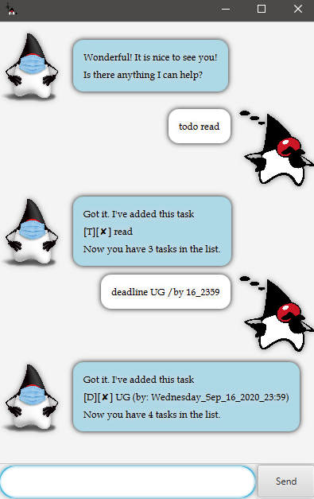

&nbsp;

### `event` - Create a event to attend

Format: `[event] <space> <detail> <space> </on> <Date and/or time>`

Example:
* `event midterm /on 16_1300` creates a new deadline task `midterm (on:Wednesday_Sep_16_2020_13:00)`
* More time format can be referred in `3.Various time format support`.

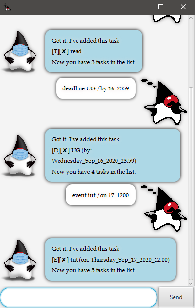

&nbsp;

### `done` - Mark a task as done

Format: `[done] <index>`

Example:
* `done 1` mark the first task in the list as done.

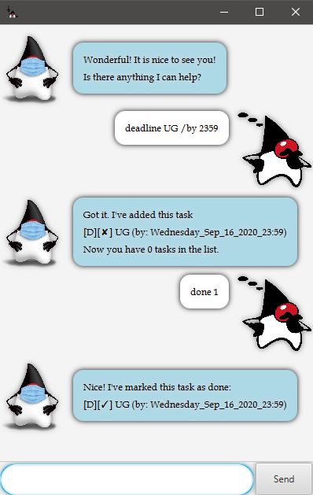

&nbsp;

### `delete` - delete a task

Format: `[delete] <index>`

Example:
*`delete 1` deletes the first task in the list.

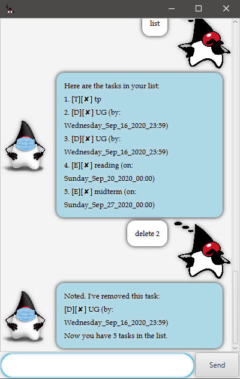

&nbsp;

### `list` - view all tasks in the list

Format: `[list]`

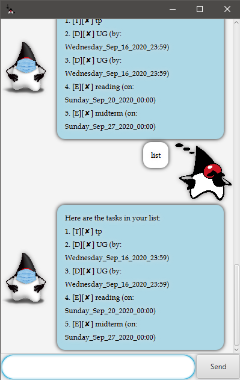

&nbsp;

### `clear` - delete all the tasks

Format: `[clear]`

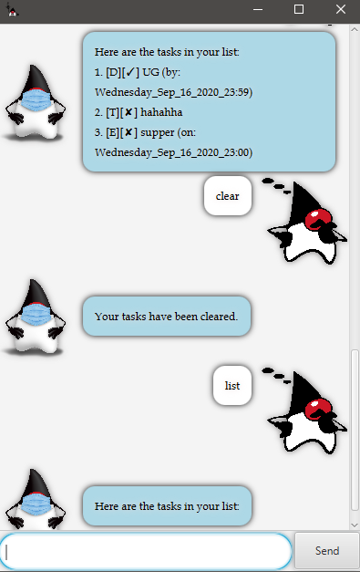

&nbsp;

### `find` - find the tasks containing each or all keywords from the user

Format: `[find] <space> <keywords>`

Example:
* `find tutorial lesson` finds tasks that contains `tutorial` or `lesson` or `tutorial lesson`.

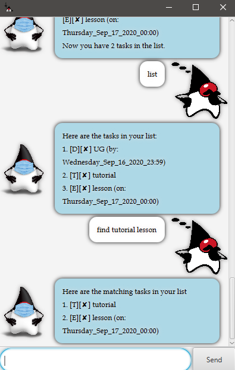

&nbsp;

### `update` - update the detail or time of an existing task

Format: `[update] <space> <index> <space> <detail/time> <space> </to> <content>`

Example: 
* `update 2 detail /to CS2103T lesson` update the detail of the 2nd task to `CS2103T lesson`. 
* `update 3 time /to 1600` update the time of the 3rd task to `1600` of the present day.

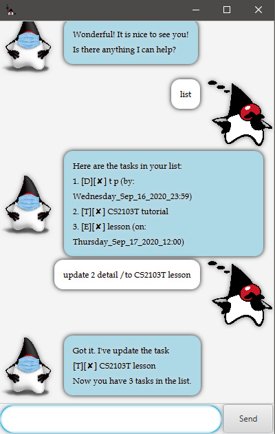
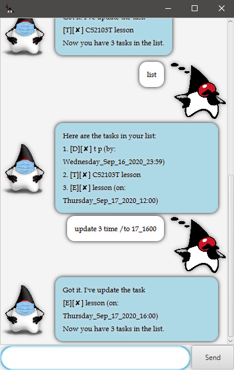

&nbsp;

### `bye` - exit the program

Format: `bye`

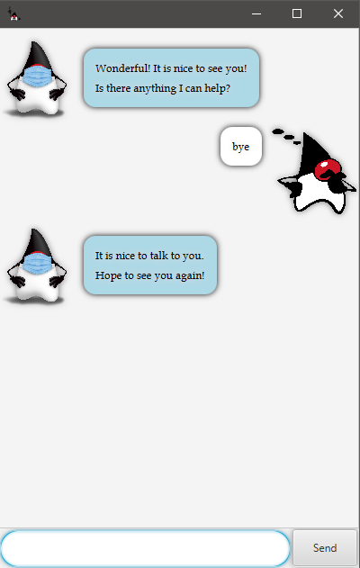