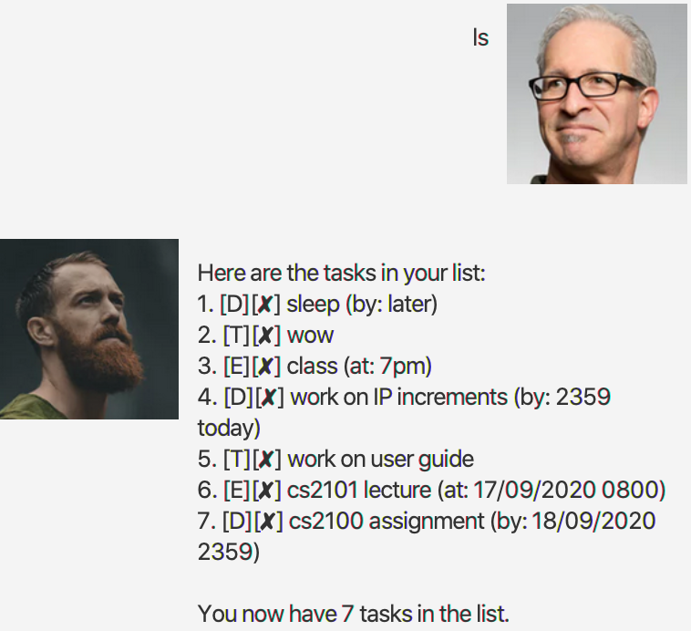
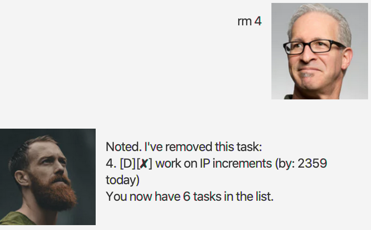

# Duke User Guide

Welcome to Duke! Duke is a intelligent chatbot that helps you to
manage your life! You can treat him as your personal secretary who
will help you to remember everything about your life.

## Features 
1. Add tasks such as todos, events or deadlines to Duke.
1. Mark tasks as completed
1. Easily find certain tasks you've added
1. Delete tasks if necessary
1. Simple date parsing for events and deadlines

## Usage

### `todo <description>` - Adds a Todo

Adds a Todo to Duke.

Example of usage: 

`todo work on user guide`

Expected outcome:

### `event <description> /at <date>` - Adds an Event at `<date>`

Adds an event at the date provided to Duke.

Example of usage: 

`event cs2101 lecture /at 17/09/2020 0800`

Expected outcome:

### `deadline <description> /by <date>` - Adds a Deadline by `<date>`

Adds a deadline by the date to Duke.

Example of usage: 

`deadline cs2100 assignment /by 18/09/2020 2359`

Expected outcome:

### `ls` - List all tasks

Lists all tasks in Duke.

Example of usage: 

`ls`

Expected outcome:

### `done <task number>` - Mark as done

Marks the task with the current task number as done.

Example of usage: 

`done 5`

Expected outcome:

### `find <search term>` - Find

Finds an added task by searching task descriptions, based on whether
any part of the description matches the search term.

Example of usage: 

`find lecture`

Expected outcome:

### `rm <task number>` - Remove task

`rm` is also aliased to `delete`.

Removes an added task using its task number.

Example of usage: 

`rm 4` OR `delete 4`

Expected outcome:

### `bye` - Exit Duke

`bye` is also aliased to `exit`.

Quits Duke.

Example of usage: 

`bye` OR `exit`

Expected outcome:

