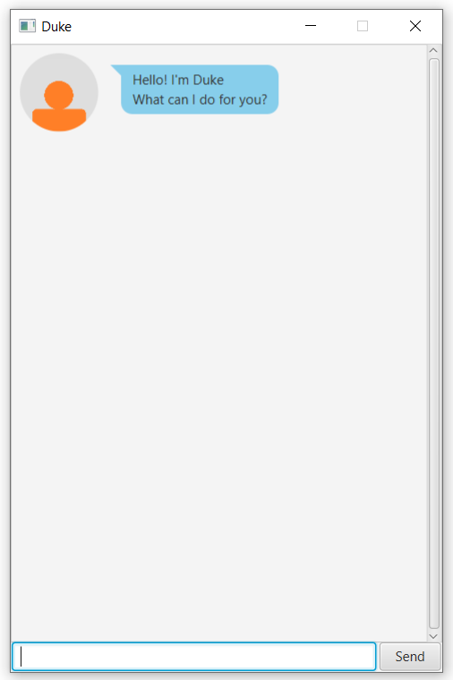

# User Guide

Duke is an **interactive desktop app used to keep track of tasks to be completed**. It is optimized 
for use through a **Command Line Interface** (CLI) while providing a minimalistic and elegant Graphical User Interface 
(GUI). If you can type fast and wish to keep track of tasks this way, then this might be the app for you!

## Quick Start
1. Ensure you have Java 11 or above installed in your computer.
2. Download "Duke.jar" from [here](https://github.com/chan-j-d/ip/releases).
3. Copy the file to the desired location where you would normally access it.
4. Double-click the file to start the app. The GUI will look similar to the image below. Upon using it for the first 
time, a new folder named "data" will be created in the same directory in order to store task data.  
 
5. Type the command in the text box and press Enter to execute the command. You can begin by trying the few commands 
in-order below.
    1. <code>todo some task</code>: Adds a todo-task <code>some task</code>.
    2. <code>list</code>: Lists all current task. You should see "some task" added in step 1.
    3. <code>done 1</code>: Marks the 1st task. In this case, it is the todo-task "some task".
    4. <code>list</code>: Lists all current task. Notice that the task is now marked as complete.
    5. <code>delete 1</code>: Deletes the 1st task. 
    6. <code>bye</code>: Closes the app.
6. Refer to the [features](https://github.com/chan-j-d/ip/tree/master/docs#features) below for more commands and the details of each command.

## Features 
Note the following about the command format:
- The first word of the command is always the command identifier.
e.g. <code>{identifier} {details}</code> where <code>{identifier}</code> is a single word identifying the command type.
- Commands are case-sensitive.
e.g. for the command <code>todo</code>, <code>TODO</code> and <code>tOdO</code> will not be recognised.
- Fields in curly braces such as <code>{description}</code> are for you to specify the input.
- Note further command format specifications for the individual commands.

### General commands
#### Listing tasks: <code>list</code>
Shows all tasks that have been added to Duke.

Format: <code>list</code>

#### Finding tasks: <code>find</code> 
Finds tasks with description containing the given word or phrase.

Format: <code>find {keyword or phrase}</code>
- The search is case-sensitive. e.g. <code>TASK</code> will not match <code>task</code>.
- The search will find exact matches of the keyword or phrase provided. e.g. <code>one t</code> will find
<code>one time</code> but not <code>onetime</code> or <code>t one</code>.

Example:
- <code>find CS2103</code> finds all tasks with <code>CS2103</code> in its description

Outcome:
- A list of tasks will be sent by Duke. The format resembles that of the <code>list</code> command. 

#### Exiting the app: <code>bye</code>
Exits the app.

Format: <code>bye</code>

### Add commands
Below are commands that add different types of tasks and their details.
#### Adding ToDo-type task: <code>todo</code>
Adds a task with a description that needs to be completed.

Format: <code>todo {description}</code>
- <code>{description}</code> cannot be empty.

Examples:
- <code>todo CS2103 Individual Project</code> Adds a todo-task with description <code>CS2103 Individual Project</code>.

Outcome:
- A todo-task is added. The task can be seen when the <code>list</code> command is called.
It will appear with the identifier <code>[T]</code> for todo.

#### Adding Deadline-type task: <code>Deadline</code>
Adds a task with a description and a deadline.

Format: <code>deadline {description} /by {deadline}</code>
- The <code>{deadline}</code> must be specified.
- The <code>{deadline}</code> is of the format <code>DD-MM-YYYY HHmm</code>.

Examples:
- <code>deadline Individual Project /by 18-09-2020 2359</code> Adds a deadline with description
 <code>Individual Project</code> and deadline at <code>18-09-2020 2359</code>.
 
Outcome:
- A deadline is added. The task can be seen when the <code>list</code> command is called. 
It will appear with the identifier <code>[D]</code> for deadline.

#### Adding Event-type task: <code>event</code>
Adds a task with a description, a start timing and an end timing.

Format: <code>event {description} /at {timings}</code>
- The <code>{timings}</code> must be specified.
- The <code>{timings}</code> is of the format <code>DD-MM-YYYY HHmm-DD-MM-YYYY HHmm</code> **or** 
<code>DD-MM-YYYY HHmm-HHmm</code> if the start and end timings are on the same day.
- The start timing must come before the end timing.

Examples:
- <code>event CS2103 Lecture /at 18-09-2020 1600-1800</code> Adds an event with description 
<code>CS2103 Lecture</code>, start timing at <code>18-09-2020 1600</code> and end timing at 
<code>18-09-2020 1800</code>.
- <code>event Recess Week /at 19-09-2020 0000-27-09-2020 2359</code> Adds an event with description 
<code>Recess Week</code>, start timing at <code>19-09-2020 0000</code> and end timing at <code>27-09-2020 2359</code>.

Outcome:
- An event is added. The task can be seen when the <code>list</code> command is called. 
It will appear with the identifier <code>[E]</code> for event.

#### Adding recurring tasks: <code>-r</code>
Adds a recurring task which recurs based on the specified interval. Task must be a deadline or event.

Format: <code>{recurring task specification} -r {interval}</code>
- <code>{recurring task specification}</code> must be a full command for adding either a deadline or event. 
e.g. <code>deadline CS2103 IP /by 18-09-2020 2359 -r {interval}</code>
- <code>{interval}</code> is of the form <code>XO</code> where
    - <code>O</code> refers to the interval specifier. The specifier is not case-sensitive.
        - <code>D</code> for day
        - <code>W</code> for week
        - <code>M</code> for month
        - <code>Y</code> for year
    - <code>X</code> refers to the multiplier
        - Multiplier must be a positive integer. e.g. 1, 2, ...
        - Multiplier is optional. If a multiplier is not specified, it is set to 1.
- The recurring task only recurs when Duke is opened after the end-timing for the recurring task. 
The task will be pushed back by multiples of the recurring interval until the end timing exceeds the current time.
 It is marked as undone regardless of the original completion status.

Example: 
- <code>deadline weekly assignment /by 17-09-2020 2359 -r W</code> Adds a recurring deadline with description 
<code>weekly assignment</code>, first deadline at <code>17-09-2020 2359</code> and recurring interval of 1 week.
- <code>event project meeting /at 16-10-2020 1400-1600 -r 2D</code> Adds a recurring event with description 
<code>project meeting</code>, first event on <code>16-10-2020</code> from <code>1400-1600</code> and recurs every 
2 days.

Outcome:
- The recurring tasks is added to the list. The recurring task can be identified by the 
<code>(Recurring: {interval})</code> at the end of the task.

### State-changing commands
#### Completing a task: <code>done</code>
Marks a task as complete.

Format: <code>done {index}</code>
- <code>{index}</code> must be a positive integer. e.g. 1, 2, ...
- <code>{index}</code> index refers to the number shown on the task when the <code>list</code> command is used.

Example:
- <code>done 2</code> Marks the 2nd task shown by the <code>list</code> command as done.

Outcome:
- If the task was previously undone (denoted with the symbol ✘), then that task is now marked as done 
(with the symbol ✓). 

#### Deleting a task: <code>delete</code>
Deletes a task from the list.

Format: <code>delete {index}</code>
- <code>{index}</code> must be a positive integer. e.g. 1, 2,...
- <code>{index}</code> index refers to the number shown on the task when the <code>list</code> command is used.

Outcome:
- The task at <code>{index}</code> will be removed from the list and is no longer shown when the <code>list</code> 
command is used.

## Command summary

Action | Format
---------|-----------
**List** | <code>list</code>
**Find** | <code>find {keyword or phrase}</code>
**Exit** | <code>bye</code>
**ToDo** | <code>todo {description}</code>
**Deadline** | <code>deadline {description} /by {deadline}</code>
**Event** | <code>event {description} /at {timings}</code>
**Recurring Task** | <code>{recurring task specification} -r {interval}</code>
**Done** | <code>done {index}</code>
**Delete** | <code>delete {index}</code>

