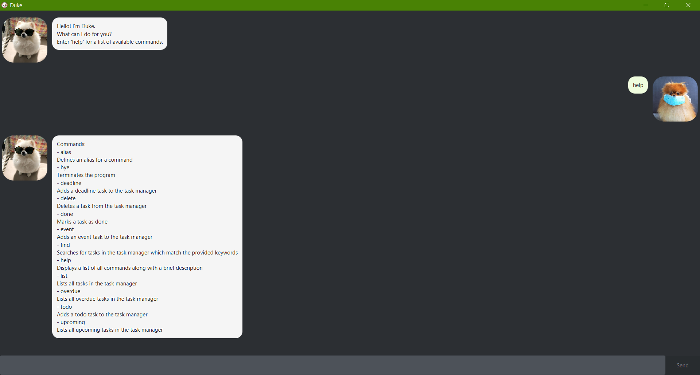
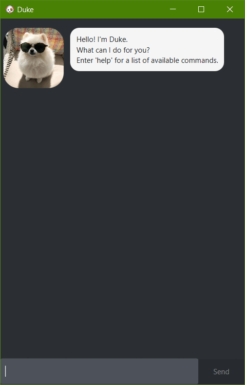
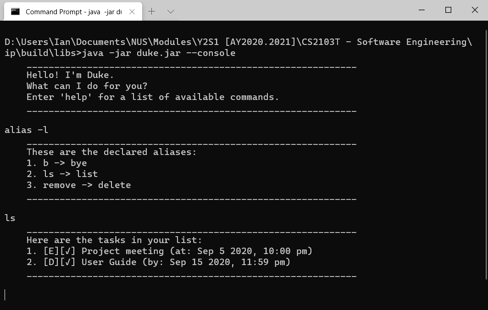
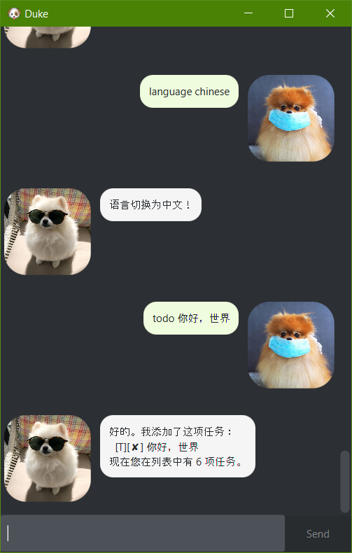

# Duke | User Guide

<div class="portrait-image-container">
  
</div>

Duke is a *Personal Assistant Chatbot* with task management functionality that caters to fast typists.
Keep track of all your tasks with ease!

## Features

### Manage Your Tasks

To best cater to your task management needs, Duke supports the creation of three different types of tasks:
- Deadlines
- Events
- Todos

#### Deadlines

Deadlines are tasks that have to be completed by a specific date and time.

#### Events

Events are tasks that occur at a specific date and time.

#### Todos

Todos are tasks that do not have a specific date and time attached to them.

All of the above tasks track whether they have been completed.
In addition, for deadline and event tasks, Duke is able to filter by overdue and upcoming tasks.

### Theming

Duke sports a dark theme that is gentle on the eyes.
This allows for prolonged usage of Duke without having to worry about eye strain.

<div class="landscape-image-container">
  
</div>

It is also possible to resize Duke if you wish to make better use of your screen real estate.

### Command History

<div class="portrait-image-container">
  
</div>

The Duke graphical user interface has an in-built command history which remembers the last 50 commands.
Just like in any other terminal, you can navigate through your previous inputs by pressing the `up` and `down` key.

### Command Line Support

<div class="landscape-image-container">
  
</div>

For users who have a strong preference for command line interfaces (CLI) over graphical user interfaces, Duke is able to run in CLI mode.
Simply launch the `.jar` file with the `-c` or `--console` flag:

```
java -jar duke.jar --console
```

### Mandarin Chinese Support

<div class="portrait-image-container">
  
</div>

Duke has been designed from the ground up for i18n.
All user-facing strings are set in a resource file, making the task of supporting a new language simply a matter of adding the translated strings.
In addition, Duke utilises UTF-8 encoding, allowing non-latin characters to be stored without issue.

Currently, Duke supports the following languages:
- English (en)
- Chinese (zh)

Switching between languages is as easy as calling the `language` command:

```
language chinese
```

Note that the language names can be substituted with the ISO 639-1 language codes as well:

```
language zh
```

## Usage

### `alias` - Defines an alias for a command

Associates an alias with a command.

Example of usage:

`alias bye b`

Expected outcome:

```
Alias 'b' successfully added for command 'bye'.
```

### `bye` - Terminates the program

Exits the program gracefully.

Example of usage:

`bye`

Expected outcome:

Program exits

### `deadline` - Adds a deadline task

Adds a new deadline task to the task manager.
A deadline task is a task with a description and a due date.

Example of usage:

`deadline User Guide /by 15/9/2020 2359`

Expected outcome:

```
Got it. I've added this task:
  [D][✘] User Guide (by: Sep 15 2020, 11:59 PM)
Now you have 4 tasks in the list.
```

### `delete` - Deletes a task

Deletes the task at the specified index from the task manager.

Example of usage:

`delete 3`

Expected outcome:

```
Noted. I've removed this task:
  [D][✘] User Guide (by: Sep 15 2020, 11:59 PM)
Now you have 3 tasks in the list.
```

### `done` - Marks a task as done

Marks the task at the specified index in the task manager as done.

Example of usage:

`done 3`

Expected outcome:

```
Nice! I've marked this task as done:
  [D][✓] User Guide (by: Sep 15 2020, 11:59 PM)
```

### `event` - Adds an event task

Adds a new event task to the task manager.
An event task is a task with a description and a date/time.

Example of usage:

`event CS2103T Lecture /at 18/9/2020 1600`

Expected outcome:

```
Got it. I've added this task:
  [E][✘] CS2103T Lecture (at: Sep 18 2020, 04:00 PM)
Now you have 4 tasks in the list.
```

### `find` - Finds tasks based on keywords

Searches for tasks in the task manager which match the provided keywords.

Example of usage:

`find 2103 guide`

Expected outcome:

```
Here are the matching tasks in your list:
1. [D][✓] User Guide (by: Sep 15 2020, 11:59 PM)
2. [E][✘] CS2103T Lecture (at: Sep 18 2020, 04:00 PM)
```

### `help` - Displays the list of commands

Displays the list of available commands along with a brief description.

Example of usage:

`help`

Expected outcome:

```
Commands:
- alias
Defines an alias for a command
- bye
Terminates the program
- deadline
Adds a deadline task to the task manager
- delete
Deletes a task from the task manager
- done
Marks a task as done
- event
Adds an event task to the task manager
- find
Searches for tasks in the task manager which match the provided keywords
- help
Displays a list of all commands along with a brief description
- list
Lists all tasks in the task manager
- overdue
Lists all overdue tasks in the task manager
- todo
Adds a todo task to the task manager
- upcoming
Lists all upcoming tasks in the task manager
```

### `language` - Sets the language of Duke

Sets the language which Duke will respond in.
Currently, the following languages are supported:
- English (en)
- Chinese (zh)

Example of usage:

`language zh`

Expected outcome:

```
语言切换为中文！
```

### `list` - Lists all tasks

Lists all tasks in the task manager.

Example of usage:

`list`

Expected outcome:

```
Here are the tasks in your list:
1. [D][✘] Add GUI to iP (by: Sep 1 2020, 11:59 PM)
2. [E][✓] Project meeting (at: Sep 5 2020, 10:00 PM)
3. [D][✓] User Guide (by: Sep 15 2020, 11:59 PM)
4. [E][✘] CS2103T Lecture (at: Sep 18 2020, 04:00 PM)
```

### `overdue` - Lists all overdue tasks

Lists all overdue tasks in the task manager.

Example of usage:

`overdue`

Expected outcome:

```
Here are your overdue tasks:
1. [D][✘] Add GUI to iP (by: Sep 1 2020, 11:59 PM)
```

### `todo` - Adds a todo task

Adds a new todo task to the task manager.
A todo task is a task with only a description.

Example of usage:

`todo CS2103T Quiz 6`

Expected outcome:

```
Got it. I've added this task:
  [T][✘] CS2103T Quiz 6
Now you have 5 tasks in the list.
```

### `upcoming` - Lists all upcoming tasks

Lists all upcoming tasks in the task manager.

Example of usage:

`upcoming`

Expected outcome:

```
Here are your upcoming tasks:
1. [E][✘] CS2103T Lecture (at: Sep 18 2020, 04:00 PM)
```
