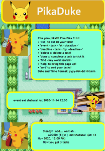
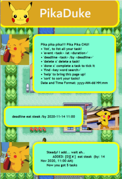
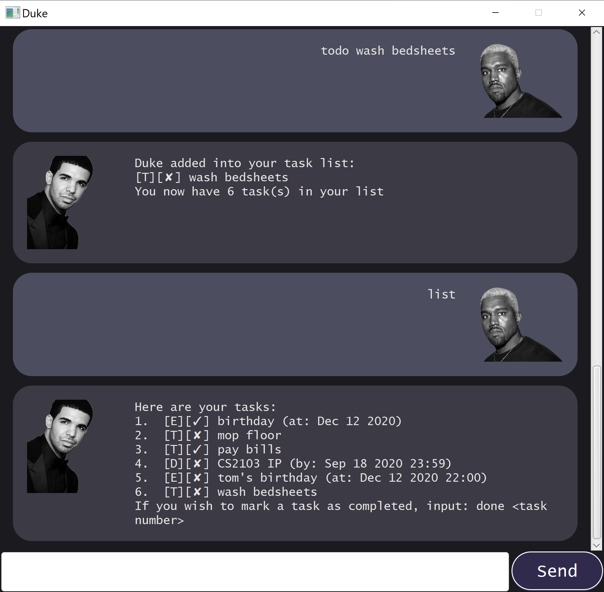
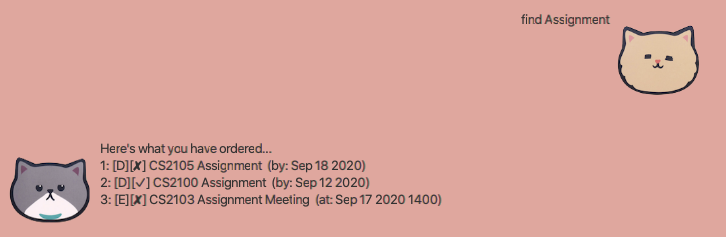

# PikaDuke User Guide
A CS2103 Project to create a simple bot for to-do tasking. 
 
The attitude of which I have adopted for this module as well as for the
graphics are inspired by my all time favorite game:

 
*Gotta Catch 'Em All (A+s)*

# Thunderbolt Features 

For the PikaDuke Bot, I have implemented the following features:

1. [**`Adding`**](#addition) of tasks to the bot.   
2. [**`Storage & Retrieval`**](#storage) of tasks in local drive.  
3. [**`Listing`**](#listing) of all existing tasks.  
4. [**`Marking completion`**](#marking) for tasks desired to be marked as completed.  
5. [**`Deletion`**](#delete) of tasks no longer desired to be in the list.  
6. [**`Searching`**](#searching) for key taskings.  
7. [**`Sorting of tasks`**](#sorting) according to their input schedule (if available).  
8. [**`Help`**](#help) display in the event user encounters error.  

## Feature Details
### 1. Addition Of Tasks 

The user will be able to add tasks into PikaDuke. There are 3 types of tasking of which the user can
segment his tasks into.
- Todo
- Event
- Deadline

#### Commands

- **Todo** - `todo <task details>`

Simply adds a tasking with the 'task details' into PikaDuke.

**Example of usage:** 

    todo eat genki sushi

**Expected outcome:**

    Steady! I add... wait ah...
        ADDED: [T][X] eat genki sushi
    Now you got 1 tasks

- **Event** - `event <task details> /at <Date & Time>`

Adds an event tasking with the 'task details' as well as Date and Time into PikaDuke. 

**Date & Time format:** `yyyy-MM-dd HH:mm`

**Example of usage:** 

    event eat shabusai /at 2020-11-14 12:00

**Expected outcome:**

    Steady! I add... wait ah...
        ADDED: [E][X] eat shabusai (at: 14 Nov 2020, 12:00PM)
    Now you got 2 tasks
    
  

- **Deadline** - `deadline <task details> /by <Date & Time>`

Adds an deadline tasking with the 'task details' as well as Date and Time into PikaDuke. 

**Date & Time format:** `yyyy-MM-dd HH:mm`

**Example of usage:** 

    deadline eat steak /by 2020-11-14 11:00

**Expected outcome:**

    Steady! I add... wait ah...
        ADDED: [D][X] eat steak (by: 14 Nov 2020, 11:00AM)
    Now you got 3 tasks

  

---

### 2. Storage and Retrieval of Tasks  
PikaDuke will smartly retrieve an existing set of task if there is an existing 
file in your local computer. Upon launching of PikaDuke, it will parse through the 
text file and create the task list to be loaded into PikaDuke.

If there are no files located by PikaDuke, PikaDuke will automatically create a 
text file named `duke.txt`  in the same directory as the source file. All writing and loading functions
will be directed to this `duke.txt`.

The default file path set for this is as follows:

    private final String defaultPath = "./duke.txt";
The code is located in`Storage.java`. If you would like to change the directory to another location
or change the filename, you can edit so via the above shown code in `Storage.java`.

---

### 3. Listing  

- **Listing** - `list`

Displays all the existing task list in PikaDuke.

**Example of usage:** 

    list

**Expected outcome:**

    Retrieving your list, patient ah!
        1. [T][X] eat genki sushi
        2. [E][X] eat shabusai (at: 14 Nov 2020, 12:00PM)
        3. [D][X] eat steak (by: 14 Nov 2020, 11:00AM)

      
 
---
### 4. Marking Completion  
- **Marking** - `done <index of task>`

Marks the completion, indicated by a `X` or `✓`. Completed tasks will display `[✓]`.
The index of the task corresponds to the number of which it is listed, you can simply run `list`
to check the index of the task.

**Example of usage:** 

    done 1

**Expected outcome:**

    Swee la, task done liao:
        [T][✓] eat genki sushi

---

### 5. Deletion of Task  
- **Deleting** - `delete <index of task>`

Deletes a task that is existing on the list.
The index of the task corresponds to the number of which it is listed, you can simply run `list`
to check the index of the task. You can run the command `list` again to see that the task is no longer
on the list.

**Example of usage:** 

    delete 1

**Expected outcome:**

    Delete liao boss:
    Remaining Tasks: 2
---

### 6. Searching  
- **Searching** - `find <key word(s)>`

Finds the tasks that contains the <key word(s)> and lists only the relevant task(s).
Note that this will not delete the tasks not relevant with the search word.

**Example of usage:** 

    find shabusai

**Expected outcome:**

    Retrieving your list, patient ah!
    1. [E][X] eat shabusai (at: 14 Nov 2020, 12:00PM)

    
---

### 7. Sorting of Tasks  
- **Sorting** - `sort`

This features helps to sort the task existing in the list. The `sort` sorts the
task list according to the date and time input. For the `todo` type tasks, without the
time and date input, will be pushed to the bottom of the list.

**Example of usage:** 

    user input: 
        list
    
    output:   
        Retrieving your list, patient ah!
        1. [T][X] eat genki sushi
        2. [E][X] eat shabusai (at: 14 Nov 2020, 12:00PM)
        3. [D][X] eat steak (by: 14 Nov 2020, 11:00AM)

    user input:
    sort
    
**Expected outcome:**

     Retrieving your list, patient ah!
         1. [D][X] eat steak (by: 14 Nov 2020, 11:00AM)
         2. [E][X] eat shabusai (at: 14 Nov 2020, 12:00PM)
         3. [T][X] eat genki sushi
---

### 8. Help Command  
- **Help** - `help`

Displays the initial prompt message to guide the user on the command available for the bot.

**Example of usage:** 

    help
    
**Expected outcome:**

    Pika pika pika!!! Pika Pika CHU!
    • 'list', to list all your task!
    • 'event <task> /at <duration>'
    • 'deadline <task> /by <deadline>' 
    • 'delete x' delete a task!
    • 'done x' complete a task to tick it
    • 'find <key word search>'
    • 'help' to bring this page up!
    • 'sort' to sort your tasks!
    Date and Time Format: yyyy-MM-dd HH:mm
    
---

# Thanks for coming!

