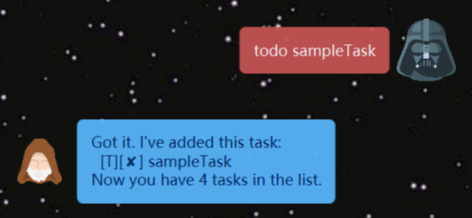
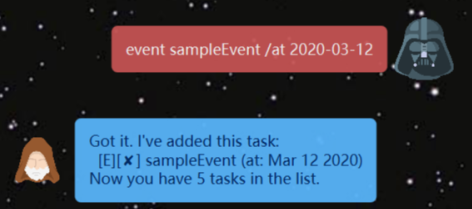
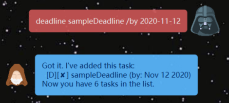
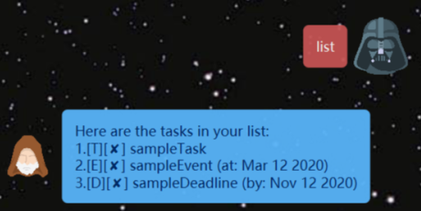
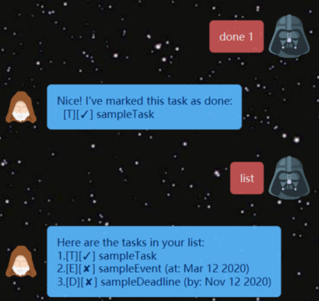
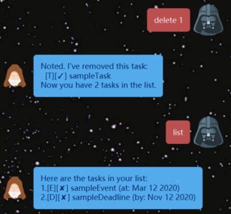
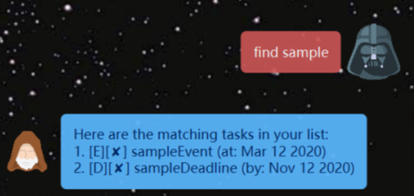
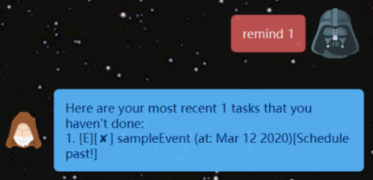

# Duke Chat bot User Guide

## Introduction

Duke chat bot is for people _in need to manage their daily tasks via CLI_.

## Quick Start

* Ensure you have `Java 11` or above installed in your Computer.
* Download latest `duke.jar`.
* Double-click on the `duke.jar` to start the application.
* Exit the app by typing in _"bye"_.

## Features

1. Add a todo/event/deadline task
1. View the list of tasks
1. Mark certain tasks as completed
1. Delete a task
1. Find a task by keyword
1. Get reminder on upcoming dues

## Usage

### `Todo` - Add a todo task

Store a todo task which does not have time constraint.

Format: `todo TASK_NAME`

Example of usage: 

   * `todo sampleTask` creates the `sampleTask` in the task list.
   * 

### `Event` - Add an event task

Store an event task which needs to be done __at__ a scheduled time.

Format: `event TASK_NAME /at SCHEDULED_TIME` where `SCHEDULED_TIME` follows the format _'YYYY-MM-DD'_.

Example of usage: 

   * `even sampleEvent /at 2020-03-12` creates the `sampleEvent` in the task list.
   * The `sampleEvent` is to be done at __March 12, 2020__.
   

### `Deadline` - Add a deadline task

Store a deadline task which needs to be done __before__ a scheduled time.

Format: `deadline TASK_NAME /by SCHEDULED_TIME` where `SCHEDULED_TIME` follows the format _'YYYY-MM-DD'_.

Example of usage: 

   * `deadline sampleDeadline /by 2020-11-12` creates the `sampleDeadline` in the task list.
   * The `sampleDeadline` is to be done before __Nov 12, 2020__.
   * 
   
### `List` - Display the list of tasks

Generates the entire list of tasks stored in the app.

Format: `list`

Example of usage: 

   * `list` returns all tasks' information presented nicely.
   * The displayed string is of the form `[TASK_TYPE][COMPLETION_INDICATOR]TASK_NAME ([TASK_SCHEDULE])`.
   * `TASK_TYPE` can be `T` (Todo) / `E` (Event) / `D` (Deadline).
   * `COMPLETION_INDICATOR` shows whether the task has been completed, a `✓` means done, a `✘` means not done.
   * `TASK_SCHEDULE` is _optional_.
   * 
   
### `Done` - Complete a task

Mark a task in the list as completed.

Format: `done TASK_INDEX` where `TASK_INDEX` is an _integer_ between 1 and length of list.

Example of usage: 

   * `done 1` updates the status of the first task as "done", represented as `✓`.
   * 
   
### `Delete` - Delete a task

Delete a task in the list by its index.

Format: `delete TASK_INDEX` where `TASK_INDEX` is an _integer_ between 1 and length of list.

Example of usage: 

   * `delete 1` delete the first task from the list.
   * 
   
### `Find` - Search for relevant tasks

Find the tasks containing certain keywords specified by the user.

Format: `find KEYWORD` where `KEYWORD` is __limited to 1 word__.

Example of usage: 

   * `find sample` returns all tasks whose name contain the word `'sample'`.
   * Here the outputs are `sampleEvent` and `sampleDeadline`.
   * 
   
### `Reminder` - Get notified of upcoming due

Remind the use the upcoming events/deadlines sorted by their schedule.

Format: `remind TASK_NUMBER` where `TASK_NUMBER` is amount of upcoming tasks the user wants to know.

Example of usage: 

   * `remind 1` returns the earliest 1 task the user hasn't completed.
   * If the task's scheduled time has past, the returned task will also indicate it.
   * Here the earliest task is `sampleEvet`, which should be done at _March 12, 2020_. The output also shows `[Schedule past!]` to remind user this event has past and not been done.
   * 