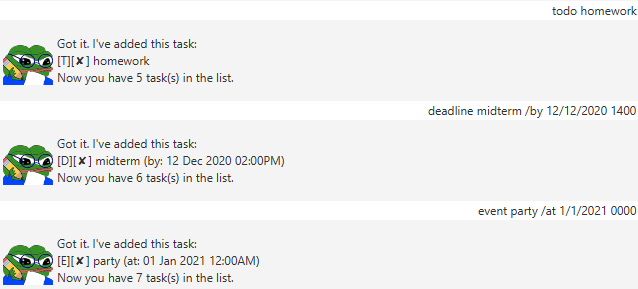
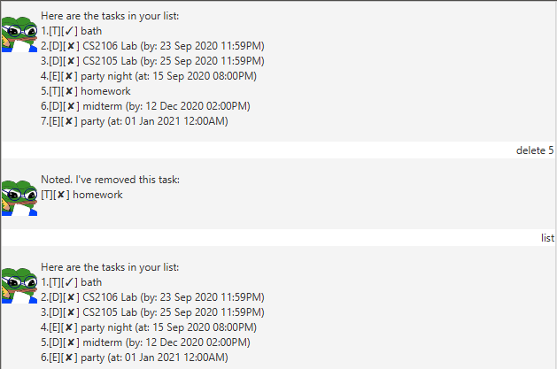
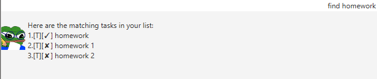
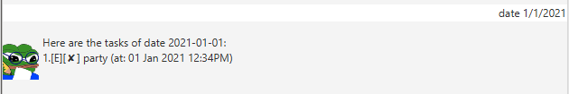
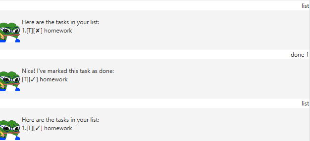

# User Guide

DukeTaskManager is a simple, easy-to-use task managing application that might aid your scheduling of daily 
tasks, deadline and on-coming events. 

This application has both **Command Line Interface (CLI)** and **Graphical User Interface (GUI)** which is optimised
users who prefer typing than clicking and navigating with their mouse.

Furthermore, this app features [Pepe the frog](https://en.wikipedia.org/wiki/Pepe_the_Frog), so for those who are obsessed with such memes can 
have some fun using this app.


<hr>


##Table of Contents
* **Getting Started**
* **Key Features**
    * **Adding and deleting a task**
    * **Find a task**
    * **Mark as done**
    * **Delete tasks**
    * **Reminder**
* **Commands Summary**
* **FAQ**


##Getting Started

To use DukeTaskManager, you can do the following to "install".

1. Install **Java 11** on your computer.
2. Download Latest DukeTaskManager release [here](https://github.com/YuunoKun/ip/releases).
3. Double click the **DukeTaskManager.jar** to start. 

##Key Features

####Adding and deleting a task 

There are quite a couple ways to add a task such as:**`todo`** **`deadline`** **`event`**


To add a todo task:
```
todo DESCRIPTION
e.g. todo homework for CS2100
```

To add a deadline task:
```
deadline DESCRIPTION /by DATETIME
e.g. deadline homework for CS2100 /by 9/9/2020 2359
```

To add a event task:
```
event DESCRIPTION /at DATETIME
e.g. event party /at 1/1/2021 0000
```
Do take note that `DESCRIPTION` can be a sentence with spaces between words, and there must be a 
whitespace before and after `/at` or `/by`. Also, `DATETIME` must be in the form of `dd/MM/yyyy hhmm`
, i.e. `1/1/2020 1800`. The given date must be in the future or the date will be invalid.


If you want to delete a certain task, you can use the command  **`delete`**

```
delete TASKINDEX
e.g. delete 1
```

If you want to delete all the tasks stored, use **`clearall`**
```
clearall
```

####Find a task

Find a task by using command such as **`find`** and **`date`**

Command `find` is designed to find tasks by matching the description of the tasks while command `date` focus
on finding tasks by their date and time.


Find tasks with certain keyword:
```
find KEYWORD
e.g. find homework
```


```
date DATE
e.g. date 10/12/2020
```

####Mark as done



To mark task as done:
```
done TASKINDEX
```
Note that you might want to check the correct index of the task before 
marking a task as done, as there isn't a way to mark a task as undone yet.

<br>

####Reminder

If you have a deadline or event that within 2 days, a reminder will be sent when you start DukeTaskManager.


<hr>

##Commands Summary

Command | Format
------- | --------
`todo` | `todo DESCRIPTION` 
`deadline` | `deadline DESCRIPTION /by DATETIME`
`event` | `event DESCRIPTION /at DATETIME`
`list` | `list`
`done` | `done TASKINDEX`
`find` | `find KEYWORD`
`date` | `date DATE`
`delete` | `delete TASKINDEX`
`clearall` | `clearall`


