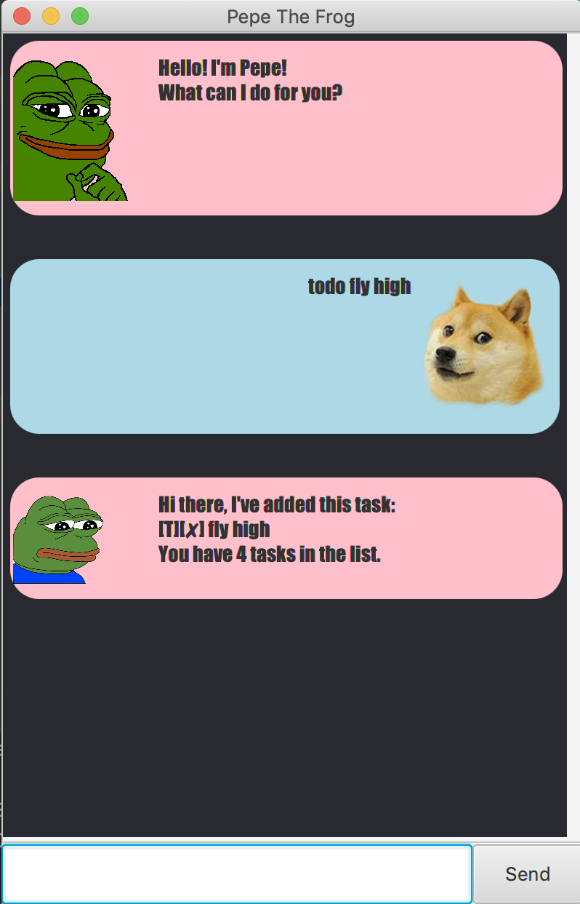
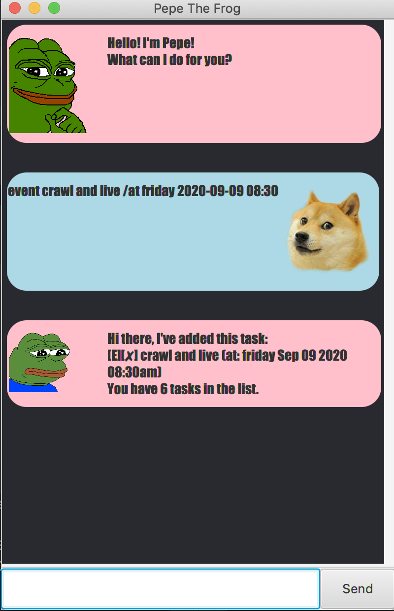
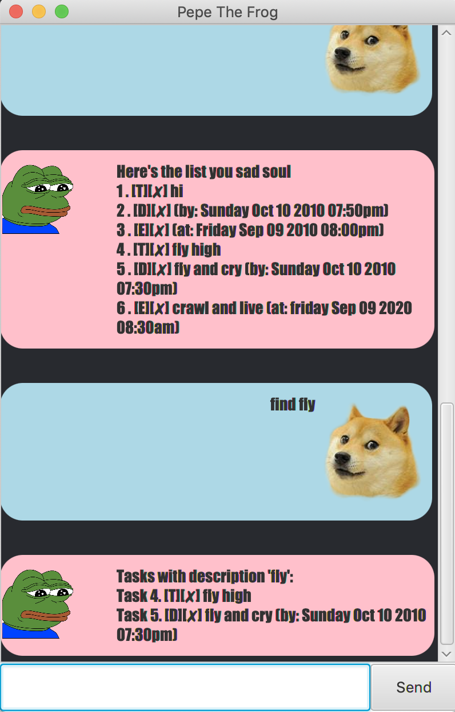
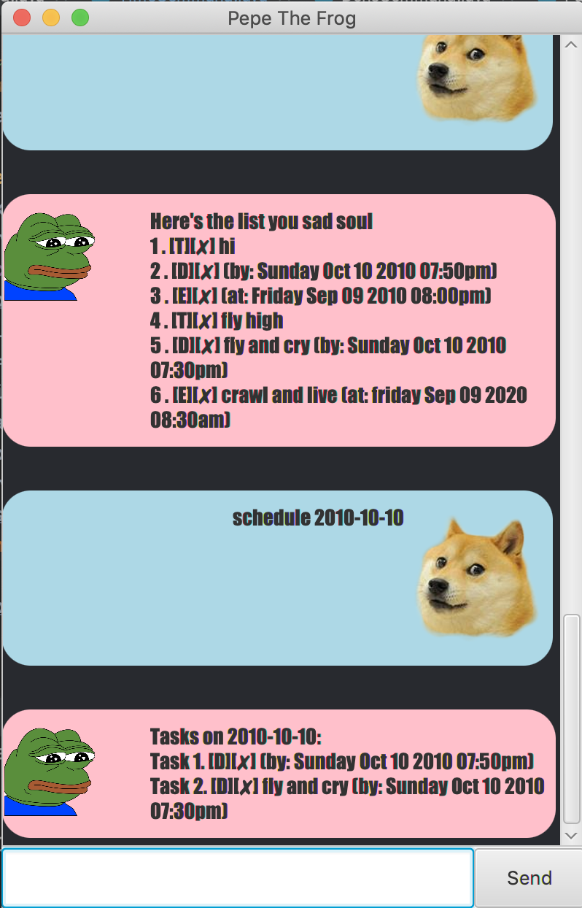
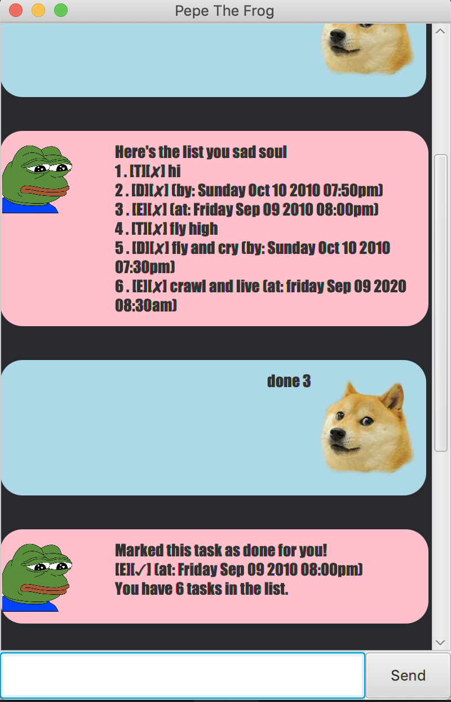
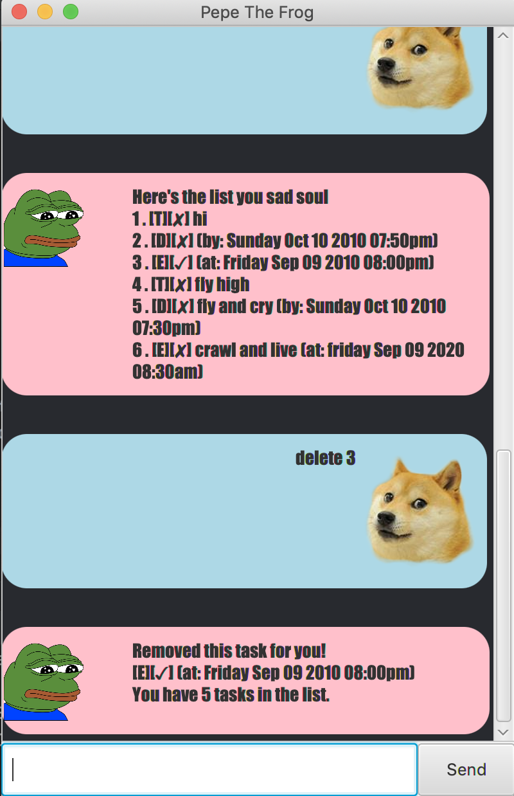

# User Guide 

## Introduction
A simple guide to get you kick started on how to easily use this CLI app to create and manage your personal TaskList
## Features 

View Function

## `list`
 

**Command to view tasks**
 

* Type in `list`
* List of all tasks currently contained in tasklist will be shown
 
 

Add Functions

 

**Here are the commands to add different types of tasks into your tasklist**  
 

Add Todo

## `todo`
 

* Type `todo` followed by a space and then type in the 'todo' you wish to add into your list
 
 

Add deadline

## `deadline`
 

* Type `deadline` followed by description of deadline, then followed by  `/by` followed by a space and then type the rest of the description
* Input date via `YYYY-MM-DD` format and time in `HH:MM` format if you wish to add date and time
 
 

Add event

## `event`
 

* Type `event` followed by description of event, then followed by `/at` followed by a space and then type in the rest of the description
 
* Input date via `YYYY-MM-DD` format and time in `HH:MM` format if you wish to add date and time
 
 

Search Functions

 

**Here are the commands to search for tasks via description, time or date**  
 

Search Via Description

## `find`
 

* Type in `find` and then the description that you want to search for in the tasklist
* Return you tasks which contains the description you searched for
 
  

Search Via Time

## `time`
 

* Type in `time` followed by the time that you wish to search for in `HH:MM` format
* Returns you the tasks which take place at the time you searched for
 
 

Search Via Date

## `schedule`
 

* Type in `schedule` followed by date that you wish to search for in `YYYY-MM-DD` format
* Returns you the tasks which take place on the date you searched for
 
  

Update functions

 

**Commands to edit tasklist**
 
 

Change Task Status

## `done`
 

* Type in `done` followed by task number which you wish to mark as done
* Status icon of task will be changed
 
 

Delete Task

## `delete`
 

* Type in `delete` followed by task number of task you wish to remove from tasklist
* Task with corresponding number entered will be removed
 
 

## Usage

### `Keyword` - Describe action

Describe action and its outcome.

Example of usage: 

`keyword (optional arguments)`

Expected outcome:

`outcome`
