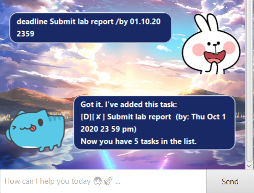
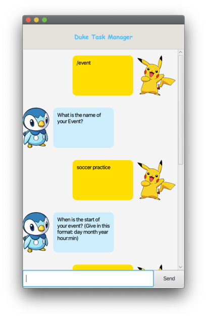
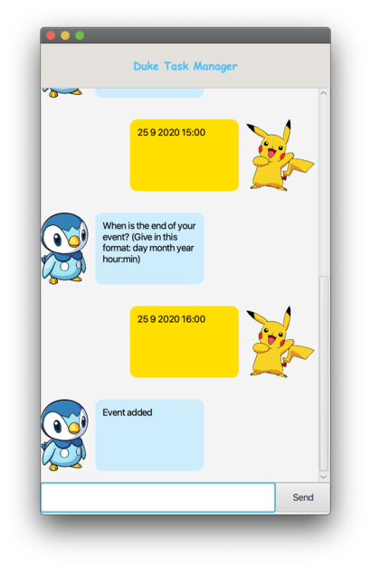
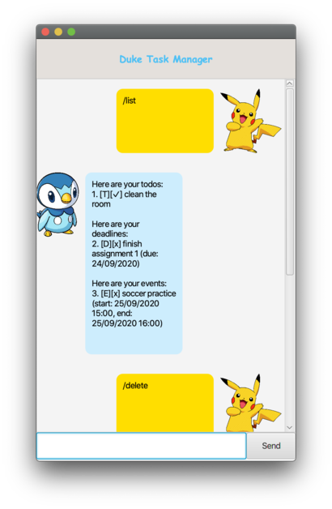
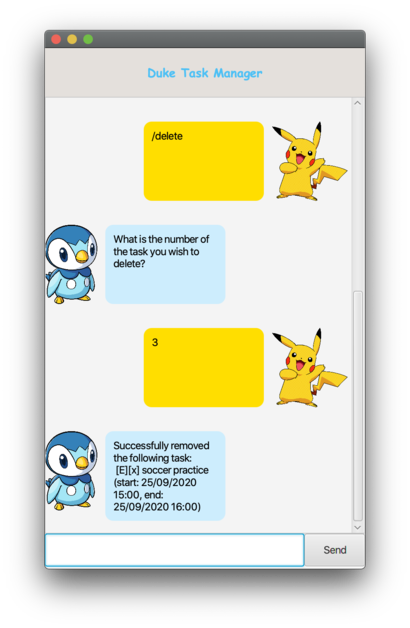

# User Guide
Duke is a simple task manager that can help you keep track of your todos,
deadlines and events.

## Features 
1. [Add a todo](#add-a-todo)
2. [Add a deadline](#add-a-deadline)
3. [Add an event](#add-an-event)
4. [List all tasks](#list-all-tasks)
5. [Delete a task](#delete-a-task)
6. [Mark a task as complete](#mark-task-complete)

### Add a todo
Adds a todo

Format: `todo`, `[todo name]`

### Add a deadline
Adds a deadline.

Format: `deadline`, `[deadline name]`, `[deadline due date]`

Deadline due date should be given in this format: `dd mm yyyy`

### Add an event
Adds an event

Format: `event`, `[event name]`, `[event start time]`, `[event end time]`

Event timings should be given in this format: `dd mm yyyy HH:mm`

 

### List all tasks
Lists all tasks

Format: `list`

### Delete a task
Deletes a task. Task is indicated by its number in the list.

The number can be checked with the command `list`.

Format: `delete`, `[task number]`

 

### Mark task complete
Marks a task as completed. Task is indicated by its number in the list.

The number can be checked with the command `list`.

 

Format: `complete`, `[task number]`