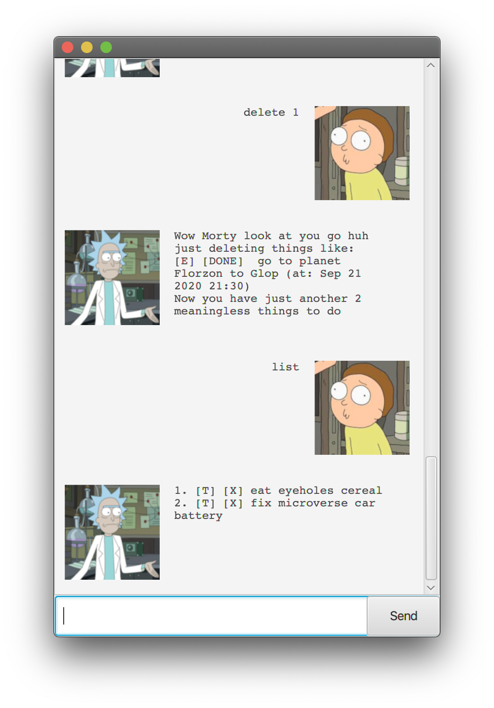

# RickBot User Guide

A Rick and Morty themed Command Line Interface for doing To-do tasking.

## Rick Sanchez Features

Here are the features supported by Rick:
1. [Adding tasks in the list](#add)
2. [Listing of tasks](#list)
2. [Marking the tasks as DONE](#done)
3. [Deleting tasks](#delete)
4. [Finding a task](#find)
5. [Help](#help)
6. [Save Tasks](#save)
7. [Load Tasks](#load)

### Features
#### 1. Adding tasks in the list 

User will be able to add tasks into RickBot. There are 3 types of tasks that can be added to RickBot.
Note that all Strings written in [SquareBrackets] are the command parameters, with specified formatting.
##### 1. Todo  - `todo [TaskName]`
Adds a simple todo with the specified task name.

Example usage: `todo go to planet Florzon to Glop`

Expected outcome:

##### 2. Deadline  - `deadline [TaskName] /by [DD/MM/YYYY] [HH:MM]`
Adds a todo with a deadline with the specified task name, date and time.

Example usage: `deadline go to planet Florzon to Glop /by 21/09/2020 21:30`

Expected Outcome:

##### 3. Event  - `event [TaskName] ['/at' OR '/on'] [DD/MM/YYYY] [HH:MM]`
Adds a todo as an occurrence, with the specified task name, date and time.

Example usage: `event go to planet Florzon to Glop /at 21/09/2020 21:30`

Expected Outcome:

#### 2. Listing of tasks 

User will be able to list the current tasks in the task list.
##### `list`

Example usage: `list`

Expected Outcome:

#### 3. Marking the tasks as DONE 

All User added tasks will be added as uncompleted tasks. User can mark them as DONE using this command.
##### `done [TaskListNumber]`
The User can see what the TaskListNumber is from the [**`list`**](#list) command.

Example usage: `done 1`

Expected Outcome:

#### 4. Deleting tasks 

User can delete tasks from list.
##### `delete [TaskListNumber]`
The User can see what the TaskListNumber is from the [**`list`**](#list) command.

Example usage: `delete 1`

Expected Outcome:

#### 5. Finding a task 
User can find tasks in the list.
##### `find [TaskNameSubString]`

User can type in any substring that appears in the Task name, and they will be given a list of tasks with the specified substring.

Example usage: `find car`

Expected Outcome:

#### 6. Help 
Rick Sanchez may be the smartest man in the universe, so he doesn't expect Morty(the User) to remember the commands that he can say to him.
The User may type in the `help` command to find the right command for the job.
##### `help`

Example usage: `help`

Expected Outcome:

If the User wants a more detailed description of the command then they can use the following command:
##### `help [CommandName]`

Example usage: `help deadline`

Expected Outcome:

Ofcourse, they can use the [**`help`**](#help) command to see the list of commands.

#### 7. Save Tasks 
User can use the following command to save the current tasks into persistent storage.
##### `save`

Example usage: `save`

Expected Outcome:

This will save the Tasks in a human readable format under the file path ip/data/duke.txt by default.

All previous data in the save file(duke.txt) will be overwritten by this.

#### 8. Load Tasks 
User can use the following command to load previously stored tasks from persistent storage.
##### `load [FilePathName]`

Example usage: `load ./data/duke.txt`

Expected Outcome:

This will load the Tasks from the filePath specified. User is expected to use `./data/duke.txt` by default.

User may choose to make their own task file and load it. The tasks are to follow the following format:

1. [T] [X]  some todo name here
2. [D] [X]  some deadline name here (by:  12/05/2020 14:30)
3. [E] [X]  some event name here (at:  13/05/2020 13:30)

If the tasks do not follow this format, there will be a WrongFormat Error shown to the User.
If unsure, refer to [**`todo`**](#addTodo), [**`deadline`**](#addDeadline), [**`event`**](#addEvent).

Have fun talking to RickBot from Dimension B420!