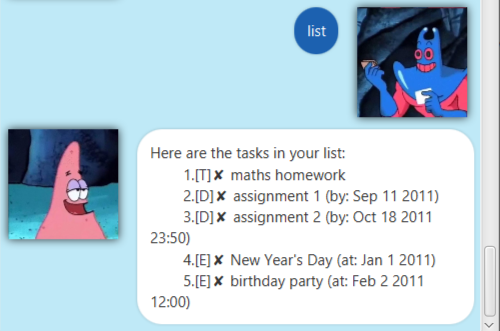
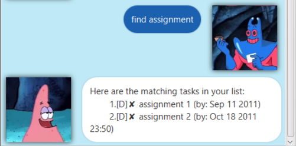

# User Guide

Welcome to Duke, a task manager that helps to keep track of, well, tasks!
Duke is capable of keeping track of simple todos, deadlines as well as events.

Of course, adding tasks is not the only thing Duke can do! Below are all the features
implemented into this version of Duke. Enjoy!

## Features 
* Add a todo/deadline/event
* Delete a todo/deadline/event
* Set a task to have the "done" status
* View all the tasks that you have currently
* Exit using the "bye" command
* Tag a task with your own custom tag name
* Untag a tagged task
* Find tasks that contain a specified keyword
* Saves your tasks upon parsing every command

### Add a task
In Duke, there are 3 types of tasks you can enter into the program:

Todos, Deadlines and Events

## Usage
To add a task, follow the commands below.

todo: `todo <insert task name here>` 

deadline: `deadline <insert task name here> /by <insert due date here>`

event: `event <insert task name here> /at <insert task location here>`

**NOTE**: When entering task names, ensure that your task name does not contain the '#' character. That character is 
reserved for tagging.

**NOTE**: When entering due dates for deadlines, ensure that the due date follows the "YYYY-MM-DD" format. Otherwise an 
error message would appear on Duke!

### `todo`
Upon a successful task creation, you will see Duke acknowledging the created todo.

Example of usage:

`todo homework`

Expected outcome:

### `deadline`
Upon a successful task creation, you will see Duke acknowledging the created deadline.

Example of usage: 

`deadline homework /by 2020-09-19`

Expected outcome:

### `event`
Upon a successful task creation, you will see Duke acknowledging the created event.

Example of usage: 

`event homework /at home`

Expected outcome:

***
## Delete a task
Deletes a task at a specific numbering

## Usage
To delete a task, follow the command below:

`delete <insert item index here>`

**NOTE**: Ensure that the index you input into the command is valid (i.e not less than 1 and not more than the number
of tasks)

### `delete`
Upon a successful task deletion, you will see Duke acknowledging the deleted task.

Example of usage:

`delete 1`

Expected outcome:

***

## Set task to be 'done'
In Duke, you can set a task to be 'done', replacing its default cross icon with a tick

## Usage
To set a task to be 'done', enter the command below:

`done <insert item index here>`

**NOTE**: Similar to delete, ensure that the index you input into the command is valid (i.e not less than 1 and not more 
than the number of tasks)

### `done`
Upon successfully marking a task as 'done', you will see Duke acknowledging the completed task.

Example of usage: `done 2`

Expected outcome:

***

## View all current tasks
In Duke, you can view all tasks you have added/updated.

## Usage
To view all the tasks you have, enter the command below:

`list`

### `list`
Upon successfully listing all the tasks you have, you will see Duke with the output as shown.

Example of usage: `list`

Expected outcome:

***

## save the tasks you have
In Duke, you can save all the tasks you have added/updated before closing the program using the `bye` command.

## Usage
To save all the tasks you have and exit the program, enter the command below:

`bye`

### `bye`
Upon successfully saving all the tasks you have, you will see Duke with the output as shown before shutting down.

Example of usage: `bye`

Expected outcome:

***

## Tagging and Untagging of tasks
In Duke, you can tag untagged tasks with a custom tag, and vice versa.

## Usage
To tag an untagged task, or untag a tagged task, enter the commands below:

tag: `tag <insert task index here> <insert tag description here>`

untag: `untag <insert task index here>`

**NOTE** Each task can only have one tag, attempting to tag a tagged task would result in an error message 

**NOTE** Just like before, ensure that the index you input into the command is valid (i.e not less than 1 and not more 
than the number of tasks)

### `tag`
Upon successfully tagging an untagged task, you will see Duke acknowledging the command with the following output:

Example of usage: `tag 2 finished`

Expected outcome:

### `untag`
Upon successfully untagging a tagged task, you will see Duke acknowledging the command with the following output:

Example of usage: `untag 2`

Expected outcome:

### Finding tasks using keywords
In Duke, you are able to find specific tasks that contains a keyword of your choosing.

## Usage
To find tasks that contain a certain keyword, enter the command below:

`find <insert keyword here>`
Upon successfully finding tasks that contains the specified keyword, you will see Duke acknowledging the command with 
the following output:

Example of usage: `find home`

Expected outcome:

