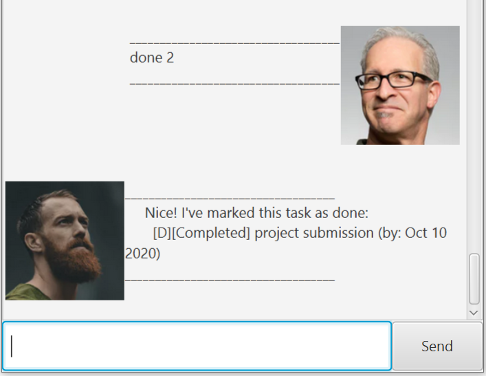

# User Guide
Alice is a **chatbot desktop app** for managing your tasks for you.
It is optimized for use via a Command Line Interface, 
so that you can get things done faster than your traditional task management apps.

* Table of Contents
{:toc}

## Features 

### 1. Task management

Execute simple task management with easy to use commands:
* Create
    * Simple todos, `todo`
    * Tasks with deadlines, `deadline`
    * Events to attend, `event`
* Mark tasks as complete, `done`
* Delete tasks, `delete`

### 2. Task viewing
View all tasks with simply with `list`.
Additionally, search for specific tasks using `search` or `find`

### 3. Natural date time support
Use natural date language instead of spelling out the actual date & time in a recognised format.

Supported natural date language:
* Today
* Tomorrow
* Yesterday
* Day of the week

Supported natural time language:
* Morning - 8am
* Noon - 12pm
* Evening - 7pm
* Night - 10pm
* Midnight - 11.59pm

Hybrid natural language:
* Now
* Tonight (equivalent to tomorrow night)

## Usage

**:information_source: Notes about the command format:** 

* Words in `UPPER_CASE` are the parameters to be supplied by the user. 
  e.g. in `todo DESC`, `DESC` is a parameter which can be used as `todo do homework`.

* Items in brackets are optional. 
  e.g `find KEYWORD (MORE_KEYWORDS)…` can be used as `find apple book` or as `find apple`.

* Items with `…` after them can be used multiple times including zero times. 
  e.g. `(MORE_KEYWORDS)…` can be used as ` ` (i.e. 0 times), `lecture`, `book` etc.

* Words in square brackets means choose either one. 
  e.g. `clear [all, done]` can be used as `clear all` or `clear done`  
  e.g. `[list, ls]` as the command phrase means that you can use`list` or `ls` to execute the command.
  

### `help` - Viewing help

Shows the list of commands and use format.

Format: `help`

### `todo` - Create a todo

Create a task to be done.

Format: `todo DESC`

* `DESC` cannot be empty

Examples:
* `todo finish project` creates a new todo task named `finish project`
* `todo eat` creates a new todo task named `eat`

### `event` - Create an event

Create a task happening at the specified time.

Format: `event DESC /at DATETIME`

* `DESC` cannot be empty
* Either a `DATE` or `TIME` must be included under `DATETIME`
* Date and time should be separated by a whitespace eg. `DATE TIME`
* If `DATE` is not specified, the `DATE` will default to today or tomorrow depending on the current time of the day
* If `TIME` is not specified, it will not be included in the task creation
* Natural datetime language is [supported](#3-supports-natural-date-input)

Examples:
* `event lecture /at today` creates a new party event happening `Today`
* `event lunch /at tomorrow noon` creates a new lunch event happening tomorrow at `12PM`
* `event party /at 24-8-2020 night` creates a new party event happening on `Monday, Aug 24 2020, 10PM`

### `deadline` - Create a deadline

Create a task to be done by the specified time.

Format: `deadline DESC /by DATETIME`

* `DESC` cannot be empty
* Either a `DATE` or `TIME` must be included under `DATETIME`
* Date and time should be separated by a whitespace eg. `DATE TIME`
* If `DATE` is not specified, the `DATE` will default to today or tomorrow depending on the current time of the day
* If `TIME` is not specified, it will not be included in the task creation
* Natural datetime language is [supported](#3-supports-natural-date-input)

Examples:
* `deadline finish homework /by today` creates a new `finish homework` deadline to be done by today
* `deadline submission /by 2200` creates a new `submission` deadline to be done by today 10PM or tomorrow 10PM 
depending on the time of creation
* `deadline homework /by 3/4 2pm` creates a new `homework` deadline to be done by Apr 03, 2PM of the current year

### `done` - Mark a task as done

Marks the specified task as completed.

Format: `done TASK_NUMBER`

* Mark the task at the specified `TASK_NUMBER` as done.
* The `TASK_NUMBER` refers to the index number shown when `list` or `find` command is called. 
* The `TASK_NUMBER` is relative to the task position in the list
* The `TASK_NUMBER` must be a positive integer 1, 2, 3, ...

Example:
* `done 3` marks the 3rd task in the list as done

### `[delete, del, rm]` - Delete a task

Deletes the specified person from the address book.

Format: `delete TASK_NUMBER`

* Deletes the task at the specified `TASK_NUMBER`.
* The `TASK_NUMBER` refers to the index number shown when `list` or `find` command is called. 
* The `TASK_NUMBER` is relative to the task position in the list
* The `TASK_NUMBER` must be a positive integer 1, 2, 3, ...

Examples:
* `delete 4` deletes the 4th task in the list

### `[list, ls]` - List all tasks

Shows a list of all tasks in the address book.

Format: `list`

### `[find, search]` - Locate tasks by description

Finds the task whose description contains any of the given keywords.

Format: `find KEYWORD (MORE_KEYWORDS)…`

* The search is case-insensitive, e.g `lecture` will match `Lecture`
* Order of keywords does not matter, e.g `book practice` will match `practice book`
* Only the description is searched
* Only full words will be matched, e.g `book` will not match `books`
* Tasks that matches any keyword will be returned
* Tasks will be returned with their corresponding task number (relative to their position in the list)

Examples:
* `find homework` returns `Do Homework` and `submit homework`
* `find meeting book` returns `return book` and `project meeting`

### `[clear, clr]` - Clear tasks

Clear tasks from the task manager.

Format: `clear [all, done]`

* The keywords `all` and `done` are case-insensitive

Examples:
* `clear all` clears all tasks in the list
* `clear done` clears only the completed tasks from the list.

### `[bye, exit]` - Exit the program

Exits the program.

Format: `bye`