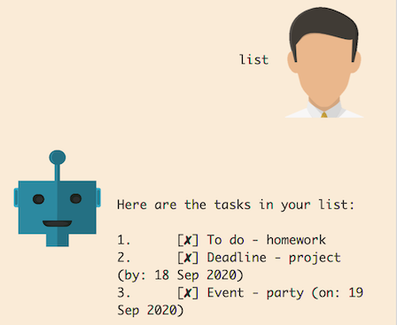

# Duke - User Guide

Duke is a chat bot that helps a user keep track of simple tasks.

## Features Summary

Command | Description | Example
-----|-----|-----
todo | Adds a new ToDo task | todo homework
deadline | Adds a new Deadline task | deadline assignment /by 18/09/2020
event | Adds a new Event task | event party /on 19/09/2020
list | Shows all tasks | list
delete | Deletes a task with the given number | delete 1
find | Finds tasks with a matching keyword | find homework
done | Completes a task with the given number | done 2
clear | Clears all tasks | clear
bye | Terminates Duke | bye 

## Usage

### `todo` - Adds a new ToDo task

Example of usage: 

If you wish to add a ToDo task for a homework:

    todo homework

Expected outcome:

### `deadline` - Adds a new Deadline task

Example of usage: 

If you wish to add a Deadline task for a project which is due on 18th September 2020:

    deadline project /by 18/09/2020

Expected outcome:

### `event` - Adds a new Event task

Example of usage: 

If you wish to add a Event task for a party which is to be held on 19th September 2020: 

    event party /on 19/09/2020

Expected outcome:

### `list` - Shows all tasks

Example of usage: 

If you wish to view all your tasks:

    list

Expected outcome:

### `delete` - Deletes a task with the given number

Example of usage: 

If you wish to delete the first task in the list:

    delete 1

Expected outcome:

### `find` - Finds tasks with a matching keyword

Example of usage: 

If you wish to find tasks with the keyword 'homework':

    find homework

Expected outcome:

### `done` - Completes a task with the given number

Example of usage: 

If you wish to complete the second task in the list:

    done 2

Expected outcome:

### `clear` - Clears all tasks

Example of usage: 

If you wish to clear all your tasks:

    clear

Expected outcome:

### `bye` - Terminates Duke

Example of usage: 

If you wish to terminate your session with Duke:

    bye

Expected outcome:

